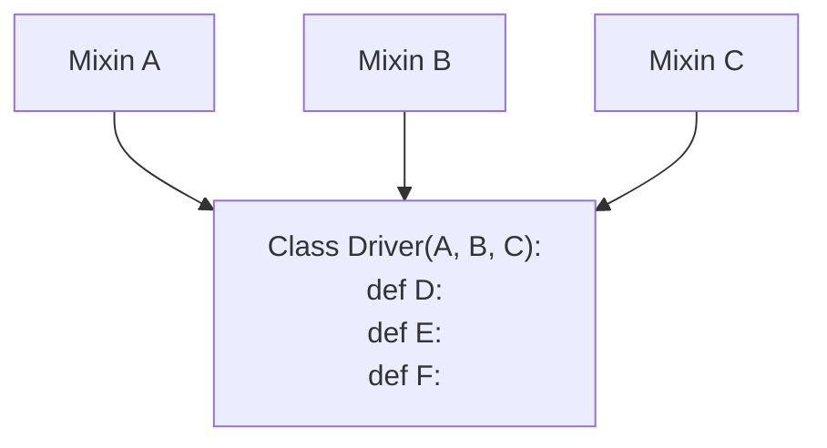

# ALE Driver Architecture

## Drivers

There are many similarities between image-gathering spacecraft. 
For example, their output will generally include an image and a timestamp. 
Though not always attached, orientation data can often be found given that timestamp. 
Data should be able to be processed into a standard format.

But, each spacecraft also has it's particularities. 
One may gather image data in more bands than another.  The distortion of their lenses may differ. 
They may gather the same type of data, but store it in slightly different formats. 
To get data into a standard format, the unique properties of each spacecraft must be accounted for.

This is what ALE drivers are for.  If ALE has a driver for a spacecraft, 
it can return an ISD (Image Support Data) for images from that spacecraft. 
(ALE may also need supplementary data along with the image, like labels or NAIF SPICE Kernels)

An ALE driver is a Python Class.  It uses Mixins to inherit shared functionality, 
and Methods to define per-spacecraft fuctionality.

## Mixins

Mixins allow code from different classes to be reused and mixed together in one class (or ALE driver, in our case). 
Mixins can be thought of like multiple inheritance, though one mixin is not usually the single parent/super of another class. 
They can also be thought of similar to an *include* at the top of the class. 

A class that uses a mixin is not typically a specialized version of that mixin. 
Rather, the mixin is one component among many in the class that is using it. 

In this example, the Driver class may use methods from Mixins A, B, and C, as well as its own methods D, E, and F.

Mixins let ALE drivers mix and match common spacecraft/image data features.
For example, there are mixins that correspond to different camera types.
So, whatever the other mixins and methods in a driver, 
any methods that correspond to a certain type of camera
can be included simply by adding a mixin like `Framer`.

More info can be found on ALE Driver mixins it the 
[Creating ALE Drivers](../../how-to-guides/ale-developer-guides/creating-ale-drivers/#class-signature) 
How-To Guide, under Class Signature.

## Ale::load

- ? Not sure exactly what is intended for this section ?
- Load order of mixins
- `src/load.cpp`
- `ale/drivers/__init__.py > load`

## Overwriting Base Behavior

- Use ISIS ISDs as truth data, and ISIS classes as guidelines to instrument particularities

- Changing the order of Mixins
  - load mixin with desired behavior first (leftmost)
  - this overwrites behavior in further-right mixins

- When to make a new property in a driver
  - if spacecraft records data in a different way than others, not available in existing mixins