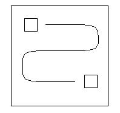
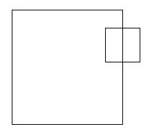
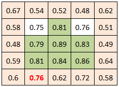

# Pattern Matching

## Introduction

This document attempts to describe how automatic registration is accomplished in ISIS. In simple terms, automatic registration is the attempt to match a pattern in a cube. For example, given a reseau template pattern, we would like to find positions in a cube which match the reseau. Similarly, if we extract from a cube a ground feature (e.g. crater, fault line, etc) as a pattern, we would like to find the same feature in another overlapping cube to define match points.

## Plugins and PVL

Automatic registration is a tricky subject. Algorithms and parameters that successfully work for one pattern are likely not to work for other conditions. In ISIS, we do not want to restrict our registration programs (e.g., coreg, pointreg) to a single algorithm. We would view this similar to map projections or camera models. That is, if a particular registration algorithm meets our needs we can choose to use it, however, if none meet our needs a new algorithm can be developed. A key element is we want the new algorithm immediately available in all applications without the need to modify them. We will facilitate this requirement through plugins and the use of Parameter Value Language (PVL) definition files. The PVL syntax will be introduced gradually as the overall discussion of automatic registration progresses.

## Chips

In the simplest terms, automatic registration attempts to find some sub-area of a cube (or "pattern" window) inside some subarea of another cube (or "search" window). In ISIS, these "generally" small sub-areas of a cube are called "chips". There are two chips used in automatic registration, the "pattern" chip and the "search" chip, corresponding to the two sub-areas discussed above. We will discuss each in more detail within the following sections, but for now we describe the basic elements of a chip. That is, an NxM chip is defined to be an N samples by M lines region of a cube. Some key elements of a chip are as follows:

1. N and M are natural numbers (1, 2, 3, ...)
2. Like cubes, chip coordinates are sample/line based and indexed from 1
3. The center of the chip is (N-1)/2 + 1 and (M-1)/2 + 1.

### Pattern Chip

The pattern chip contains the data you want to match. In the past we have called this the "truth" chip or "hold" chip. Both of these terms can be confusing. The term "truth" has different meanings in regards to match points and term "hold" is misleading as a pattern chip actually floats through the search chip. So we refrain from their use and stick with the term "pattern" chip. The PVL for a pattern chip is:

```
Object = AutoRegistration
    Group = PatternChip
    Samples = 5
    Lines   = 5
    End_Group
End_Object
```

### Search Chip

The search chip is the area of an overlapping cube you believe the pattern will fall within. That is, we will walk the pattern chip through the search chip looking for the best match. The size of the search chip defines how far the pattern chip is allowed to deviate from a desired center search spot. Consequently, the search chip must be larger than the pattern chip in order for the pattern chip to move through the search chip:

```
Object = AutoRegistration
    Group = PatternChip
    Samples = 5
    Lines   = 5
    End_Group

    Group = SearchChip
    Samples = 21
    Lines   = 21
    End_Group
End_Object
```

### Restrictions

From the above discussion of pattern and search chips, an intuition should be developing about how changes to one chip will necessitate changes to the other. Because the pattern chip and search chip are tightly coupled in this way, there are some restrictions on the relative dimensions of the two chips that must be put in place. Specifically:

1.  **N + M >= 3**

    where N and M are the dimensions of the pattern chip. This ensures the pattern is not a single pixel. However, in practice, small pattern chips often match too many areas in a search chip.

2.  **N<sub>search</sub> >= N<sub>pattern</sub>+2** and **M<sub>search</sub> >= M<sub>pattern</sub>+2**

    where N and M are again the dimensions of their respective chips. This ensures that the pattern chip spans at least a 3x3 window in the search chip. This is a subtle but important requirement for surface fitting in order to compute sub-pixel accuracy (which will be discussed later in this document).

## Match Algorithms

Rarely in practice will the pixels in a search chip have a one-to-one correspondence with some sub-area of the search chip. Consequently, we introduce match algorithms designed to correlate two chips and find the "best" match within the search area.

An objective of the ISIS automatic registration design is to allow for a variety of match algorithms. For example, an algorithm could be developed that works best for matching MGS/MOC wide angle and Odyssey Themis IR cameras. For this objective to be met we will utilize applications which allow automatic registration plugins. This concept is identical to that of applications which utilize camera and/or map projection plugins such as cam2map, map2map, etc.

The plugin match algorithm will receive the pattern chip and a sub-region of the search chip. This sub-region will have the same dimensions as the pattern chip to allow for a pixel-by-pixel comparison of the chips. The algorithm is expected to return a single value that represents the "goodness of fit" (GOF) between the two chips. The definition of the GOF is algorithm dependent. For clarity, we present two types of match algorithms in this document with the understanding that more algorithms may be developed in the future.

### Maximum Correlation

This match algorithm computes the correlation coefficient, R, between the pattern chip and the sub-region of the search chip as follows:

    R = Covariance(pattern, subregon) / [Variance(pattern) * Variance(subregion)]

    where -1.0 <= R <= 1.0

    GOF = |R|

In this algorithm, the "one pixel accuracy" goodness of fit will range from no correlation (zero) to perfect correlation (one). Example PVL for this algorithm would as follows:

```
Object = AutoRegistration
    Group = PatternChip
    Samples = 5
    Lines   = 5
    End_Group

    Group = SearchChip
    Samples = 21
    Lines   = 21
    End_Group

    Group = Algorithm
    Name    = MaximumCorrelation
    End_Group
End_Object
```

### Minimum Difference

This match algorithm defines goodness-of-fit (one pixel accuracy) as the average absolute difference per pixel between the pattern chip and the search sub-region. Specifically, it sums the pixel differences within the pattern chip and search sub-region and divides by the total pixel count to get an average. In equation form:

    GOF =  ∑|pattern(i,j) - subregion(i,j)| / count

A GOF value of zero indicates a perfect match, while larger values indicate a less likely match. Obviously, negative values could never occur.

To have your automatic registration use this Minimum Difference algorithm, specify the following in the "Algorithm" group of your PVL definition file:

```
Object = AutoRegistration
    Group = PatternChip
    Samples = 5
    Lines   = 5
    End_Group

    Group = SearchChip
    Samples = 21
    Lines   = 21
    End_Group

    Group = Algorithm
    Name    = MinimumDifference
    End_Group
End_Object
```

### Gruen

A modification to the Adaptive Least Squares Correlation algorithm was introduced by A.W. Gruen as a flexible technique for image data matching. It allows for simultaneous radiometric corrections and local geometrical image shaping in which the system parameters are automatically assessed, corrected, and thus optimized during the least squares iterations. The tools of least squares estimation are utilized for the assessment of the correlation quality. The algorithm allows for stabilization and improvement of the correlation procedure through the simultaneous consideration of geometrical constraints. Within ISIS, this algorithm provides adaptive image (chip) registration using an Affine transform to iteratively adjust the search chip at each iteration. Each iteration solves for new adjustments to the Affine transform until the 6 affine parameters fall below the tolerances as specified by the following parameters:

<h1 align="center">Gruen AutoReg Parameters</h1>

| Parameter                  | Description                                                                                                                                                                                                                                     |
|----------------------------|-------------------------------------------------------------------------------------------------------------------------------------------------------------------------------------------------------------------------------------------------|
| **Name**                   | Name of the algorithm that the set of parameters description applies to. This should be *AdaptiveGruen*.                                                                                                                                        |
| **Tolerance**              | This constrains the eigenvalues of the registration result. Registrations with **GoodnessOfFit** larger than this value are rejected. A low GOF value near zero represents a good fit. (Default: Unbounded)                                  |
| **MaximumIterations**      | Maximum number of iterations allowed for the registration processing to converge. (Default: 30)                                                                                                                                                |
| **AffineTolerance**        | The amount of offset in pixels an Affine derived point is allowed to deviate from the original match point. (Default: Unbounded)                                                                                                               |
| **SpiceTolerance**         | The amount of offset in pixels a registration is allowed to deviate from a registered point. (Default: Unbounded)                                                                                                                               |
| **AffineTranslationTolerance** | Specifies the threshold convergence value of the Affine translation shift in line/sample between each Gruen match iteration. If the amount of this value computed in the Gruen algorithm is less than this value, it is deemed a match point. (Default: 0.1) |
| **AffineScaleTolerance**   | Specifies the threshold convergence value of the Affine scale in line/sample between each Gruen match iteration. If the amount of this value computed in the Gruen algorithm is less than this value, it is deemed a match point. (Default: 0.3)  |
| **AffineShearTolerance**   | Specifies the threshold convergence value of the Affine shear in line/sample between each Gruen match iteration. If the amount of this value computed in the Gruen algorithm is less than this value, it is deemed a match point. (Default: AffineScaleTolerance) |
| **RadioShiftTolerance**    | Specifies the threshold convergence value for the radiometric shift of the pixel value between each Gruen match iteration. If the amount of this value computed in the Gruen algorithm is less than this value, it is deemed a match point. (Default: Unbounded) |
| **RadioGainMinTolerance**  | Specifies the threshold convergence minimum value for the radiometric gain of the pixel value between each Gruen match iteration. If the amount of this value is greater than this value and less than RadioGainMaxTolerance, it is deemed a match point. (Default: Unbounded) |
| **RadioGainMaxTolerance**  | Specifies the threshold convergence maximum value for the radiometric gain of the pixel value between each Gruen match iteration. If the amount of this value is less than this value and greater than RadioGainMinTolerance, it is deemed a match point. (Default: Unbounded) |
| **DefaultRadioShift**      | Sets the default value for the radiometric shift value used as a starting point in the Gruen algorithm. (Default: 0)                                                                                                                           |
| **DefaultRadioGain**       | Sets the default value for the radiometric gain value used as a starting point in the Gruen algorithm. (Default: 0)                                                                                                                            |


### Tolerance

In all algorithms we will want to define a tolerance for goodness of fit. The tolerance test must be made by the plugin as the direction of the test is dependent on the algorithm. In our examples, the goodness of fit and Tolerance represent a one pixel accuracy level. The MinimumDifference would use a test for "less than" Tolerance, MaximumCorrelation would use "greater than" Tolerance, and GruenAdaptive would use "less than" Tolerance (the goodness of fit for Gruen is at a sub-pixel accuracy). This is represented in PVL in the following fashion:

```            
Object = AutoRegistration
    Group = PatternChip
    Samples = 5
    Lines   = 5
    End_Group

    Group = SearchChip
    Samples = 21
    Lines   = 21
    End_Group

    Group = Algorithm
    Name      = MaximumCorrelation
    Tolerance = 0.7
    End_Group
End_Object
```

## Creating a Fit Chip

We define a third chip, the fit chip, which represents the goodness of fit at each equivalent position in the search chip. That is, we can think of the pattern chip walking through the search chip and at each position extract a sub-region to be used for computing a fit value. After walking and computing at each position we have a chip filled with goodness of fit values that are in 1-1 correspondence with pixels in the search chip. An example of the pattern chip weaving its way through the search chip is given:



How the pattern chip walks the search chip can vary; currently we define one method: a dense walk.

### Dense Walk

In the obvious case, we walk every possible position in the search chip by starting in the upper-left corner and moving over by one sample. When we come to the right edge we will move down one line and reset to the left edge. However, we do not test where the pattern would lie outside the search chip. For example:



In other words, we only test the pattern if it is fully inside of the search chip. This will be true for all walking scenarios. Therefore, if we have 3x3 pattern chip and a 7x7 search chip, we compute fits for 25 of the 49 pixels in the search chip.

## Sub-Pixel Accuracy

Upon walking the pattern chip through the search chip we will have created the fit chip. The highest (or lowest) goodness of fit value generally represents the whole pixel position that best matched between the pattern and search area.

The Subpixel Algorithm option is on by default (SubpixelAccuracy=True), it is possible to turn it off by using the SubpixelAccuracy keyword. Example:

```
Group = Algorithm
    Name             = MaximumCorrelation
    Tolerance        = 0.7
    SubpixelAccuracy = False
End_Group
```

In this case, the whole pixel with the best fit is returned.

As of ISIS3.4.0, the subpixel algorithm was replaced with the algorithm described under SurfaceModeling. To estimate the true registration position, the previous algorithm used a least squares fit to generate a 2nd degree 2-dimentional polynomial given an NxN window of points from the fit chip. This previous algorithm optionally applied two parameter tolerances that are no longer needed and have been removed, Eccentricity Ratio and Residual Tolerance. If a PVL definition file includes these parameters when applying the new subpixel algorithm, they will simply be ignored.

### Surface Modeling

When enabled, the subpixel accuracy algorithm analyzes a window size (WindowSize x WindowSize) block containing fit chip pixel values centered at the whole pixel with the best registration (local extreme value of the fit chip; the highest or the lowest value).

The fit chip analysis is performed by using an adaptive flood fill and weighted average algorithm as follows: (The figure below is based on a 5x5 WindowSize block of a fit chip returned by the Maximum Correlation algorithm). The best registration among the border pixels of the WindowSize block (light orange colored pixel cells) is found (0.76 in the example below). A continuous flood fill is done selecting all continuous pixels with registration values on the interval (0.76,1.0)-(the green colored cells). An average of the selected cell coordinates is then computed (weighting each coordinate by it's registration value) to reduce the selection to a single location.



It is required that 95% of the pixels within the fit chip block be valid. Thus, in a 5x5 block, only one pixel could be invalid. This is enforced primarily to avoid false positive registrations on image edges.

The dimensions of the WindowSize fit chip block must be an odd number in order to have a center pixel. Also, the dimensions of the WindowSize fit chip block cannot be less than 5, but can be as large as the original fit chip (though this is not recommended). Recommended dimensions for (MaximumCorrelation and MinimumDifference) range from 5, 7, 9, 11, to 15.

Optionally, the window size and tolerance may be supplied through PVL:

```
Group = SurfaceModel
    DistanceTolerance = 0.75
    WindowSize        = 5
End_Group
```

### Distance Tolerance

The result of a sub-pixel accuracy computation is likely to move the result away from its original whole-pixel fit. However, sometimes the move could be so drastic that it calls into question the validity of the match. This tolerance value thus specifies the max number of pixels (with sub-pixel granularity) the sub-pixel accuracy computation can move the best fit before the registration is rejected entirely. The distance tolerance in pixels must be greater than 0 and is defaulted to 1.0.

For example:

```
Group = SurfaceModel
    DistanceTolerance = 3.5
End_Group
```

Here a registration will be rejected if the new position is more than 3.5 pixels away from the original whole-pixel result. The recommended value is 0.5 or 0.75, this assumes that the original starting position at the whole pixel level is accurate. This distance test is not a 2D check, but rather, two single dimension checks (line direction and sample direction).

### Window Size

When refining a whole-pixel match to sub-pixel accuracy, it's important to consider how much area around that best whole-pixel fit to sample for subpixel analysis. The WindowSize keyword defines the size of the window, centered on the best whole-pixel match, that will be used for subpixel refinement. Values for WindowSize specify the N of an NxN chip, and must be odd numbers greater than or equal to 5. By default, this window size is 5x5 pixels, but can be specified in the SurfaceModel group as follows:

```
Group = SurfaceModel
    WindowSize = 5
End_Group
```

Here we define our window to be 5x5 pixels around the best whole-pixel match, and the resulting surface will be modeled with the data in this chip.

It is required that 95% of the pixels within the fit chip block be valid. Thus, in a 5x5 block, only one pixel could be invalid. This is enforced primarily to avoid false positive registrations on image edges. An invalid pixel is defined as any 'Special Pixel' (NULL, HRS, LRS, etc) or if it is a value that falls outside the user specified 'ValidMinimum/ValidMaximum' parameter values.

The dimensions of the WindowSize fit chip block must be an odd number in order to have a center pixel. Also, the dimensions of the WindowSize fit chip block cannot be less than 5, but can be as large as the original fit chip (though this is not recommended). Recommended dimensions for (MaximumCorrelation and MinimumDifference) range from 5, 7, 9, 11, to 15.

If an ideal goodness of fit is found (e.g. 0.0 for MinimumDifference or 1.0 for MaximumCorrelation), we have a perfect fit and, thus, know it is in the best position. In this case, the sub-pixel accuracy phase is omitted.

## Advanced Features

This section covers advanced features of automatic registration. While these features are not necessary in order to accomplish the registration, they can be used to significantly improve the chance of success and/or the accuracy of the match.

### Restricting Pixel Ranges

Pixels may be excluded from the match algorithm if they fall outside of a specified range. This range is independent for both the pattern and search chip. It is handled via the PVL as follows:

```
Object = AutoRegistration
    Group = PatternChip
    Samples      = 5
    Lines        = 5
    ValidMinimum = 0.1
    ValidMaximum = 0.4
    End_Group

    Group = SearchChip
    Samples      = 21
    Lines        = 21
    ValidMinimum = 2.5
    ValidMaximum = 10.5
    End_Group

    ...
End_Object
```

If values are not given in the PVL then all pixels are considered valid (with the exception of special pixels).

### Valid Pixel Count

Prior to the match algorithm being invoked during the walk process, a simple test is performed to ensure there are enough pixels to work with. Pixels are deemed valid if they are in the minimum/maximum range and/or they are not special pixels. The pattern chip is only checked once. If it does not contain enough valid pixels the match is deemed to fail. As the walk through occurs, the sub-region is extracted from the search chip. If this sub-region does not have enough valid pixels a match will be deemed to fail at that search location. In the following PVL example we have a 5x5 chip with 25 pixels of which 80% or more must be valid:

```
Group = PatternChip
    Samples      = 5
    Lines        = 5
    ValidMinimum = 0.1
    ValidMaximum = 0.4
    ValidPercent = 80
End_Group
```

We only need to specify the percent for the pattern chip as the sub-region chip of the search area will use the same value.

### Reduction Factor

The automatic registration process can often be a time-consuming one, especially when needing to consider a large search area to walk through. In order to help speed up this portion of the process, we introduce the notion of a "Reduction Factor".

If a reduction factor greater than 1 is specified by the user, then before attempting to walk the pattern chip through the search chip looking for a match, the algorithm will first perform a "reduced match". In other words, new pattern and search chips will be derived from the original chips with dimensions equal to the original chip dimensions divided by the ReductionFactor, in a manner similar to the reduce program, and a match will be performed on them first to help refine the general match to a smaller search area. For example, a common reduction factor is 2, and can be specified in the definition file as follows:

```
Object = AutoRegistration
    Group = Algorithm
    ReductionFactor = 2
    End_Group

    Group = PatternChip
    Samples      = 7
    Lines        = 7
    End_Group

    Group = SearchChip
    Samples      = 21
    Lines        = 21
    End_Group
End_Object
```

In the above example, a new pattern chip would be constructed with dimensions of 3 samples by 3 lines (i.e., 7 / 2 rounded down). The new search chip, likewise, would be 10 samples by 10 lines (i.e., 21 / 2).

Of course, by reducing the chips we lose an amount of detail directly proportionate to the magnitude of the reduction factor. Increasing the reduction factor will speed up computation, but also decrease the reliability of the result. A pixel in a reduced chip is simply computed by averaging surrounding pixels in the original chip.

After the match has been performed on the reduced chips, instead of simply accepting the result, the algorithm will continue on to matching the original chips, but decrease the search area to a smaller area surrounding the "best" sample and line derived from the reduced match, effectively cropping the search chip (not scaling it, as in the reduced match) to some general area suspected to contain the exact match. Increasing the reduction factor will increase the size of the resulting search area.

After finding the reduced match, the new search window is defined by expanding outwards from the best pixel (remapped from the reduced chips to the original chips) by:

    ReductionFactor + WindowSize + 1

...in all four directions. The WindowSize can be specified by the user in the definition file's SurfaceModel group. To help understand why the reduction factor is used in this manner, consider the following example:

```
Object = AutoRegistration
    Group = Algorithm
    ReductionFactor = 10
    End_Group

    Group = PatternChip
    Samples         = 700
    Lines           = 700
    End_Group

    Group = SearchChip
    Samples         = 1000
    Lines           = 1000
    End_Group

    Group = SurfaceModel
    WindowSize      = 3
    End_Group
End_Object
```

Using a reduction factor of 10: the search chip becomes 100x100, the pattern 70x70, and only 900 different comparison are made. However, the best pixel match is only accurate to about 10 pixels because of the reduction. So we repeat the matching process in a window around the best pixel. The windows size is 10 in either direction plus the number of pixels needed for sub-pixel accuracy computations (WindowSize is usually 3). In the our case the matching would be done on a 2 * (10 + 3 + 1) or 28x28 window, or 784 additional comparisons. Therefore the total comparisons to get a match is 900 + 784 = 1684 and is significantly less than the 90000 comparisons done without the reduction factor.

Adaptive algorithms will make additional use the "best" sample and line derived from the reduced match when setting up affine transformations.

### Geometric Warping of Pattern Cubes

The pattern cube can be forced to match the geometry of the search cube by using map projections and/or camera models. Additionally, rotations can be applied to the pattern cube. The warping is application-dependent and therefore is under the control of the programmer. That is, there is no PVL mechanism for warp selection/deselection.

However, when interpolating during the warp process, the user can choose, via the definition file, which interpolation algorithm to use. Available interpolation algorithms include [Nearest Neighbor](https://en.wikipedia.org/wiki/Nearest-neighbor_interpolation), [Bilinear](https://en.wikipedia.org/wiki/Bilinear_interpolation), and [Cube Convolution](https://en.wikipedia.org/wiki/Bicubic_interpolation#Bicubic_convolution_algorithm). As an example of how to specify which algorithm to use:

```
Group = Algorithm
    ChipInterpolator = NearestNeighborType
End_Group
```

The above example would warp the geometry of the pattern cube using the Nearest Neighbor algorithm. For a complete list of all possible values for this keyword, see the [Definition File Keywords](#definition-file-keywords) appendix below.

### Z-Score Test

To guarantee an accurate match, we first need to check if the pattern chip has enough variation to perform the algorithm on. This is done by calculating the z-score of both the minimum and maximum values of the chip. The z-score measures the number of standard deviations the value is away from the mean. If the z-score for either value is greater than the specified minimum value, then it is an acceptable pattern chip. For example:

```
Group = PatternChip
    MinimumZScore = 1.5
End_Group
```

In this case, the chip's extreme values must be more than 1.5 standard deviations away from the mean. If the MinimumZScore keyword is not included, the default value of 1 standard deviation is used.

### Gradient Filters

To increase the chances of successful registration, a gradient filter can be applied to both the search and pattern chips before attempting to perform a match. In simple terms, a gradient filter highlights the edges in an image. Thus, the use of a gradient filter on the search and pattern chips may increase the chances of finding a match when the pattern chip contains distinctive features whose edges need to be emphasized. This is especially the case for search and pattern chips where the images have differing illumination conditions.

Currently, the Sobel gradient filter is supported. The [Sobel](https://en.wikipedia.org/wiki/Sobel_operator) gradient filter looks at the eight surrounding pixels for a given point. A Sobel gradient filter can be specified like so:

```
Group = Algorithm
    Gradient = Sobel
End_Group
```

## Appendices

Here you'll find a collection of quick references to help improve your results when performing automatic registration.

### Definition File Keywords

The following table provides an exhaustive listing of every keyword that can be provided in an automatic registration definition file. The **keywords** are organized by what **groups** they can appear in after what **algorithms** they can be used with. If a keyword can be used with every algorithm, then its value for this cell is "All". The **type** column specifies what kind of value is expected (an integer, real number, boolean, or a string). The **values** column provides either the set of valid values (in the case of strings) or a numerical range, with a paren "(" denoting an exclusive value and a bracket "[" denoting an inclusive value. The **default** column provides the value that will be taken when the keyword is not provided. If the value for a particular cell is <span style="color:red;">red</span>, then instead of the corresponding keyword defaulting to some value in the registration process, the stated action will be performed. In the case of an <span style="color:red;">Exception</span>, unless the specific application being used handles the missing value, the registration will fail.

<h2 align="center">Parameter Table</h2>

| Keyword                                                      | Groups                          | Algorithms | Type    | Values                                                        | Default                                   |
|--------------------------------------------------------------|---------------------------------|------------|---------|---------------------------------------------------------------|-------------------------------------------|
| [Name](#match-algorithms)                                    | Algorithm                       | All        | String  | {MaximumCorrelation, MinimumDifference, Gruen, AdaptiveGruen} | <span style="color:red;">Exception</span> |
| [Tolerance](#tolerance)                                      | Algorithm                       | All        | Real    | [0.0, infinity)                                               | <span style="color:red;">Exception</span> |
| [ChipInterpolator](#geometric-warping-of-pattern-cubes)      | Algorithm                       | All        | String  | {NearestNeighborType, BiLinearType, CubicConvolutionType}     | CubicConvolutionType                      |
| [ReductionFactor](#reduction-factor)                         | Algorithm                       | All        | Integer | [1, infinity)                                                 | 1                                         |
| [SubPixelAccuracy](#sub-pixel-accuracy)                      | Algorithm                       | All        | Boolean | {True, False}                                                 | True                                      |
| [Gradient](#gradient-filters)                                | Algorithm                       | All        | String  | {None, Sobel}                                                 | None                                      |
| [Samples](#chips)                                            | PatternChip, SearchChip         | All        | Integer | [1, infinity)                                                 | <span style="color:red;">Exception</span> |
| [Lines](#chips)                                              | PatternChip, SearchChip         | All        | Integer | [1, infinity)                                                 | <span style="color:red;">Exception</span> |
| [ValidMinimum](#restricting-pixel-ranges)                    | PatternChip, SearchChip         | All        | Real    | (-infinity, infinity)                                         | Isis::ValidMinimum                        |
| [ValidMaximum](#restricting-pixel-ranges)                    | PatternChip, SearchChip         | All        | Real    | (-infinity, infinity)                                         | Isis::ValidMaximum                        |
| [MinimumZScore](#z-score-test)                               | PatternChip                     | All        | Real    | (0.0, infinity)                                               | 1.0                                       |
| [ValidPercent](#valid-pixel-count)                           | PatternChip                     | All        | Real    | (0.0, 100.0]                                                  | 50.0                                      |
| [SubchipValidPercent](#valid-pixel-count)                    | SearchChip                      | All        | Real    | (0.0, 100.0]                                                  | 50.0                                      |
| [DistanceTolerance](#distance-tolerance)                     | SurfaceModel                    | All        | Real    | (0.0, infinity)                                               | 1.5                                       |
| [WindowSize](#window-size)                                   | SurfaceModel                    | All        | Integer | [3, infinity) odd                                             | 5                                         |
| [MaximumIterations](#gruen)                                  | Algorithm                       | Gruen      | Integer | (-infinity, infinity)                                         | 25                                        |
| [AffineTranslationTolerance](#gruen)                         | Algorithm                       | Gruen      | Real    | (-infinity, infinity)                                         | 0.1                                       |
| [AffineScaleTolerance](#gruen)                               | Algorithm                       | Gruen      | Real    | (-infinity, infinity)                                         | 0.5                                       |
| [AffineShearTolerance](#gruen)                               | Algorithm                       | Gruen      | Real    | (-infinity, infinity)                                         | AffineScaleTolerance                      |
| [AffineTolerance](#gruen)                                    | Algorithm                       | Gruen      | Real    | (-infinity, infinity)                                         | DBL_MAX                                   |
| [SpiceTolerance](#gruen)                                     | Algorithm                       | Gruen      | Real    | (-infinity, infinity)                                         | DBL_MAX                                   |
| [RadioShiftTolerance](#gruen)                                | Algorithm                       | Gruen      | Real    | (-infinity, infinity)                                         | DBL_MAX                                   |
| [RadioGainMinTolerance](#gruen)                              | Algorithm                       | Gruen      | Real    | (-infinity, infinity)                                         | -DBL_MAX                                  |
| [RadioGainMaxTolerance](#gruen)                              | Algorithm                       | Gruen      | Real    | (-infinity, infinity)                                         | DBL_MAX                                   |
| [FitChipScale](#gruen)                                       | Algorithm                       | Gruen      | Real    | (-infinity, infinity)                                         | 0.1                                       |
| [DefaultRadioGain](#gruen)                                   | Algorithm                       | Gruen      | Real    | (-infinity, infinity)                                         | 0.0                                       |
| [DefaultRadioShift](#gruen)                                  | Algorithm                       | Gruen      | Real    | (-infinity, infinity)                                         | 0.0                                       |

