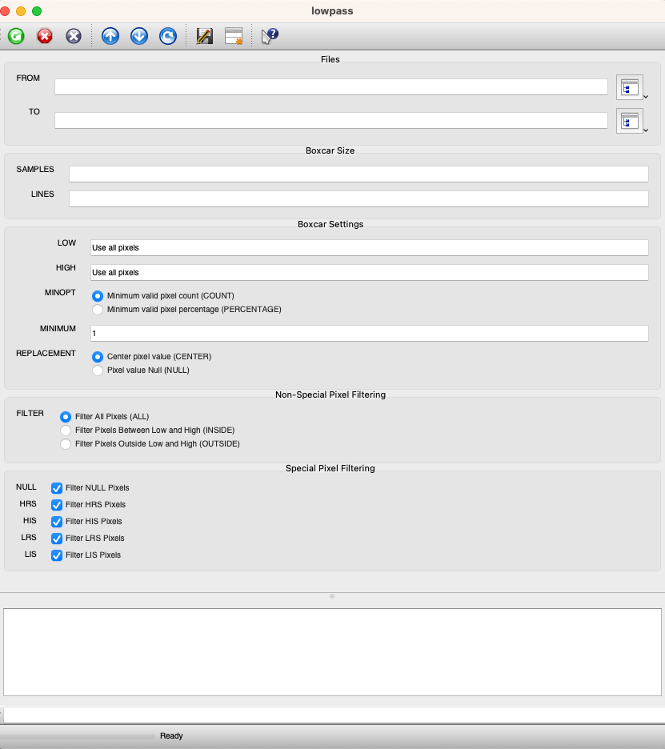

# Command Line Usage
_Invoking ISIS programs from the UNIX command line_

## Introduction

This section describes how to run ISIS programs on the command line instead of the GUI. This is particularly useful 
1. to setup shell scripts or other batch job mechanisms to run a sequence of programs on cubes or if 
2. you prefer keyboarding over mousing.

## Invoking a Program

To start an ISIS program, simply type its name, for example, _lowpass_. This starts the program under the GUI; however, if you provide anything after the program name, as in the example below, it is assumed the program is running in command line mode.

`lowpass from=moon.cub to=moon.lpf.cub lines=5 samples=5 minimum=1`

The program will immediately attempt to run and if parameters are missing or wrong, an error will be output. Example:

```
lowpass from=moon.cub lines=4 samples=5 minimum=1

  Group = Error
    Program = lowpass
    Class   = "USER ERROR"
    Code    = 2
    Message = "Parameter [TO] must be entered"
    File    = IsisAml.cpp
    Line    = 2867
  End_Group
```

```
lowpass from=moon.cub to=moon.lpf.cub lines=4 samples=5 minimum=1

  Group = Error
    Program = lowpass
    Class   = "USER ERROR"
    Code    = 2
    Message = "Value for [LINES] must be odd"
    File    = IsisAml.cpp
    Line    = 2357
  End_Group
```


## Application Specific Parameters

All ISIS command lines take the following form:

`program parameter1=value parameter2=value ...parameterN=value`

The parameters can be entered in any order, can be abbreviated so long as they are unique, are case insensitive, and can be omitted if they have a default value. The values can be integers, doubles, strings, or booleans, and homogeneous arrays of these types.

Display the _lowpass_ GUI from the command line or use the -help reserved parameter to see the parameter names that are available for the program. Simply type "lowpass" to display the GUI, or type the command "lowpass -h" to display the parameter names necessary to run a particular ISIS program on the command line. The default values are shown below, to the right of the equal sign. The results of the two methods shown below can be used as a guide to construct the commands on the command line.

**GUI Example**  
[](../../assets/isis-fundamentals/lowpass_GUI_1.png)

**Command Line Help Example**  

Results of _lowpass -h_ are shown below:
```
FROM	    = Null
TO	        = Null
SAMPLES     = Null
LINES	    = Null
LOW	        = Null
HIGH	    = Null
MINOPT      = (*COUNT, PERCENTAGE)
MINIMUM     = 1
REPLACEMENT = (*CENTER, NULL)
FILTER      = (*ALL, INSIDE, OUTSIDE)
NULL	    = TRUE
HRS	        = TRUE
HIS	        = TRUE
LRS	        = TRUE
LIS	        = TRUE
```

Below are examples of constructing a command line using the GUI or the parameter list shown above as a guide:

```
Example1: lowpass f=moon.cub t=moon.lpf.cub s=5 l=5 minimum=1
Example2: lowpass f=moon.cub t=moon.lpf.cub s=5 li=5 minimum=1
Example3: lowpass f=moon.cub t=moon.lpf.cub s=5 lin=5
```


Example 1 would fail because "l" could represent the parameters lines, low, lrs, or lis.

```
lowpass f=moon.cub t=moon.lpf.cub s=5 l=5 minimum=1
**USER ERROR** Invalid command line
**USER ERROR** Parameter [l] is not unique.
```


Example 2 would fail because "li" could represent the parameter lines or lis.

```
lowpass f=moon.cub t=moon.lpf.cub s=5 li=5 minimum=1
**USER ERROR** Invalid command line
**USER ERROR** Parameter [li] is not unique.
```

Example 3 would execute successfully because all the parameters provided by the user are unique. The parameter **minimum** is not required because the default value has been used. When the default value is not used for a specific parameter, then it must be specified. Also note this example shows that the parameters are case insensitive and the parameters may occur in any order.

```
lowpass S=5 LIN=5 F=moon.cub T=moon.lpf.cub
Working
100% Processed
```

## Integer and Double Parameters

The documentation for each application indicates the valid data type of each parameter. The examples below show the values entered as an Integer for samples and a Double for minimum:
```
samples=5
minimum=0.679
```

Often there will be error checks performed by the application to ensure the values entered are valid. Example:

```
lowpass f=moon.cub t=moon.lpf.cub s=0 lin=5

  Group = Error
    Program = lowpass
    Class   = "USER ERROR"
    Code    = 2
    Message = "Parameter [SAMPLES] must be greater than or equal to [1]"
    File    = IsisAml.cpp
    Line    = 2205
  End_Group
```

Similarly, paired parameters used to specify minimum and maximum values are verified so that the low value parameters do not exceed the high value parameters.

```
lowpass f=moon.cub t=moon.lpf.cub s=5 lin=5 low=5 hi=3

**USER ERROR** Invalid command line.
**USER ERROR** Parameter [hi] is not unique.
```

```
lowpass f=moon.cub t=moon.lpf.cub s=5 lin=5 low=5 high=3

  Group = Error
    Program = lowpass
    Class   = "USER ERROR"
    Code    = 2
    Message = "Parameter [LOW] must be less than parameter [HIGH]"
    File    = IsisAml.cpp
    Line    = 2623
  End_Group
```

## String Parameters

String parameters can be slightly more complicated because of operating system intricacies. The difference is in one word strings versus multiple word strings. The command line parsing has been improved to handle escape sequences and support arrays better for strings. The equation parser is case insensitive, ignores whitespace, and converts all braces to parentheses. Parameter values, when quoted, no longer need the quotes escaped. Please note that the dollar sign ($) still requires a backslash for batchlist variables.

The command line syntax changes are as follows (with TCSH/BASH examples):

```
TCSH/BASH 
Before: 
     crop from=\"some file.cub\" to=\"output file.cub\"
Now:    
     crop from="some file.cub" to="output file.cub"
```

Array values, for programs such as _spiceinit_, will be the same.

```
TCSH
Before: 
     spiceinit from=input.cub ck='(file1.cub,file2.cub)'
Now:    
     spiceinit from=input.cub ck='(file1.cub,file2.cub)'

BASH:
Before: 
     spiceinit from=input.cub ck='(file1.cub,file2.cub)'
Now:    
     spiceinit from=input.cub ck='(file1.cub,file2.cub)'
```

An escape character "\\" has been added to differentiate a first parenthesis from the beginning of an array sequence.

```
TCSH
Before: 
     fx equation='"(1+2)/2"'
Now:    
     fx equation='\(1+2)/2'

BASH
Before: 
     fx equation='"(1+2)/2"'
Now:    
     fx equation=\(1+2)/2
```

The equation string entered within a GUI interface may not work if the entire string is copied, pasted, and executed at the command line. If the first character in the equation is a "(" then it must be prefixed by a "\\" when executing as a command line, but the remaining parentheses do not need to be prefixed with a backslash.

Example:

This equation string works inside the _fx_ GUI:

`fx f1=BIFQF23N004_D218_T069S02_V02_I3.cub to=tt.cub equation=(f1*(f1>.004))`

These equation strings fail on the command line:
```
fx f1=BIFQF23N004_D218_T069S02_V02_I3.cub to=tt.cub equation=(f1*(f1>.004)) 
fx f1=BIFQF23N004_D218_T069S02_V02_I3.cub to=tt.cub equation="(f1*(f1>.004))" 
```
This equation string works on the command line:

`fx f1=BIFQF23N004_D218_T069S02_V02_I3.cub to=tt.cub equation="\(f1*(f1>.004))"`

Other miscellaneous command lines which are not proper will no longer work, such as the following command, where space is used as an argument:

`spiceinit from=input.cub " "`

Multiple spaces in strings are detected better now and properly identified on a command line. Although spaces are detected better, it is recommended that file names and directory names do not contain spaces especially if batch processing will be utilized in subsequent processing steps.  

```
TCSH/BASH  
Before:

tabledump from=input.cub name=\"some  table\"

Now:

tabledump from=input.cub name="some table" 
tabledump from=input.cub name="some  table"
``` 

Note the first example shows a single space between "some" and "table" and the second example shows two spaces between "some" and "table."

## Special Characters

When running an ISIS application from the command line, there may be conflicts with the syntax between ISIS and the shell (e.g., bash, tcsh). ISIS commands can use characters that the shell reserves for special actions; therefore, in order for ISIS to get the correct string, certain characters must be escaped to derive the correct meaning.

Here are some special shell characters that must be escaped when using ISIS commands on the command line:

   ? $ ' ` " * ( ) { } \

*   The backslash ( \ ) will escape a single special character; this means the shell will treat a special character with a backslash in front of it as a literal character.
*   The single or double quotes provide cleaner syntax when there are multiple characters to escape. The single quotes are the strongest type of escape; every special character is treated as a normal character when it is bound by single quotes.
*   Double quotes, on the other hand, only escape some of the special characters.
*   The single quote, double quote, and the backslash have similar functions in the shell.
*   The dollar sign ($) and back quote (`) retain their special meaning. This allows command and variable expansion. In bash the backslash (\) also retains its meaning. However, in tcsh it is escaped. Bash allows you to nest quotes but tcsh does not.

For example, if `ISISROOT = /home/checkout/isis`, the command

    echo "$ISISROOT"

returns 

     /home/checkout/isis

However, the commands

     echo '$ISISROOT' and echo \$ISISROOT

return 
     
    $ISISROOT

When using the command line, escape characters may be necessary to generate the correct ISIS string. Escape characters will not cause program errors because ISIS ignores them.

The dollar sign ($) signifies a variable as shown in the first example of this section. The $( ) pair is used for command expansion and $((expression)) is used for arithmetic expansion. The parentheses are also used to separate tokens and change the order of precedence, parentheses execute first. The ${ } pair is used for parameter expansion. The curly braces ({ }) denote reserved words.

For example,

     echo ${ISISROOT}

will result in

     /home/checkout/isis

The dollar sign ($) is also used to represent the last line in certain pattern matching situations. For instance, 3-$ means to begin an action at line 3 and to keep going with that particular action until the end of the file is reached.

`sed '3-$d' filename.txt`

The dollar sign ($) can also be followed by a number. ISIS ignores dollar signs unless the batchlist parameter is used. See the "-BATCHLIST PARAMETER" section for more information.

Another very common special character used in ISIS scripts is the question mark (?). The shell interprets this as any single character. The question mark can be used when there are multiple strings to read or write. ISIS on the other hand, replaces the question mark (?) with a single integer starting at one and continues for the number of digits represented by question marks. For example, to create the control point IDs of a control network, in sequential order, and to append numbers to a string prefix termed "newpoint," do the following:

`pointid="newpoint????"`

This will give each new control point a unique, sequential name: newpoint0001, newpoint0002, and so on up to 4 digits or up to the number of points in the control network file. The numbering starts with 1.

Since the shell processes the special characters in the command before passing it to the ISIS application, something like the pointid example above, without the quotes, would fail because the shell would try to find a file name beginning with "newpoint" followed by exactly four other characters. It probably would not find anything and would result in an error. So, what we want is for ISIS to get the "newpoint????" string including the unprocessed question marks. ISIS will then replace the question marks with sequential integers. Because there is one level of processing being done by the shell before the command is passed to ISIS you can use any of the following to get the same result:

`pointid='newpoint????'`

`pointid="newpoint????"`

`pointid=newpoint\?\?\?\?`

The asterisk (\*) is also used in many ISIS scripts. The shell will replace the asterisk (\*) with any number of characters that complete the string to fit the pattern. The following example shows a directory's contents, and then the use of the wildcard, aka the asterisk, to list specific filenames.

Current directory contents:
```
moon_a.cub
mars.cub
moon.cub
winter_storm.jpg
moon.jpg
starMoon.cub
```
Command to make an input list of all filenames that begin with moon, and have the extension .cub:

`ls moon*.cub > inputList.lis`

If you view the contents of **inputList.lis** file, then it should contain the following:
```
moon_a.cub
moon.cub
```
A very important difference between the asterisk ( * ) and the question mark ( ? ) is that the asterisk will not work as part of an output string like "newpoint????" because it is ambiguous. It will not auto-generate a string to match the pattern.

The following command will give an error in both bash and tcsh:

Current directory contents:
```
a.lis
b.lis
c.lis
```
Command to create a list and pump its contents into a ".lis" file using a wildcard:

`ls > *.lis`

Resulting error:

`*.lis: ambiguous`

The asterisk (*) can be escaped with the backslash(\\), single quotes('), or double quotes("), just like the question mark.

The back quote (`), often used in test scripts, are different from double quotes. Instead of escaping its contents, the back quotes cause the encompassed command to be executed and the results of that command will replace the quoted string. The back quotes are special characters that retain special meaning in double quotes, but this is not the case with single quotes.

For example, when the directory contents are
```
test_a
test_b
test_c
```
and the following command(s) are executed
```
  echo `ls test*` and echo "`ls test*`"
```
both will result in following:
```
test_a
test_b
test_c
```
Whereas the following command(s)
  
  `echo "ls tests*" or echo 'ls tests*'`

would result in

  `ls tests*`

## Lists of String Parameters

Some applications will restrict the values of string parameters to a pre-defined list. We will use the _raw2isis_ GUI below as a guide for the examples. In this particular case, both BITTYPE and BYTEORDER are strings restricted to certain values. Those values are given in parentheses to the right of the radio buttons in the GUI. Two examples follow.
```
raw2isis byteorder=lsb bittype=real from=file.raw to=file.cub line=500 sample=500
raw2isis byteorder=lsb bittype=R from=file.raw to=file.cub lin=500 samp=500
```
When radio buttons appear in the GUI, the value can be abbreviated to uniqueness and is case insensitive as well. The second example, bittype=R implies bittype=real. The following example would fail because the string "unsigned" for the bittype parameter is not unique for the options UnsignedByte and UnsignedWord:
```
raw2isis bittype=unsigned from=file.raw to=file.cub line=500 samp=500

  Group = Error
    Program = raw2isis
    Class   = "PROGRAMMER ERROR"
    Code    = 3
    Message = "Value of [BITTYPE] does not match a list option uniquely"
    File    = IsisAml.cpp
    Line    = 2188
  End_Group
```
**Lists of String Parameters Example**

[![[raw2isis GUI Screenshot]](../../assets/isis-fundamentals/raw2isis_gui_1.png)](../../assets/isis-fundamentals/raw2isis_gui_1.png)

## Boolean Parameters

These parameters are represented by check boxes in the GUI. Command line examples of the use of a boolean parameter are
```
foobar option=yes
foobar option=no
foobar option=true
foobar option=false
foobar option=t
foobar option=f
```
The values are case insensitive. That is, Yes, YES, True, T, etc. work as well.

## Inclusive and Exclusive Parameters

The GUI has the ability to include or exclude parameters via stipling (graying out parameters). The application programs will throw an error if certain parameters are incorrectly included or excluded when executing a command in command line mode. See the following _grid_ example, and notice the user errors:
```
grid from=0145r_cal.cub to=gridtest.cub baseline=10 basesamp=20

   Group = Error
    Program = grid
    Class   = "USER ERROR"
    Code    = 2
    Message = "Parameter [BASELINE] can not be entered if parameter [MODE] is
               equal to [GROUND]"
    File    = IsisAml.cpp
    Line    = 2736
  End_Group
```
If the _grid_ GUI is used, the parameters baseline and basesample would be grayed out and the user would not be allowed to define them; however, if the command line mode is used then the error check is performed when the program is executed. The parameter "mode" must be set to "image" to use "baseline" and "basesample" parameters. The example below shows the correct usage:

`grid from=0145r_cal.cub to=gridtest.cub baseline=10 basesamp=20 mode=image`

## Cube Attributes

When a parameter is an input or output cube, the GUI presents two extra buttons (1) file selection [dir] and (2) additional options [att]. The file selection [dir] dialog button is not implemented in the command line mode. However, the additional attribute options shown in the GUI are fully implemented for both the input and output cube. The selected options can be appended to the filename on the command line.

### Output Cube Attributes

Below are examples of properties of an output cube that users may specify:

*   Pixel Type
*   Output Pixel Range
*   Label Format
*   Pixel Storage Order
*   Storage Format

On the command line, the user supplements the output parameter with the attributes as shown in the examples below:
```
highpass from=temp.cub to=temp.hpf.cub+detached+bsq line=51 samp=51
highpass from=temp.cub to=temp.hpf.cub+16bit line=51 samp=51
highpass from=temp.cub to=temp.hpf.cub+8bit+-5.0:5.0 line=51 samp=51
```
### Pixel Type

This defines the output pixel type. There are three types of output pixels: UnsignedByte, SignedWord, and Real. Valid values and synonyms are given below:

*   +UnsignedByte
*   +8bit
*   +8-bit

*   +SignedWord
*   +16bit
*   +16-bit

*   +Real
*   +32-bit

The default value depends upon the type of program used. Most geometry-like programs such as _crop_, _rotate_, _cam2map_, and _pad_, will simply propagate the input pixel type. Programs which use pixel values such as _derive_, _highpass_, and _grad_ will generally output real pixels.

### Output Pixel Range

When choosing an output pixel type other than Real/32-bit, the user must define the expected range of output pixels. The form is +minimum:maximum. See the following application using the application _moccal_:

`moccal to=cal.cub+0.0:0.3`

It is important to select a good minimum and maximum DN value for the valid range. If the window is too tight, pixels in the output file will be saturated (many LRS or HRS special pixels). If the window is too wide, then quantization can occur. That is, all the pixels are mapped to one value in the output cube. It can be a difficult problem that can be alleviated by outputting real images, understanding that the sacrifice is utilizing more disk space.

### Label Format

The option exists to create attached or detached labels. The complete word must be used. The default option is read from the system-wide/user IsisPreference file. See the following example using the application _crop_:
```
crop from=input.cub to=output.cub+detached
crop from=input.cub to=output.cub+attached
```
Detached labels will be put in a separate file with an .lbl extension.

### Pixel Storage Order

The two formats, lsb and msb are for least and most significant byte orders respectively. The default is to use the format native to the machine's architecture.

The output Byte order of 16-bit and 32-bit pixels can be selected in the following manner:
```
crop from=input.cub to=output.cub+lsb
crop from=input.cub to=output.cub+msb
```
### Storage Format

The storage format of the file can be tile or band sequential. The default format is tile, which is preferable for most geometric processing programs. To select the format use
```
lowpass from=input.cub to=output.cub+tile
lowpass from=input.cub to=output.cub+bsq
lowpass from=input.cub to=output.cub+bandSequential
```
Combining the cube attributes
```
lowpass from=input.cub to=output.cub+bandSequential+detached
```
creates a band sequential output file and a detached label file that can be easily imported into other image processing packages. The ISIS output cube file must be converted to a raw file or another format that non-ISIS applications can read.

### Input Cube Attributes

Input cube attributes are significantly less complicated than those of output. They allow the user to select the bands on which to operate. The example below divides all bands by band 5:

`ratio num=input.cub den=input.cub+5 to=dividebyband5.cub`

There are several forms of band selection:

*   +singleBand
*   +startBand-endBand

The selections can be combined by comma separation. Below are several examples of selecting bands:
```
+9
+3-5
+3,8,10-12
+3-1
+8,4,2
```
## Reserved Parameters

All ISIS applications have a suite of reserved parameters that can be specified. The options are listed below:

*   -webhelp, -help or -help=parameterName
*   -last
*   -restore=file
*   -gui
*   -nogui
*   -batchlist=file
*   -errlist=file
*   -onerror=abort | continue
*   -preference=file
*   -log or -log=file
*   -info or -info=file
*   -save or -save=file
*   -verbose

These parameters may be typed out in full or until the command is distinct. For instance:
```
equalizer -pref=myPreferences -s=ttt -g
equalizer -l
```
The first command line is acceptable because each parameter is distinct. However, the second command line would cause an error. The -l could have been intended to be the -last or -log parameter. In this case, the -l must be extended to -lo for log or -la for last. If you choose to use the shortened version of the parameters, be sure to watch for conflicts of this sort.

### -webhelp and -help Parameters

This parameter is used to obtain help on the program. Typing the **-webhelp** parameter will launch a browser containing the documentation for the application. Typing the **-help** parameter will give a list of the programs parameters with their default value. All the possible options will be output to the screen, and there will be a \* placed before the default option if an option can be selected from more than one available options. Typing **-help=_parameterName_** will give a brief description of the parameter, its default value, inclusion/exclusion information, and any other information provided in the program documentation. The three possible options and the resulting output are provided below:

`equalizer -webhelp`

The command above will cause a web browser to be launched with the documentation for the _equalizer_ program.

`equalizer -help`

The command above will cause the following terminal output to appear on the screen:
```
FROMLIST    = Null
HOLDLIST    = Null
TOLIST      = Null
OUTSTATS    = Null
INSTATS     = Null
PROCESS     = (*BOTH, CALCULATE, APPLY)
SOLVEMETHOD = (QRD, *SPARSE)
ADJUST      = (*BOTH, BRIGHTNESS, CONTRAST, GAIN)
MINCOUNT    = 1000
WEIGHT      = FALSE
PERCENT     = 100.0
```
To gain more information on the ADJUST parameter, the following command can be used:

`equalizer -help=ADJUST`

This command will cause the following terminal output to appear on the screen:
```
ParameterName = ADJUST
Brief         = "Algorithm type used to adjust the pixel values"
Type          = string
Default       = BOTH

Group = BOTH
  Brief = "Adjust the brightness and contrast of the images."
End_Group

Group = BRIGHTNESS
  Brief = "Adjust the brightness of the images using calculated offsets"
End_Group

Group = CONTRAST
  Brief = "Adjust the contrast of the images only using calculated gains"
End_Group

Group = GAIN
  Brief = "Adjust the contrast of the images without normalization"
End_Group
```
### -last Parameter

This parameter will run the program using the parameter settings from the previous program run, if a parameter file exists (**programName.par**). Example:

`highpass -last`

Additionally, parameters can be modified in the following manner:

`highpass -last from=next.cub to=next.hpf.cub`

### \-restore Parameter

This parameter must be used in conjunction with a PVL file similar to the one created using the -save parameter (see Reserved Parameter -save). It allows the user to run the programs with the parameters from that file. Example:

`highpass -restore=guiSave.par`

In this example, the program will look for the last occurrence of Group=UserParameters in the guiSave.par file and load the parameter values into Group=UserParameters of Object=highpass.

### -gui Parameter

This parameter invokes the GUI. Other parameter names and values specified by the user are also loaded into the GUI. It can be used in combination with parameters and reserved parameters.
```
highpass from=input.cub to=output.cub lines=5 -gui
highpass -last -gui
```
All examples cause the GUI to be shown with the values filled into the appropriate fields, but does not execute the program.

### -nogui Parameter

This parameter forces the GUI not to run. Its main intention is to be used on a program with no parameters. For example,

`csspck2spk -nogui`

### -batchlist Parameter

This parameter allows the user to run a program multiple times on a list of input parameters. It can be used in combination with all parameters, except -last, -restore, and -gui reserved parameters. The batch list file must be a text file containing one or more columns of data. The columns are referred to in the command line by using a '\$' followed by the column number. Below is an example of the contents of a batch list file **batchList.txt**:
```
/viking/   f387a06.cub
/viking/   f348b26.cub
/viking/   f319b19.cub
```
Below is a command line using a batch list file where the contents of the file will be substituted for $1 (column 1) and $2 (column 2) upon execution of the _highpass_ program:

`highpass -batchlist=batchList.txt from=\$1\$2 to=\$1/hpf/\$2 lines=5 samples=5`

The command lines that would be constructed and executed from the above command are shown below:
```
highpass from=/viking/f387a06.cub to=/viking/hpf/f387a06.cub lines=5 samples=5
highpass from=/viking/f348b26.cub to=/viking/hpf/f348b26.cub lines=5 samples=5
highpass from=/viking/f319b19.cub to=/viking/hpf/f319b19.cub lines=5 samples=5
```
### -errlist Parameter

This parameter will save the lines from the batch list file that failed to execute to an error file in addition to writing the errors to the screen. It can be used in combination with all parameters, and the -batchlist and -onerror reserved parameters. All lines that did not run successfully will be propagated to the error file.

`highpass -batchlist=batchList.txt from=\$1\\2 to=\$1/hpf/\$2 lines=5 samples=5 -errlist=errList.txt`

The error list can be read back in as the batch list file once the errors are corrected as shown below:

`highpass -batchlist=errList.txt from=\$1\$2 to=\$1/hpf/\$2 lines=5 samples=5 -errlist=errList2.txt`

### -onerror Parameter

This parameter can be used with all parameters, and the -batchlist and -errlist reserved parameters. If the **continue** option is selected, it allows the user to run the program on all the files in the batch list file without stopping until all the command lines are executed. Any errors that were encountered are reported to the error list file. If the **abort** option is selected or it is run without being set (the default is **abort**), the program will halt when the first error occurs.

`highpass -batchlist=batchList.txt from=\$1\$2 to=\$1/hpf/\$2 lines=5 samples=5 -onerror=continue`

In this example, any errors that occur will be printed out to the screen and the program will continue to the next command. The only record of the failures will be in the **print.prt** file.

### -preference Parameter

This parameter can be used with all parameters, and reserved parameters. It overrides some of the settings in the current or default preference file with the contents of the file input by the user. 

For example:

`highpass from=input.cub to=output.cub lines=5 samples=5 -preference=myHighpassPrefs`

In this example, anything currently in the preference file will be overridden with the preferences in the file **myHighpassPrefs**.

### -log Parameter

This parameter can be used with all parameters including the reserved parameters. It overrides the current log file in the preferences with the file input by the user. If the -preference option is also used, the log file entered will override the session log loaded in the preference file. When -log is used without specifying a filename, the session log will be saved to the **print.prt** file. If the session log output is turned off in the preferences, using the -log option will override it. Examples of each use follow.
```
highpass from=input.cub to=output.cub lines=5 samples=5 -log
highpass from=input.cub to=output.cub lines=5 samples=5 -log=temp.prt
```
In the first example, the session log will be saved in the **print.prt** file in the current directory (even if the session log output is turned off in the default preferences file). In the second example, the current session log file in the preference file will be overridden with **temp.prt**, and the session log information will be saved there.

### -info Parameter

This parameter can be used with all parameters including the reserved parameters. It gathers debugging information necessary to help the ISIS developers determine if the program failure is due to user error or a program bug. When the -info is used without specifying a filename, the debugging information will be displayed on the screen through standard output.
```
highpass from=input.cub to=output.cub lines=5 samples=5 -info
highpass from=input.cub to=output.cub lines=5 samples=5 -info=debug.log
```
In the first example, the debugging information will be output to the screen. In the second example, the debugging information will be written to **debug.log**.

### --save Parameter

This parameter can be used with all parameters, and reserved parameters except the -batchlist and -errlist options. It saves the command line parameters to a file in PVL format. The parameters in the output file that is saved can be restored into the program using the -restore option. The default file name is **_programName_.par**. If the -save option is not used, the history file will be saved by default in the location specified in the preference file under HistoryPath. If only -save is used, the file will be saved in the current directory. If the -save option is used with a specific filename, it will be saved to that file.
```
highpass from=input.cub to=output.cub lines=5 samples=5 -save=hpf/saveFile.par
highpass from=input.cub to=output.cub lines=5 samples=5 -save
```
In the first example, the program will save the parameter information in the **saveFile.par** file in the **hpf** directory. The second example would save the same parameter information to **highpass.par** file in the current directory.

### -verbose Parameter

This parameter can be used with all parameters including the reserved parameters. If the terminal output preference is turned off in the default preferences file, the -verbose option will override it, and print the terminal output to the screen for the current command only. For example:

`highpass from=input.cub to=output.cub lines=5 samples=5 -verbose`

The terminal output would be written out to the screen as the program was executed.

## Error Status

In the command line mode, programs exit with a status indicating success (zero) or failure (non-zero). The status codes are useful to determine a course of action when batch processing scripts are developed to run a series of ISIS programs. 