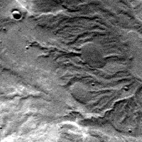
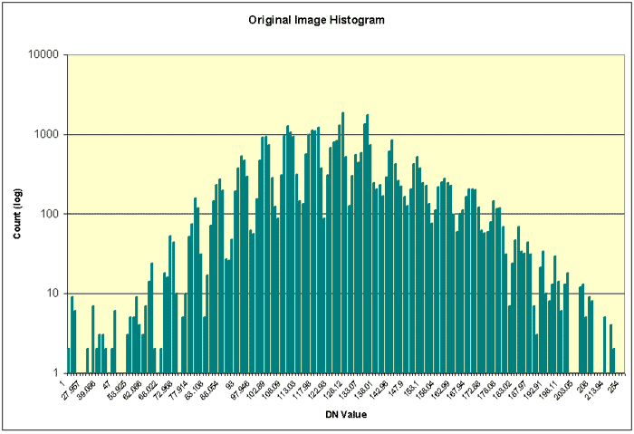
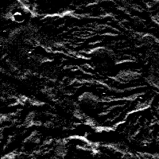
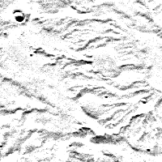
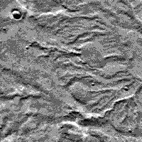
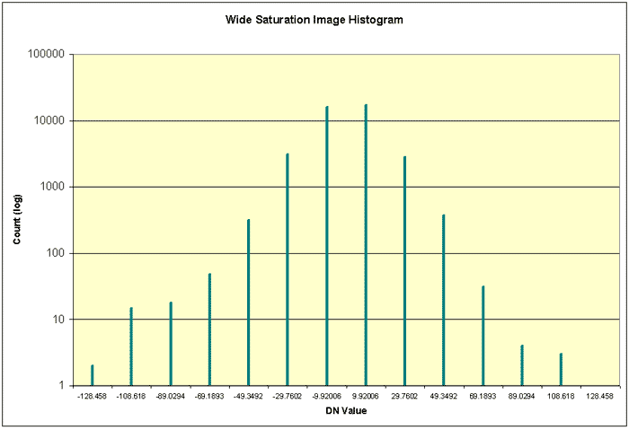

# Core Base and Multiplier

<!-- Ported from https://doi-usgs.github.io/ISIS3/Core_Base_and_Multiplier.html -->
<!-- Old Source: https://github.com/DOI-USGS/ISIS3/blob/gh-pages/Core_Base_and_Multiplier.html -->

<script src="https://asc-public-docs.s3.us-west-2.amazonaws.com/common/scripts/isis-demos/jquery-3.7.1.min.js"></script>
<link href="../../../css/isis-demos.css" media="all" rel="stylesheet"/>


<script type="text/javascript">
if (typeof window.isisDemosLoaded == 'undefined') {
    var isisDemosLoaded = true;
    $.getScript("https://asc-public-docs.s3.us-west-2.amazonaws.com/common/scripts/isis-demos/easeljs-0.8.1.min.js").done( function(s,t) { $.getScript("../../../js/isisDemos.js");});
}
</script>

!!! info "Use 32-bit images to avoid Base/Multiplier conversion issues."

    Core Base and Multipliers apply to **8-bit and 16-bit ISIS Cubes only**.  If you have enough space to work with 32-bit cubes, you can avoid the complexities of working with Base and Multiplier Values.  
    
    Append an attribute (`+_____`) to your cube's filename when running an ISIS app to set the bit-type of your output cube: `to=output.cub+32bit` See [Bit-Types](bit-types.md) for more info.

## Digital Numbers (DNs)

Recall that a [Digital Number (DN)](cube-format.md#pixel-values-digital-numbers) is the content of a pixel. DNs are used to represent mesurements like radiance, reflectance, elevation, and emissivity.

Take, for example, an 8-bit cube with elevation values in meters. Unfortunately, 8-bit pixels (unsigned) have a range of 0 to 255, which is very restrictive for elevation. ISIS deals with this problem by using a Core Base and Multiplier. In ISIS, each DN is treated as a floating point number.

## Core Base and Multiplier and ISIS

In ISIS, each app uses the [***bit-type***](bit-types.md), ***Base***, and ***Multiplier*** to find Digital Numbers (DNs) for each pixel of data. If a cube holds elevation data, the DN of each pixel is the elevation (in meters, feet, etc.) of that point on the surface. All ISIS apps use the floating point values (i.e., with the base and multiplier applied to the stored pixel value, if applicable) in their functions.

The values stored in the ***Base*** and ***Multiplier*** keywords in the cube label (located in the `Pixels` Group) are applied to the stored values in 8-bit and 16-bit cubes of the image cube in order to generate DN values using the following equation:

```math
DN value = Base + (Multiplier * stored value)
```

For example, radiance values in a radiometrically-calibrated cube are displayed as floating point values (regardless of the stored value) representing radiance from the surface in radiance units (e.g. µw/(cm2sr)). If the output calibrated image file is an 8-bit cube (i.e. values ranging from 0 to 255), the Base and Multiplier are applied, to shift/scale the stored values, to represent the actual floating point radiance values.

The resulting DNs will vary slightly between 8-bit and 16-bit cubes due to the different number and range of values that can be stored within each bit-type.

For 32-bit cubes, the Base and Multiplier keywords are not used because each pixel DN already directly represents actual floating point value. Processing image data within ISIS in 32-bit avoids processing-induced saturation of pixel DNs and bin compression problems.

??? example "Interactive Demo"

    Mouse-over the 8-bit cube to see the elevation values, then change the ***multiplier*** and ***base***, and note how the values change. 
    Remember the equation:

    ```math
    DN value = Base + (Multiplier * stored value)
    ```

    Click the questions to see the answers.

    ??? question "Change the multiplier to 100. What is the range of elevations represented?"

        With a ***Base*** of 0 and a ***multiplier*** of 100, the DNs range from 0 (black) to 25500 (white) in 100 meter increments.

    ??? question "Change the base to -500 . What is the range of pixel values?"

        With a ***Base*** of -500 and a ***multiplier*** of 100, the DNs range from -500 (black) to 25000 (white) in 100 meter increments.

    <div class="app-container" id="isis-multiplier"></div>

    !!! note

        - The equation applied to 8-bit and 16-bit cubes is `DN = Base + (stored value * Multiplier)`.
        - Base and Multiplier are not used for 32-bit cubes.
        - It may be easier to think of all ISIS cubes as 32-bit even though they may be stored as 8-bit or 16-bit.

## Processing Considerations

!!! warning "Choose Output Range Carefully"

    Append an attribute (`+_____`) to your cube's filename when running an ISIS app to set the [bit-type](bit-types.md#) of your output cube: `to=output.cub+32bit`

When processing image data with 8-bit or 16-bit output, anticipate the output DN range of the cube. This is particularly important if the input DN range will be changed after processing in an ISIS app (such as radiometric calibration or ratio).

ISIS automatically computes the Base and Multiplier values based on the provided range of valid output DNs you set for 8- or 16-bit output image cubes. Take care in setting the output range, otherwise valid data may be lost:

- **Minimum too high** - Output DNs falling below the MIN value will be set to low saturation
- **Maximum too low** - Output DNs falling above the MAX value will be set to high saturation
- **Range too wide** - Output DNs will be binned (a subrange of DNs are all combine into one DN), reducing the number of discrete DNs in the output

## Data Loss Examples

These are exaggerations, but illustrate some problems you may run into creating 8-bit and 16-bit output cubes.

!!! example ""

    { align=right }

    ***Original Image***

    ??? abstract "Histogram"

        

        Note that the pixel values are well-distributed over the range.

    ??? quote "Statistics - Few Null or HRS Pixels"

        ```sh
        Group = Results
        From              = original.cub
        Average           = 125.24218105453
        StandardDeviation = 22.665000770265
        Variance          = 513.70225991612
        Median            = 124.90322580645
        Mode              = 126.88172043011
        Skew              = 0.044865021383909
        Minimum           = 1.0
        Maximum           = 254.0
        TotalPixels       = 40000
        ValidPixels       = 39999  # Many Valid Pixels, Good.
        NullPixels        = 0
        LisPixels         = 0
        LrsPixels         = 0
        HisPixels         = 0
        HrsPixels         = 1
        End_Group
        ```

=== "Low-Saturation"

    {align=right}

    ```sh title="Command Line"
    highpass
    from=original.cub \
    to=lowsaturation+8bit+1:254 \
    lines=31 samples=31
    ```

    Here, the range is set to 1:254. By default, the pixels [`highpass`](https://isis.astrogeology.usgs.gov/9.0.0/Application/presentation/Tabbed/highpass/highpass.html) generates have values that are centered around 0. Since there will be values less than 1 in the file, setting the minimum of the output range to 1 will cause all of the pixels with values less than 1 to be set to `NULL`. In this example, over half our pixels have been set to `NULL`, needlessly throwing out what should be valid data.

    ??? quote "Statistics - Many Null Pixelss"

        ```sh
        Group = Results
        From              = lowsaturation.cub
        Average           = 11.533880695352
        StandardDeviation = 9.9256794761932
        Variance          = 98.519113064124
        Median            = 8.9423264907136
        Mode              = 1.9775171065494
        Skew              = 0.78328769658181
        Minimum           = 1.0
        Maximum           = 126.0
        TotalPixels       = 40000
        ValidPixels       = 19731
        NullPixels        = 20268  # Lots of Null Pixels, Bad.
        LisPixels         = 0
        LrsPixels         = 0
        HisPixels         = 0
        HrsPixels         = 1
        End_Group
        ```

=== "High-Saturation"

    {align=right}

    ```sh title="Command Line"
    highpass
    from=original.cub \
    to=highsaturation+8bit+-123:1 \
    lines=31 samples=31
    ```

    Now the range is set to -123:1. Like above, by default, the pixels [`highpass`](https://isis.astrogeology.usgs.gov/9.0.0/Application/presentation/Tabbed/highpass/highpass.html) generates have values centered around 0. Since there will be values greater than 1 in the file, setting the maximum of the output range to 1 will cause all of the pixels with values greater than 1 to be set to High Representation Saturation (HRS). In this example, nearly half our pixels have been set to HRS, needlessly throwing out what should be valid data.

    ??? quote "Statistics - Many HRS Pixels"

        ```sh
        Group = Results
        From              = highsaturation.cub
        Average           = -10.640719301463
        StandardDeviation = 10.791846466594
        Variance          = 116.46395015854
        Median            = -7.8135106000765
        Mode              = -1.4146604383805
        Skew              = -0.78592909289581
        Minimum           = -122.50988142293
        Maximum           = 0.9999999999954
        TotalPixels       = 40000
        ValidPixels       = 21278
        NullPixels        = 1
        LisPixels         = 0
        LrsPixels         = 0
        HisPixels         = 0
        HrsPixels         = 18721  # Lots of HRS Pixels, Bad
        End_Group
        ```

=== "Wide-Saturation"

    { align=right }

    ??? abstract "Histogram"

        === "Wide-Saturation Histogram"

            

            All pixels are in one of a few bins, not well-distributed over the range.

        === "Original Histogram"

            

            The pixel values are well-distributed over the range.

    ```sh title="Command Line"
    highpass
    from=original.cub \
    to=widesaturation+8bit+-2500:2500 \
    lines=31 samples=31
    ```

    Here, the range is set to -2500:2500. Unlike the above examples, this range encompasses the entire range of the output data. But, the range is much wider than necessary! In order to squeeze all the 5,001 possible values into the 256 possible values that can be stored in our 8-bit output file, ranges of values are combined into a single value that represents that range. Instead of getting a nice distribution of values across the range (like in our original image), now there's only a handful of values representing our data set. This effect is called ***binning***. The effects of binning are most obvious in the image histogram - compare the wide-saturation histogram graph to the histogram graph of the original image.

    ??? quote "Statistics"

        ```sh
        Group = Results
        Cube:           widesaturation.cub
        Band:           1
        Average:        -0.00419971
        Std Deviation:  16.5516
        Variance:       273.957
        Median:         9.92006
        Mode:           9.92006
        Skew:           -1.79878
        Minimum:        -128.458
        Maximum:        128.458
        
        Total Pixels:    40000
        Valid Pixels:    39999
        Null Pixels:     0
        Lis Pixels:      0
        Lrs Pixels:      0
        His Pixels:      0
        Hrs Pixels:      1
        End_Group
        ```

-----

## Tips

- ISIS doesn't need the base and multiplier to be the same in all input cubes
- If you're uncertain about what the DN range of your output cube will be, set it to make a standard 32-bit cube and run [`stats`](https://isis.astrogeology.usgs.gov/9.0.0/Application/presentation/Tabbed/stats/stats.html) on the new cube.
- In general, we recommend always working with 32-bit cubes. If you don't reduce the bit-type to 8-bit or 16-bit, you don't need to worry about saturation, binning, or loss of accuracy while working.

## Related ISIS Apps

- [`stats`](https://isis.astrogeology.usgs.gov/9.0.0/Application/presentation/Tabbed/stats/stats.html) - Get statistics on a cube.
- [`hist`](https://isis.astrogeology.usgs.gov/9.0.0/Application/presentation/Tabbed/hist/hist.html) - Get histogram data and statistics on a cube.
- [`highpass`](https://isis.astrogeology.usgs.gov/9.0.0/Application/presentation/Tabbed/highpass/highpass.html) - High Pass Filter.

## Summary

The ***base*** and ***multiplier*** are used to convert 8-bit and 16-bit cube pixel values stored on disk to digital numbers (DNs). Once converted, the DN may represent measurements like elevation, emissivity, radiance or reflectance. 32-bit pixels are not converted using the base and multiplier. They already represent the true measurement.

```math
DN = Base + (stored value * Multiplier)
```

Be careful when specifying the [bit-type](bit-types.md) for an output cube. Smaller bit-types can cause a loss of data. Larger bit types will preserve more data, but increase the size of the output cube.