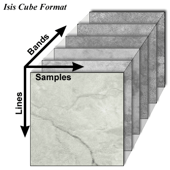

# ISIS Cube Format

<link href="../../../css/isis-demos.css" media="all" rel="stylesheet"/>

## What Is A Cube?
---------------

{ align=right }

A cube is a 3-dimensional image with axis: samples, lines, and bands. The physical dimensions of a cube are called the number of samples (NS), number of lines (NL), and number of bands (NB). Typically, the sample and line dimensions are used to represent spatial information while the band dimension represents spectral information. See the table below for examples of the line, sample, and band dimensions of a few data sets from planetary missions.

> Illustration of an ISIS3 image cube, showing the three dimensions of an ISIS3 image: width (samples), height (lines), and depth (bands)

<table>
    <thead>
        <tr>
            <th>Instrument/Camera</th>
            <th># Lines</th>
            <th># Samples</th>
            <th># Bands</th>
            <th>Bands</th>
        </tr>
    </thead>
    <tbody>
        <tr>
            <td>Mars Odyssey - Thermal Emission Imaging System, Infrared (THEMIS-IR)</td>
            <td>240</td>
            <td>320</td>
            <td>10</td>
            <td>All 10 are Infrared, ranging from 6.78 to 14.88 microns</td>
        </tr>
        <tr>
            <td>Mars Odyssey - Thermal Emission Imaging System, Visible Imaging Subsystem (THEMIS-VIS)</td>
            <td>1024</td>
            <td>1024</td>
            <td>5</td>
            <td>visible</td>
        </tr>
        <tr>
            <td>Viking Orbiter</td>
            <td>1056</td>
            <td>1204</td>
            <td>1 ?</td>
            <td>blue, minus-blue, violet, green, red, clear</td>
        </tr>
        <tr>
            <td>Mars Global Surveyor - Mars Oribiter Camera Wide Angle (MOC-WA)</td>
            <td>*</td>
            <td>3456</td>
            <td>1</td>
            <td>bandwidth encompasses visible and near-infrared</td>
        </tr>
        <tr>
            <td>Galileo Near-Infrared Mapping Spectrometer (NIMS)</td>
            <td>*</td>
            <td>20</td>
            <td>408</td>
            <td>visible to infrared</td>
        </tr>
    </tbody>
</table>

## What Are Pixels?
----------------

The individual cells within a cube are called pixels. Each pixel in a cube has a location, which is similar to rectangular coordinates (i.e.., (samples, lines, bands)). A cube can be as small as one sample, by one line, by one band (1,1,1). If we had a cube of this size, it would contain only one pixel. A cube can be as large as thousands of samples, by thousands of lines, by thousands of bands. A cube with dimensions (1000, 1000, 1000) would contain one billion pixels.  See the demo below for an interactive visual of samples, lines, and bands.

### ISIS Cube Demo

 

!!! tip

    Notice sample 1 is on the left edge of the image and line 1 is on the top edge. Therefore, to figure out the coordinates of a pixel, count lines and samples staring with (1, 1) in the upper left corner and move down and to the right.

    

## Bit-Depth (aka Bit-Type)

For more info about the amount of data stored per-pixel, or range of DNs, see [Bit-Type](../../concepts/isis-fundamentals/bit-types.md)

## Pixel Values: Digital Numbers
-----------------------------

Each pixel contains a numerical value, often referred to as the digital number, or DN. Low DNs typically show up as black in the image and high DN as white. DNs represent a measurement in units such as:

*   Radiance - A measurement describing the amount of electromagnetic energy emitted from an area of a planet
*   Reflectance - The ratio of reflected energy to incoming energy
*   Elevation - The height above or below a fixed point on the surface of a body
*   Emissivity - A measure describing a substances ability to absorb and radiate electromagnetic energy

## Core Base and Multiplier Basics
-------------------------------

An 8-bit cube needs to represent elevations in meters. Unfortunately, 8-bit pixels have a range of 0 to 255, which is very restrictive for elevation. ISIS3 deals with this problem by using a **Core Base** and **Multiplier**. Each DN is really treated as a kind of floating point number in all ISIS3 programs.  A multiplier of 100 on an 8-bit cube would make the DN range from 0 to 25500.  A base of 30 with a multiplier of 100 would make that range from 30 to 25530.

*Base + Multiplier * DN = True DN*

### Core Base and Multiplier Demo

## Sub-Pixel Positioning
--------------------

ISIS3 programs and users often need to interact at the sub-pixel level. That is, fractional pixel positions. The integral sample/line position is defined to be the center of a pixel.

Take a pixel centered at (5, 5) for example.  The upper left of the pixel contains the point (4.75, 4.75), and the lower right of the pixel contains the point (5.25, 5.25).  The threshold between pixels is a value ending in .5

## Sub-Pixel Demo

## Summary
-------

Cubes are made up of individual pixels. Each pixel usually represents some area of a planet, moon, asteroid or other body. Pixels hold a DN (digital number). That number can be one, two or four bytes long depending on the accuracy necessary to represent the data. DNs can be modified by a "Base" and "Multiplier". The columns of a cube are called samples, the rows are called lines and a plane of samples and lines is called a band.