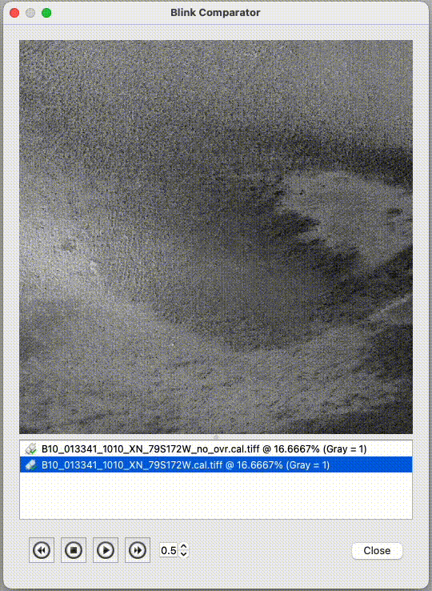

# GDAL Support

<script src="https://asc-public-docs.s3.us-west-2.amazonaws.com/common/scripts/isis-demos/jquery-3.7.1.min.js"></script>
<link href="../../../css/isis-demos.css" media="all" rel="stylesheet"/>


<script type="text/javascript">
if (typeof window.isisDemosLoaded == 'undefined') {
    var isisDemosLoaded = true;
    $.getScript("https://asc-public-docs.s3.us-west-2.amazonaws.com/common/scripts/isis-demos/easeljs-0.8.1.min.js").done( function(s,t) { $.getScript("../../../js/isisDemos.js");});
}
</script>


The Geospatial Data Abstraction Library (GDAL) provides a broad range of data formats that ISIS could read or write. Currently, ISIS only supports Geospatial Tag Image File Format (GeoTiff) but has the potential to expand to other desired formats. How to access each format along with any potential quirks of processing using said formats will be detailed below.

## Processing With GeoTIFFs

Users wanting to process using GeoTIFFs only have to use `+GTiff` as an output attribute similar to cube [storage formats](../../concepts/isis-fundamentals/command-line-usage.md#storage-format) in ISIS found under the Command Line Usage page in the Isis Fundamentals. This will produce a `.tiff` file and a `.tiff.msk` file as your output file. For example:

```
mroctx2isis from=mroraw.img to=mrotiff.tiff+GTiff
```
results in

```
mrotiff.tiff
mrotiff.tiff.msk
```
The GeoTIFFs can then be used as input like cubes to other applications.

One can also combine supported output attributes with the `+GTiff` attribute. The `GTiff` attribute will work with all ISIS [pixel type attributes](../../concepts/isis-fundamentals/command-line-usage.md#pixel-type) and [label format attributes](../../concepts/isis-fundamentals/command-line-usage.md#label-format). [Pixel storage order](../../concepts/isis-fundamentals/command-line-usage.md#pixel-storage-order) does not work and will not perform any alterations to the byte ordering.


When using +GTiff in ISIS, the current defaults will automatically set a DEFLATE compression with PREDICTOR=2. This type of compression is lossless and supports all bit types. Overviews are not automatically created by ISIS, but they can be added to any TIFF using the GDAL routine gdaladdo.

Technically, a fully realized GeoTIFF is only enabled when the data is map projected. For images that are not yet map projected, the underlying TIFF format will still be used, but there will be no geospatial map projection in the ISIS or TIFF label. For more information on the Open Geospatial Consortium GeoTIFF specification please [see](https://www.ogc.org/publications/standard/geotiff/).

### Processing With Cloud Data

GDAL allows for access to online/cloud volumes. Now that ISIS supports reading/writing GeoTIFFs, this includes accessing online/cloud data.

When working with online/cloud volumes, one can access these volumes by adding `/vsicurl/` in front of the URL for your data. See [this](https://gdal.org/en/stable/user/virtual_file_systems.html) GDAL page for more information on `vsicurl` An example process can look something like this:
```
catlab from=/vsicurl/https://astrogeo-ard.s3-us-west-2.amazonaws.com/mars/mro/ctx/controlled/usgs/T01_000881_1752_XI_04S223W__P22_009716_1773_XI_02S223W/T01_000881_1752_XI_04S223W__P22_009716_1773_XI_02S223W-DEM.tif
```
Qview can also access files in the same way, one can run
```
qview /vsicurl/https://astrogeo-ard.s3-us-west-2.amazonaws.com/mars/mro/ctx/controlled/usgs/T01_000881_1752_XI_04S223W__P22_009716_1773_XI_02S223W/T01_000881_1752_XI_04S223W__P22_009716_1773_XI_02S223W-DEM.tif
```
and see cloud data in qview.

Many cloud volumes will have overviews, or compressed versions of the image that can be requested for display rather than the full resolution image.

The best use of overviews is for responsiveness over the web. If an online dataset has overviews, users will be able to stream the overview data rather than the full resolution data. This decreases the amount of data needed to display the image. For example, if someone is displaying a 500 x 500 portion of a 1000 x 1000 image at .25 scale that has overviews, GDAL will extract the DNs from the overview with a downsampling of 8. So instead of having to transfer all 250000 DN values over the network then subsampled, only 15625 downsampled DNs will to be transferred.

Below is a comparison between a GeoTIFF with overviews and a GeoTIFF with no overviews. If a GeoTIFF does not have overviews it will be subsampled based on the scale as ISIS already does with cubes. When using overviews, the image will be sampled at the closest resolution to the requested resolution. The images will look slightly different as a result when viewed in Qview. As shown in the gif below, the images look like they are changing but in reality, `B10_013341_1010_XN_79S172W_no_ovr.cal.tiff` is being subsampled while `B10_013341_1010_XN_79S172W.cal.tiff` is using overviews.



For information on creating overviews, checkout the section on [Working with GDAL Products Outside of ISIS](gdal-support.md#working-with-gdal-products-outside-of-isis).

### ISIS Specific GeoTIFF Data

All axiliary processing data used in ISIS will be stored onto the GeoTIFF as JSON. As mentioned in ISIS [RFC 13](https://github.com/DOI-USGS/ISIS3/discussions/5698), each blob/table will be stored as a string under a keyword that represents the blob. All tables are denoted as "Table_`NAME`" and all blobs are "`OBJECT`_`NAME`". For example the ISIS `SunPosition` table can be found under `Table_SunPosition`, and the ISIS `History` blob can be found under `History_IsisCube`.

Below is an explicit example of how the table looks on the TIFF vs the Cube:

Table Metadata from Cube label
```
Object = Table
  Name                 = SunPosition
  StartByte            = 493963254
  Bytes                = 112
  Records              = 2
  ByteOrder            = Lsb
  CacheType            = Linear
  SpkTableStartTime    = 297088762.24158
  SpkTableEndTime      = 297088808.37074
  SpkTableOriginalSize = 2.0
  Description          = "Created by spiceinit"
  Kernels              = ($base/kernels/spk/de430.bsp,
                          $base/kernels/spk/mar097.bsp)

  Group = Field
    Name = J2000X
    Type = Double
    Size = 1
  End_Group

  Group = Field
    Name = J2000Y
    Type = Double
    Size = 1
  End_Group

  Group = Field
    Name = J2000Z
    Type = Double
    Size = 1
  End_Group

  Group = Field
    Name = J2000XV
    Type = Double
    Size = 1
  End_Group

  Group = Field
    Name = J2000YV
    Type = Double
    Size = 1
  End_Group

  Group = Field
    Name = J2000ZV
    Type = Double
    Size = 1
  End_Group

  Group = Field
    Name = ET
    Type = Double
    Size = 1
  End_Group
End_Object
```

Table Metadata and data on TIFF
```json
{"Table_SunPosition": 
    '{
        "_container_name":"Table",
        "_type":"object",
        "Field_J2000X":{
            "_container_name":"Field",
            "_type":"group",
            "Name":"J2000X",
            "Type":"Double",
            "Size":"1"
        },
        "Field_J2000Y":{
            "_container_name":"Field",
            "_type":"group",
            "Name":"J2000Y",
            "Type":"Double",
            "Size":"1"
        },
        "Field_J2000Z":{
            "_container_name":"Field",
            "_type":"group",
            "Name":"J2000Z",
            "Type":"Double",
            "Size":"1"
        },
        "Field_J2000XV":{
            "_container_name":"Field",
            "_type":"group",
            "Name":"J2000XV",
            "Type":"Double",
            "Size":"1"
        },
        "Field_J2000YV":{
            "_container_name":"Field",
            "_type":"group",
            "Name":"J2000YV",
            "Type":"Double",
            "Size":"1"
        },
        "Field_J2000ZV":{
            "_container_name":"Field",
            "_type":"group",
            "Name":"J2000ZV",
            "Type":"Double",
            "Size":"1"
        },
        "Field_ET":{
            "_container_name":"Field",
            "_type":"group",
            "Name":"ET",
            "Type":"Double",
            "Size":"1"
        },
        "Name":"SunPosition",
        "StartByte":"1",
        "Bytes":"112",
        "Records":"2",
        "ByteOrder":"Lsb",
        "CacheType":"Linear",
        "SpkTableStartTime":"297088762.24158",
        "SpkTableEndTime":"297088808.37074",
        "SpkTableOriginalSize":"2.0",
        "Description":"Created by spiceinit",
        "Kernels":[
            "$base/kernels/spk/de430.bsp",
            "$base/kernels/spk/mar097.bsp"
        ],
        "Data":"4cffffffd401ffffffe62effffffd3ffffffa8ffffffc11d03ffffffffffffff8525495dffffffc157fffffffb03ffffff89ffffff800c404114ffffffd1ffffffa7ffffffb6ffffffecffffffe7ffffffcaffffffbfffffffc6fffffffa48ffffffd7ffffffe1ffffffe637ffffffc0246fffffff93ffffffae39ffffffea25ffffffc074ffffffd83dfffffffa36ffffffb5ffffffb141fffffff6ffffffc264fffffff92effffffd3ffffffa8ffffffc1503cffffffb32a394a5dffffffc1fffffff5fffffff746ffffffceffffff830b4041ffffffc6066d1b4fffffffe3ffffffcaffffffbf6c4f1dffffff80ffffffe1ffffffe637ffffffc03fffffffb246ffffffde39ffffffea25ffffffc0ffffff8fffffffe85e2837ffffffb5ffffffb141"
    }'
}
```
### Working with GDAL Products Outside of ISIS
GDAL also provides a suite of applications that work on either GeoTIFFs or cubes. The programs that can be run on ISIS produced images can be found [here](https://gdal.org/en/stable/programs/index.html)

While there are plans to update the GeoTiff Driver in GDAL to support and maintain this ISIS JSON metadata, if an external application is used, the ISIS metadata within the GeoTIFF will likely not be recognized or lost during conversion. For example, during a conversion of an ISIS-created GeoTIFF using `gdal_translate`, the output file will not contain the JSON metadata.

Some notable applications are `gdalinfo`, `gdal_translate`, and `gdaladdo`.

- [`gdalinfo`](https://gdal.org/en/stable/programs/gdalinfo.html#gdalinfo) provides information on supported GDAL formats
- [`gdal_translate`](https://gdal.org/en/stable/programs/gdal_translate.html#gdal-translate) can convert one supported GDAL image format into another.
- [`gdaladdo`](https://gdal.org/en/stable/programs/gdaladdo.html#gdaladdo) builds image overviews. This is largely useful in a cloud computing environment when viewing images, as overviews will transfer less data when requesting DNs over the net.