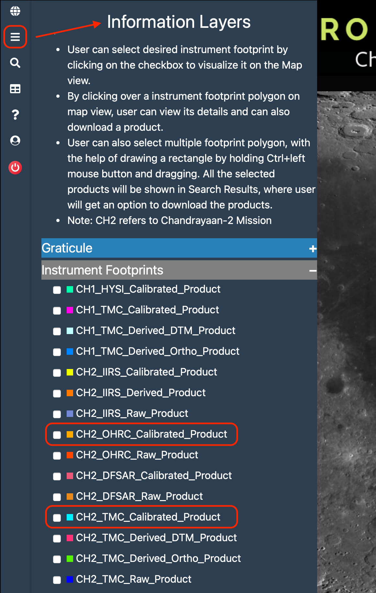
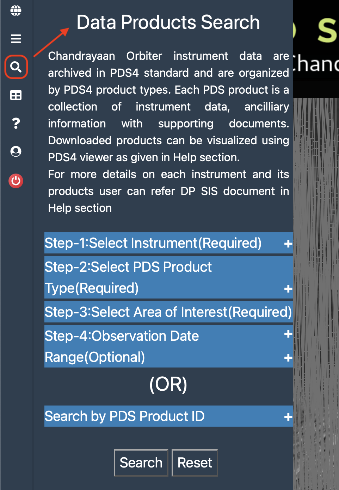
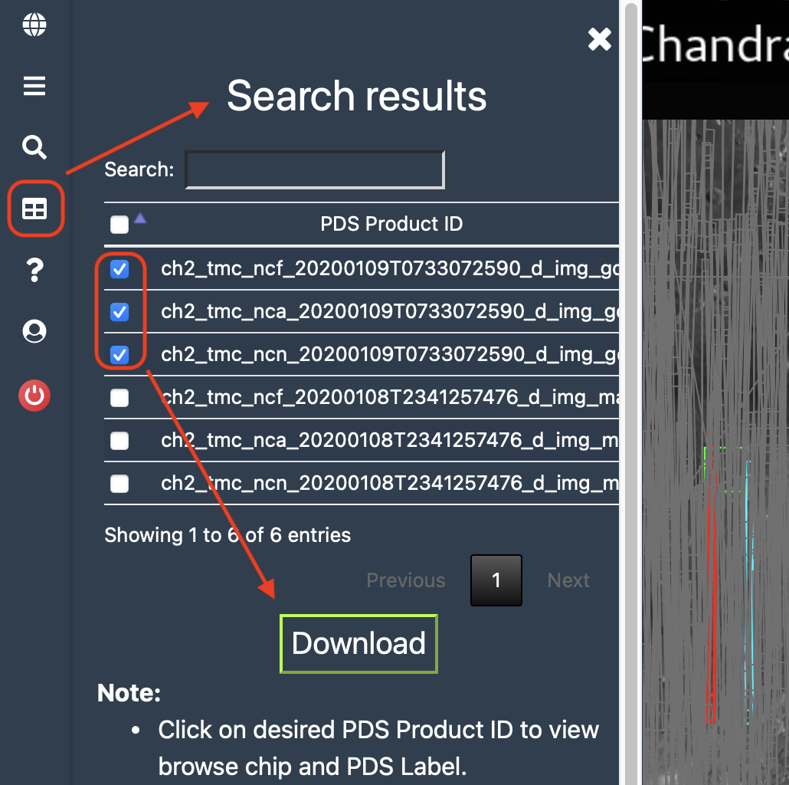

# Chandrayaan 2

<figure markdown="span">
  
  <figcaption>TMC-2 Footprints</figcaption>
</figure>

The Chandrayaan 2 is an Indian Space Research Organisation 
(ISRO) Lunar Mission. 
The Chandrayaan 2 Lunar Orbiter was launched in 2019 
and remains in successful operation (as of early 2026).
It orbits the moon in a 100km polar orbit.
The Orbiter's instruments, TMC-2 and OHRC, 
are notable for their high resolution images.


## Instruments

### TMC-2 (Terrain Mapping Camera)

- Resolution: 5m/pixel
- Band: Panchromatic Grayscale (PAN, 0.4-0.85 microns)
- Area Captured: 20km swath
- Captures Stereo Triplets with its 3 CCD arrays
    - Fore (+25 degrees)
    - Nadir (0 degrees)
    - Aft (-25 degrees)

### OHRC (Orbiter High Resolution Camera)

- Resolution: 0.25-0.32m/pixel
- Band: Visible Panchromatic Grayscale (PAN)
- Area Captured: 12km x 3km
- Can capture dual angle images, over two orbits.

## Obtaining Chandrayaan 2 Images

Chandrayaan 2 images can be downloaded from the 
[Chandrayaan 2 Data Explorer (Interactive Map)](https://chmapbrowse.issdc.gov.in) 
or the [ISRO Science Data Archive](https://pradan.issdc.gov.in/ch2/protected/payload.xhtml) 
on [Pradan](https://pradan.issdc.gov.in/ch2/) to manually browse files.  A login is required; new users must register an account.

??? info "Using the ISRO Chandrayaan Data Explorer"

    Once you are logged in to the ISRO Website, 
    you can access the [CH-2 Data Explorer](https://chmapbrowse.issdc.gov.in/MapBrowse/).

    There are two ways to search for data here:

    ### Layers Panel

    {align=right width="300"}

    Selecting a type of data on this panel will show it as a layer of footprints on the map. 
    Click on a footprint to select it.  This should bring up the Results Panel.

    *If you are using USGS software, you will most likely be interested in the `CH2_OHRC_Calibrated_Product` and `CH2_TMC_Calibrated_Product` layers.*

    -----

    ### Data Products Search Panel

    {align=right width="300"}

    This panel does a search for images.  It can be a ***filtered search***, 
    narrowed by Instrument, Data Type, Area, and (optionally) observation date, 
    or an ***ID search***, using part of the PDS Product ID. 
    For filtered searches, the search area is required and cannot span larger than 5 degrees.

    -----

    ### Results Panel

    {align=right width="300"}

    After you have selected one or more image, they will appear in the results panel, and you may download them from here with the download button.


??? note "Image Naming Convention"

    The file naming convention is as follows, and can be read using the table below:

    `ch2_<inst>_<mtc>_<YYYYMMDDTHHMMSSssss>_<P>_<prd>_<Stn>.fff`

    For Example: 

    `ch2_tmc_nca_20200207T0716469418_d_img_d18.xml`  
    Chandrayaan 2, TMC-2, Normal Operations Phase, Calibrated, Aft Camera, 2020, Feb 7th, 7:16:46.9418, Data Product, Image, ISSDC Banglador Station, Detached Label File

    | Code                 | Description                                                                                                                                 |
    |----------------------|---------------------------------------------------------------------------------------------------------------------------------------------|
    | ch2                  | Mission Name: Always ch2 for Chandrayaan 2                                                                                                                   |
    | inst                 | Instrument ID: </br> ohr - OHRC </br> tmc - TMC-2                                                                                                       |
    | m                    | Mission Phase: </br> n - Normal Operations Phase                                                                                                  |
    | t                    | Data Type: </br> r - raw data </br> c - calibrated data </br> d - derived data                                                                                |
    | c                    | Imaging Mode/Camera ID/Band:  </br> For OHRC: </br> p - Panchromatic High Resolution Camera </br> For TMC-2: </br> f - Fore Camera </br> n - Nadir Camera </br> a - Aft Camera |
    | YYYYMMDDT HHMMSSssss | Observation Start Time: Year, Month, Day, "T", Hours, Minutes, Seconds, 1/1000 seconds                                                      |
    | P                    | PDS Data Product Categories: </br> d - Data (data directory); </br> b - Browse (browse directory); </br> g - Gridded (geometry directory)                     |
    | prd                  | PDS Data Product Name: </br> img - Image </br> brw - Browse </br> grd - Gridded </br> dtm - Digital Terrain Model </br> oth - Orthoimage                                                                             |
    | Stn                  | Station ID: </br> d32 - ISSDC Bangalore; </br> d18 - ISSDC Bangalore; </br> gds - Gold Stone, USA </br> cnb - Canberra, Australia                                   |
    | fff                  | File Extension: </br> img - Image Data File </br> xml - Detached Label File </br> jpg - Browse Data File </br> csv - Geometry Data File                             |

## Using TMC-2 and OHRC Images in ISIS

??? info "Recommended: Use Calibrated Images"

    Isis can import calibrated Chandrayaan 2 images. 
    Raw images may work, but might not have the right DNs.
    Look for the `c` in the middle of the third segment
    of the filename to confirm if a product is calibrated.
    In the normal phase of the mission, that segment is  
    `ncp`, `ncn`, `nca`, or `ncf` for calibrated images in the normal mission phase.
    
    Calibrated images:
    
    - `ch2_ohr_ncp_20211228T2209123959_d_img_d18` (OHRC)
    - `ch2_tmc_ncn_20241216T0659485431_d_img_d18` (TMC Nadir)
    - `ch2_tmc_nca_20221205T1434464659_d_img_d32` (TMC Aft)
    - `ch2_tmc_ncf_20230205T2054187027_d_img_n18` (TMC Fore)

    Other Data Types:

    - ch2_tmc_nra_20191212T2004326989_d_img_d18 (Raw)
    - ch2_tmc_ndn_20200109T0733072590_d_dtm_gds (DTM)
    - ch2_tmc_ndn_20200108T2341257476_d_oth_mad (Ortho)

Calibrated Chandrayaan 2 images from the TMC-2 and OHRC instruments 
are available in the PDS-4 standard.  They can be imported 
into ISIS with 
[`isisimport`](https://isis.astrogeology.usgs.gov/Application/presentation/Tabbed/isisimport/isisimport.html). 
Templates to import images from either instrument 
are included and should be autodetected in ISIS versions 10.0 and above.

!!! example "Importing Chandrayaan 2 Images with `isisimport`"

    The Image (`.img`) and Label (`.xml`) files for an observation should be placed in the same directory, and the Label (`.xml`) file should be specified in the `from` parameter for `isisimport`:

    ```sh
    isisimport from=ch2_tmc_nca_20200207T0716469418_d_img_d18.xml to=ch2_tmc_nca_20200207T0716469418_d_img_d18.cub
    ```

## Further Chandrayaan 2 Examples:

- [Chandrayaan 2 TMC-2 Images in Knoten - Astro Docs Jupyter Notebook](../../../getting-started/csm-stack/ingesting-tmc2.md)
- [Chandrayaan 2 OHRC - Ames Stereo Pipeline](https://stereopipeline.readthedocs.io/en/latest/examples/chandrayaan2.html)

## Sources

- [Chandrayaan 2 - ISRO Science Data Archive](https://pradan.issdc.gov.in/ch2/)
- [Chandrayaan 2 Science - ISRO](https://www.isro.gov.in/Chandrayaan2_science.html)
- [DEMs of the Lunar surface from Chandrayaan 2 TMC-2 Imagery Initial Results - LPSC/USRA (PDF)](https://www.hou.usra.edu/meetings/lpsc2020/pdf/1127.pdf)