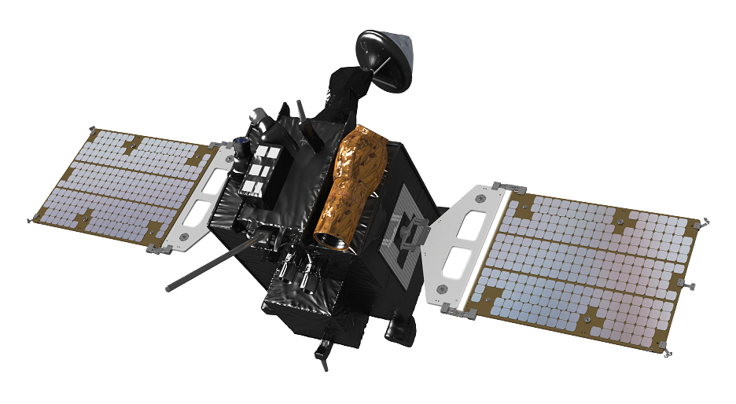

# Korea Pathfinder Lunar Orbiter (KPLO, aka Danuri)

The KPLO is a spacecraft that began orbiting the moon in December 2022.  It is operated by the Korea Aerospace Research Institute (KARI).  It carries five KARI-Developed instruments (LUTI, PolCam, KMAG, KGRS, DTNPL) as well as NASA's ShadowCam.

## ShadowCam

[{width=250 align=right}](assets/kplo-spacecraft.png "KPLO Spacecraft Render")

ShadowCam was developed by ASU, MSSS, IM, and NASA, based on the LROC NAC but more sensitive.  Its purpose is to capture images of permanently-shadowed regions (PSRs) on the moon, and provide information about water ice.

[About ShadowCam - Intuitive Machines](https://shadowcam.im-ldi.com/about)

## ShadowCam Data Sources

Search Tools:

- **[ASU Space Exploration Resources Data Portal](https://data.im-ldi.com/mds.html/)**
- **[WUSTL Lunar Orbital Data Explorer](https://ode.rsl.wustl.edu/moon/productsearch)**

Data Volume (for manual browsing):

- **[PDS Archive](https://pds.shadowcam.im-ldi.com/)**

## Processing ShadowCam Images

- [Importing ShadowCam Images into ISIS](shadowcam-import.md)
- [Calculating Photometric Angles with ShadowCam Images](shadowcam-photometric-angles.md)

