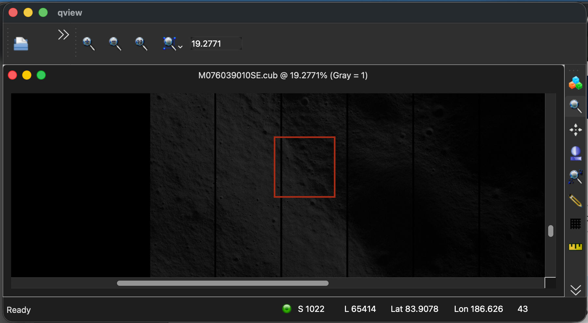
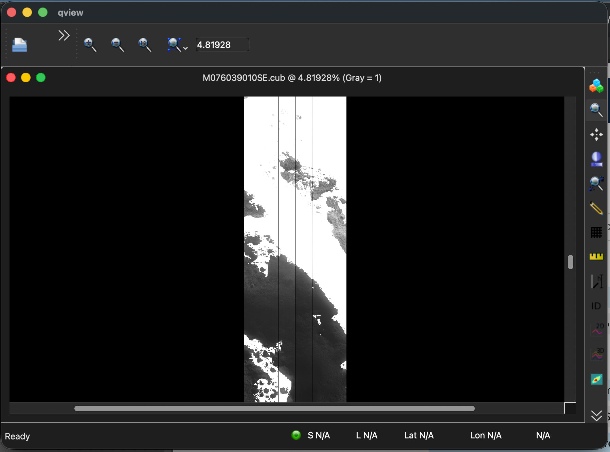

# Korea Pathfinder Lunar Orbiter (KPLO, aka Danuri)

The KPLO is a spacecraft that began orbiting the moon in December 2022.  It is operated by the Korea Aerospace Research Institute (KARI).  It carries five KARI-Developed instruments (LUTI, PolCam, KMAG, KGRS, DTNPL) as well as NASA's ShadowCam.

## ShadowCam

ShadowCam was developed by ASU, MSSS, IM, and NASA, based on the LROC NAC but more sensitive.  Its purpose is to capture images of permanently-shadowed regions (PSRs) on the moon, and provide information about water ice.

[About ShadowCam - Intuitive Machines](https://shadowcam.im-ldi.com/about)

## ShadowCam Data Sources

TODO: List ShadowCam Data Sources

## Processing ShadowCam Data in ISIS

### Import & Calibration

In ISIS, Raw EDR ShadowCam images can be imported and calibrated as so:

```sh
shadowcam2isis from=edr/M076039010SE.cub to=M076039010SE.2isis.cub
shadowcamcal from=M076039010SE.2isis.cub to=M076039010SE.cub
```

Note that the ShadowCam Team also provides calibrated ISIS cubes as part of its data releases, which are ready-to-go and do not need to be imported or calibrated.  If run on a precalibrated ShadowCam cube, the import and calibration ISIS apps will notify that that their processing is not needed.

### Attaching SPICE

After import and calibration, attach spice information with:

```sh
spiceinit from=M076039010SE.cub
```

To initialize with a specific DEM, run `spiceinit` with `shape=user` instead, specifying your DEM with the `model=` option:

```sh
spiceinit from=M076039010SE.cub shape=user model=$ISISDATA/base/dems/LRO_LOLA_LDEM_global_128ppd_20100915.cub
```

### Calculating Photometric Angles with `phocube`

`phocube` can calculate incedence and emission angles for an image.  For the best data, the image should be `spiceinit`ed with a local DEM.

#### 1. Finding an area of interest

Open qview and locate an area of interest. Shadowcam specializes in the shadowed areas of the moon. 
The white pixels in this image are HRS Special Pixels, which are areas too bright for shadowcam to capture. 
Find an area that includes darker pixels, which will contain more useful data.

<div class="grid cards" markdown>

- [](assets/shadowcam-crop.png "A region of interest on a Shadowcam image")  
    *A region of interest on a Shadowcam image*

- [](assets/shadowcam-hrs.png "HRS Special Pixels in Shadowcam")  
    *HRS Special Pixels in Shadowcam*

</div>

#### 2. Crop

This calculation takes a long time, so if possible, crop your image to a location of interest. 
If using a full-sized shadowcam image, expect phocube to run for hours, maybe a day or two.

```
crop from=M076039010SE.cub to=M076039010SE.crop.cub sample=1024 line=65414 nsamples=512 nlines=512
```

#### 3. Run `phocube`

??? note "Monitoring Progress"

    To monitor `phocube`'s progress over what may be a long run-time, configure the `ProgressBar=On` and set the desired `ProgressBarPercent` in the IsisPreferences file, under `Group=UserInterface`:

    ```
    Group=UserInterface
        ProgressBarPercent = 1
        ProgressBar        = On
        ...
    EndGroup
    ```

Set `localincidence` and `localemission` to true if using your own DEM.  (The non-local versions will just use general values from the ellipsoid.)  It creates a band (an array with a measurement at each pixel) for each specified item.  In this example, it makes a band for local incedence angles, and a band for local emission angles:

```sh
phocube from=M076039010SE.crop.cub to=M076039010SE.angles.cub \
localemission=true localincidence=true \
emission=false incidence=false phase=false latitude=false longitude=false
```

By default, phocube outputs a band for emission (ellipsoid), incidence (ellipsoid), phase, latitiude, and longitude.  They must be set to false if the those bands are not desired.
