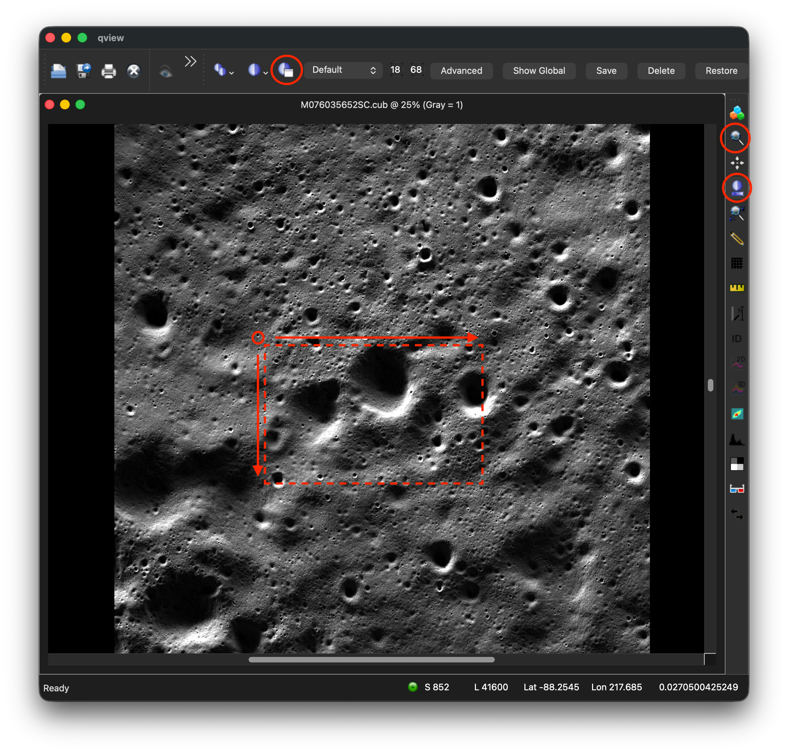
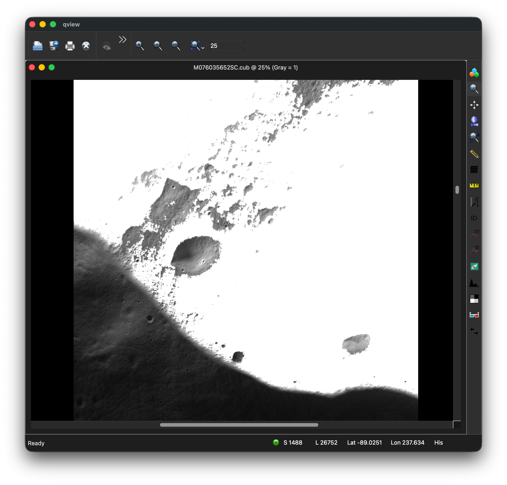
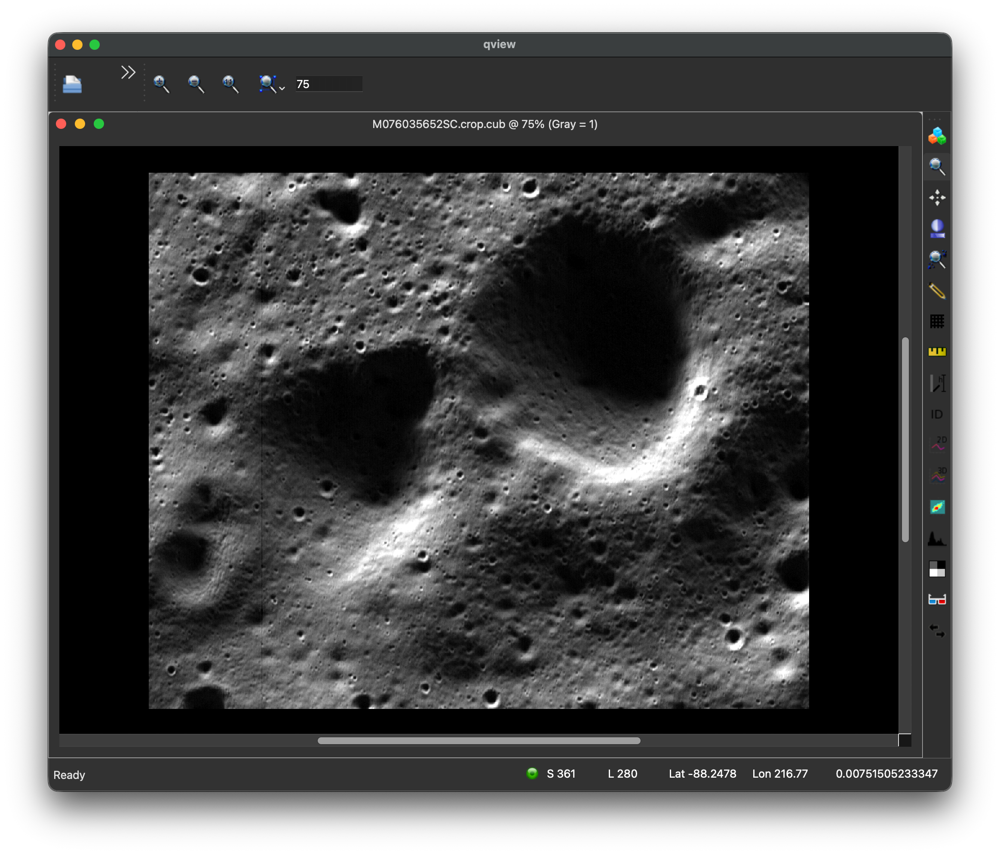
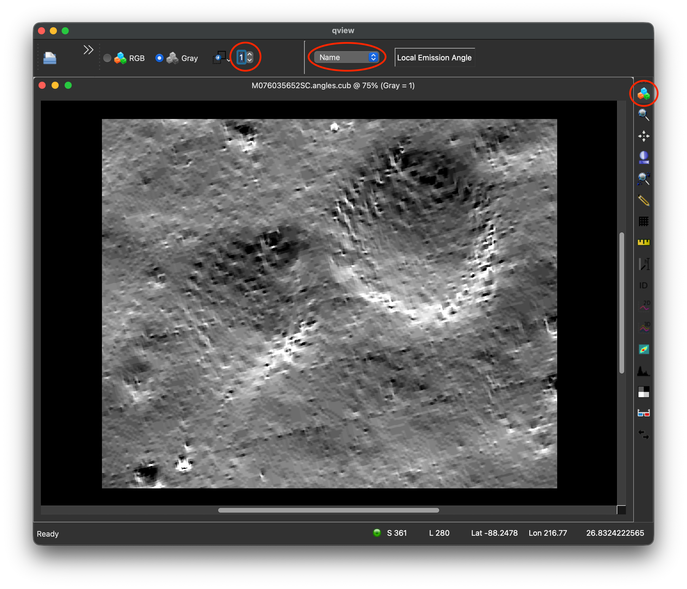
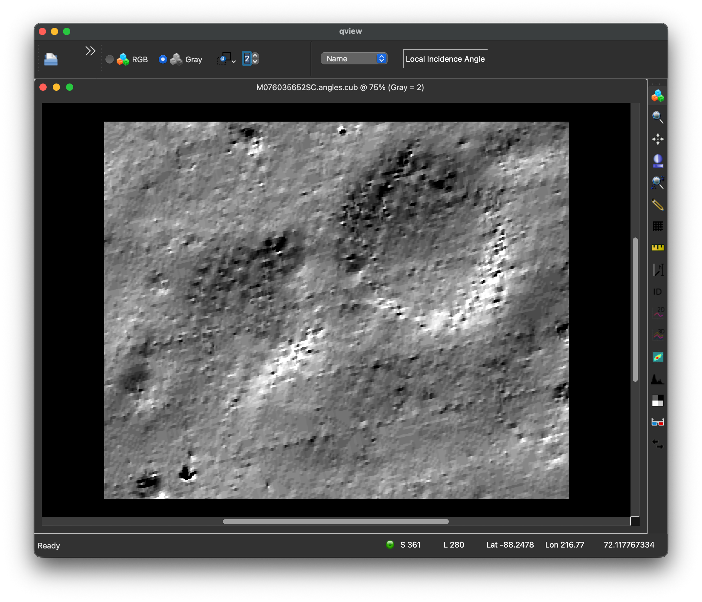
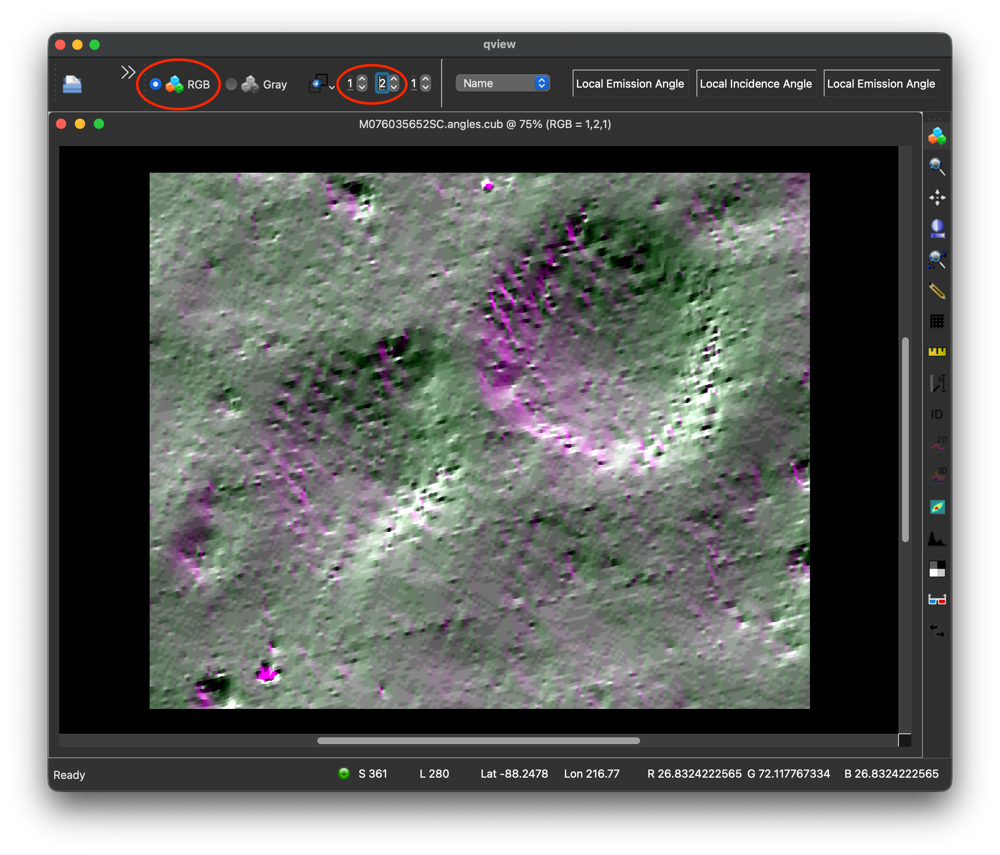
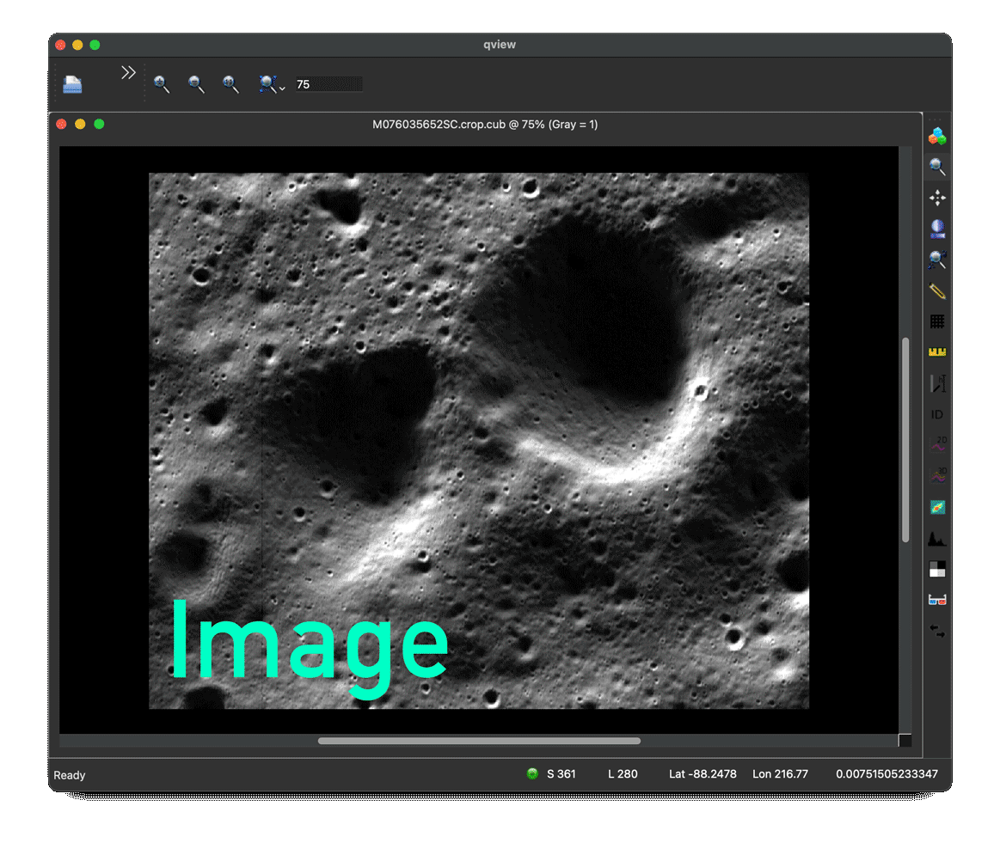

# ShadowCam - Calculating Photometric Angles

### PSRs

Capturing Data on **[Permanently Shadowed Regions (PSRs)](https://svs.gsfc.nasa.gov/11218)** is ShadowCam's specialty. Obscured by shadows, they are colder than other areas of the moon, and may harbor frozen substances.

### ShadowCam Observations

For this guide, we will use [ShadowCam Observation M076035652S](https://data.im-ldi.com/mds/shadowcam_published/M076035652S).  It is in the south-polar region of the moon, and intersects with the [Sverdrup Crater PSR](https://planetarynames.wr.usgs.gov/Feature/5782), which has been [suggested as a candidate](https://planetarynames.wr.usgs.gov/Feature/5782) for settlement.

- [Download Calibrated ISIS Image: M076035652SC.cub](https://pds.shadowcam.im-ldi.com/observation/2025/001/M076035652S/M076035652SC.cub)


??? note "Finding ShadowCam Observations"

    As of August 2026, ShadowCam Observations can be searched with the [WUSTL Lunar Orbital Data Explorer](https://ode.rsl.wustl.edu/moon/productsearch) or [ASU Space Exploration Resources Data Portal](https://data.im-ldi.com/mds.html), or manually browsed for on the [ShadowCam PDS Data Volume](https://pds.shadowcam.im-ldi.com/observation).

    An array of data products are available for each image. For our observation, M076035652S**C**.cub is the **C**alibrated 32-bit version, and M076035652S**E**.cub is the non-calibrated 8-bit **E**DR version.

### Local DTMs

Using a local DTM will give you the best data for calculating photometric angles. According to its [Space Exploration Resources Data Portal Page](https://data.im-ldi.com/mds/shadowcam_published/M076035652S), our observation ranges from about -88.88 to -85.6 latitude.

For this guide, use the LRO LOLA Derived DEM [ldem_85s_10](https://ode.rsl.wustl.edu/moon/productDetail.aspx?product_id=ldem_85s_10m&product_idGeo=33203452). It covers lunar latitudes -85 to the south pole (-90).

- Download [ldem_85s_10m.img](https://pds-geosciences.wustl.edu/lro/lro-l-lola-3-rdr-v1/lrolol_1xxx/data/lola_gdr/polar/img/ldem_85s_10m.img)
- Download [ldem_85s_10m.lbl](https://pds-geosciences.wustl.edu/lro/lro-l-lola-3-rdr-v1/lrolol_1xxx/data/lola_gdr/polar/img/ldem_85s_10m.lbl)

??? note "Finding DEMs"

    As of August 2026, LOLA Derived DEMs can be found at the [WUSTL LODE Data Portal](https://ode.rsl.wustl.edu/moon/productsearch), under `Lunar Reconnaissance Orbiter` > `LOLA` > `Derived Data` > `PDS4 Gridded Data Record Shape Map (GDRDEM)`

#### Import DEM into ISIS

```
pds2isis from=ldem_85s_10m.lbl to=ldem_85s_10m.cub
demprep from=ldem_85s_10m.cub to=ldem_85s_10m.shape.cub
```

## Using ISIS

### 1. spiceinit with DEM

For the best data, the image should be [`spiceinit`](https://isis.astrogeology.usgs.gov/dev/Application/presentation/Tabbed/spiceinit/spiceinit.html)ed with a local DEM.

```sh
spiceinit from=M076035652SC.cub shape=user model=ldem_85s_10m.shape.cub
```

### 2. Cropping (Optional)

The `phocube` calculation can take long time. If necessary, crop your image to a location of interest to save time. 
If using a full-sized shadowcam image, expect phocube to run for hours, maybe even day or two on slower machines.

??? example "Finding an area of interest in `qview`"

    Open `qview` and locate an area of interest.

    ```sh
    qview M076035652SC.cub
    ```

    1. The Sverdup Crater ranges from 212 to 222 longitude.  Focus there.  Use the **magnifying glass tool** to zoom in.
    1. This area is quite dark.  Once you've zoomed in to a dark area, use the **stretch tool** (Bright/Dark circle with gradient line underneath) to brighten it for easier viewing.
    1. Beginning at S850 L41600 are a few craters in the PSR.  Extend from that point down 1024 samples, and 832 lines.  `qview` can't crop to exact numbers, so note these numbers to use in the `crop` command:
        - sample: 850
        - line: 41600
        - number of samples: 1024
        - number of lines: 832

    You may notice large portions of the cube are blanked-out with a white areas. 
    ShadowCam is meant to capture shadowed areas - 
    the white pixels in this image are HRS Special Pixels, 
    which are areas too bright for shadowcam to capture. 
    Find an area that includes darker pixels, 
    which will contain more useful data.

    <div class="grid cards" markdown>

    - [](assets/shadowcam-qview-area.png)  
        *A region of interest on a Shadowcam image.*

    - [](assets/shadowcam-qview-hrs.png)  
        *HRS Special Pixels in Shadowcam*

    </div>

#### The `crop` command

Once an area of interest has been determined, create a cropped image with this command:

```
crop from=M076035652SC.cub to=M076035652SC.crop.cub sample=850 line=41600 nsamples=1024 nlines=832
```

<div class="grid cards" markdown>

- [{width=250}](assets/shadowcam-qview-crop.png)  
    *The cropped shadowcam image*

</div>

### 4. Run `phocube`

`phocube` can calculate incedence and emission angles for an image.  (See also: [Camera Geometry - phocube](concepts/camera-geometry-and-projections/camera-geometry/#phocube) and the [phocube ISIS App Manual](https://isis.astrogeology.usgs.gov/dev/Application/presentation/Tabbed/phocube/phocube.html))

??? note "Enabling the Progress Bar in IsisPreferences"

    To monitor `phocube`'s progress over what may be a long run-time, configure the `ProgressBar=On` and set the desired `ProgressBarPercent` in the IsisPreferences file, under `Group=UserInterface`:

    ```
    Group=UserInterface
        ProgressBarPercent = 1
        ProgressBar        = On
        ...
    EndGroup
    ```

Set `localincidence` and `localemission` to true if using your own DEM.  (The non-local versions will just use general values from the ellipsoid.)  It creates a band (an array with a measurement at each pixel) for each specified item.  In this example, it makes a band for local incedence angles, and a band for local emission angles:

```sh
phocube from=M076035652SC.crop.cub to=M076035652SC.angles.cub \
localemission=true localincidence=true \
emission=false incidence=false phase=false latitude=false longitude=false
```

By default, phocube outputs a band for emission (ellipsoid), incidence (ellipsoid), phase, latitiude, and longitude.  They must be set to false if the those bands are not desired.

#### Visual Output

In `qview`, click band tool (three colored cubes in the top right).  Then, in the dropdown at the top which defaults to `Center`, change it to `Name` to view the name of the current band ("Local Emission Angle" or "Local Incidence Angle").  The number toggle(s) to the left of the dropdown change which band is shown.  In RGB mode, multiple bands may be shown in different colors.

<div class="grid cards" markdown>

- [](assets/shadowcam-local-emission-angle.png)  
    *Local Emission Angle Band in `qview`*

- [](assets/shadowcam-local-incidence-angle.png)  
    *Local Incidence Angle Band in `qview`*

- [](assets/shadowcam-photometric-angles-color.png)  
    *Both bands overlaid in different colors.*

- [](assets/shadowcam-angle-blink-50.gif)  
    *A cycle showing the cropped image, and the emission, incidence, and emission+incidence bands.*

</div>