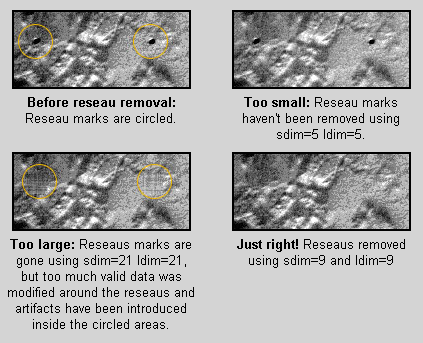

# Working with Mars Viking Orbiter Data

[About the Viking Mission to Mars](index.md)

## Processing Viking Orbiter VIS Data

  - **Level 0: Data Ingestion**  
    Acquire Viking VIS data from one of numerous sources, import it into
    ISIS, and initialize it with SPICE information.

  - **Level 1: Noise Removal and Radiometric Calibration**  
    Remove the salt-and-pepper noise, reseau marks, and missing track
    noise in the data, then radiometrically calibrate the image data so
    the DNs represent reflectance (ranging from 0 to 1).

  - **Level 2 - Projection**  
    Geodetic corrections are performed and the images projected to a map
    projection.

  - **Level 3 – Photometric Correction and Enhancement**  
    The effect of sun angle on the image is corrected, and the images
    are tone matched.

  - **Level 4 – Building a Mosaic**  
    A seamless mosaic is created.


## Level 0 Processing - Data Ingestion

This is the starting point for the production of a Viking mosaic. The
steps within the level zero processing provide the gateway into ISIS
processing. Running the following applications will **ingest the
Engineering Data Record (EDR)** and place necessary information into the
labels of the image. Viking Obiter information has been around for quite
awhile so problems with the dataset have been discovered and accounted
for, allowing this process to run smoothly.


### Acquiring Viking Orbiter Data

- **NASA PDS** ([Home](https://pds.nasa.gov/))
    - [Image Atlas Search - Viking](https://pds-imaging.jpl.nasa.gov/search/?fq=ATLAS_MISSION_NAME%3A%22viking%20orbiter%22)
    - [Data Holdings - Viking](https://pds-imaging.jpl.nasa.gov/holdings/#viking)
    - [Online Data Volumes - Viking](https://pds-imaging.jpl.nasa.gov/volumes/viking.html)

- [WUSTL Mars Orbital Data Explorer](https://ode.rsl.wustl.edu/mars/index.aspx)

- [ASU Viking Orbiter Image Map](http://global-data.mars.asu.edu/bin/viking.pl)

- [ASU JMARS](https://jmars.mars.asu.edu/)

!!! tip "Widen the search area to find shifted images"

    When searching for Viking orbiter data that covers your area
    of interest, it can be useful to widen you search area by as much as
    five degrees to each value in your latitude and longitude search values.
    The camera pointing for Viking images may be off by as much as a half
    frame so expanding your search will help insure that you get all the
    images that were acquired for that area.

??? info "Data Acquisition Tool: PDS Image Atlas"

    #### Search

    The [PDS Image Atlas](https://pds-imaging.jpl.nasa.gov/search/?fq=ATLAS_MISSION_NAME%3A%22viking%20orbiter%22&fq=TARGET%3Amars&fq=PRODUCT_TYPE%3Aedr) 
    can search for Viking Orbiter Imagery. 
    Here are some relevant filters:

    | Parameter                | Notes                                                                              |
    | ------------------------ | ---------------------------------------------------------------------------------- |
    | **Mission**              | 'Viking Orbiter' to focus on images from this mission.                             |
    | **Target**               | 'Mars' to filter out Viking images of other planetary bodies.                      |                                                                                     |
    | **Product Type**         | 'edr' The type of Viking data to search for.                                       |
    | **Lat/Lon Bounding Box** | Enter min and max latitude and longitude values that box in your area of interest. |

    #### Browsing Manually

    The [PDS Data Holdings](https://pds-imaging.jpl.nasa.gov/holdings/#viking) 
    offer Viking data archives by data type.

    The [PDS Online Data Volumes](https://pds-imaging.jpl.nasa.gov/volumes/viking.html) 
    offer an archived copy of the CDs and tapes originally used to catalog and 
    distribute Viking data.

    <div class="grid cards" markdown>

    - See Also: [Planetary Image Atlas Help :octicons-arrow-right-24:](http://pds-imaging.jpl.nasa.gov/Atlas/intro.html)

    </div>


??? info "Data Acquisition Tool: JMARS"

    JMARS is a Geographic Information System (GIS) tool.  It can be used to evaluate
    Viking images that cover an area of interest before the images are
    downloaded. The tool displays Viking footprints and a variety of other
    Mars data. JMARS can:

    - query the database of Viking images,
    - select browse images to display on-screen and download via the web,
    - generate a list of Viking images (great for creating scripts), and
    - save the displayed map as an image.

    #### Using JMARS to Display Viking Footprints

    1. Once JMARS is installed, launch it and log in.
    1.  In the Main tab of the Layer Manager, hit the Add new layer button,
        which opens a menu.
    1.  Select Viking from the Stamp menu.
    1.  In the Add Viking stamp layer window, just hit the Okay button,
        leaving all the fields blank.
    1.  A new tab named Viking stamps will appear in the Layer Manager. When
        it's done loading the footprints, its drawing status indicator will
        turn from red to green, the footprints will be displayed on the map
        and the images shown on the map are list in the Layer Manager.
    1.  Right click on a listing in the image list and on the footprints
        displayed on the screen - there's lots of options for working with
        and accessing information and data. For example, Render and Load
        Selected Stamps will download and display the Viking images for the
        selected footprints on the map, giving you the ability to preview
        the data. Web Browse will launch an image's web page in your browser
        so you can access the information and data.

    Other options in JMARS to help you search for
    Viking data include the tools for narrowing your search and modifying
    your display in the Settings, Query, and Render tabs in the Layer
    Manager, the various tools in the main menus, and adding other
    data layers to the display.

    [](assets/Jmars_screenshot.png "Jmars_screenshot.png")  
    *Screenshot of JMARS displaying Viking 2 footprints:  
    The Viking footprints (called stamps in JMARS) are displayed as blue polygons on the map. 
    Several footprints are shown selected in the Layers Manager Viking 2 Stamps list and 
    highlighted yellow on the map. Several Viking images are displayed the map, filling in 
    those footprints with a preview of the actual image data. Image names for the selected 
    footprints have been copied from JMARS to our text editor. In this case, we selected 
    Viking 2 for our new layer.*

    <div class="grid cards" markdown>

    - **See [JMARS (ASU) :octicons-arrow-right-24:](http://jmars.asu.edu/)**  
      *Free, registration required for full functionality*

    </div>


### Importing Viking Orbiter Data

Viking VIS data are distributed in Standard Data Products formatted
files, which have an .imq extension. These are compressed PDS format images,
and are decompressed before ingesting into ISIS.

!!! example "Ingest VIS Images into ISIS with [`vik2isis`](https://isis.astrogeology.usgs.gov/Application/presentation/Tabbed/vik2isis/vik2isis.html)"

    ```sh
    vik2isis FROM=Viking_input.imq To=Viking_image.cub
    ```
    Decompression for .imq images is included in
    `vik2isis`, no need to do anything extra.

??? warning "Viking VIS Problem Data - Clouds and Dust"

    Some problems with the Viking data set are due to environmental conditions, 
    and the easiest way to spot them is to visually inspect the images. 
    Clouds and airborne dust degrade the quality of the image.
    
    The decision whether to use image is a judgment based on ***how much
    information will be gained*** vs. ***how much the image will degrade*** the
    final product.

    <div class="grid cards" markdown>
    
    - [](assets/684px-Viking_Image_with_clouds.jpg "Viking Image with Clouds")

        *VIS Image with Clouds*

    - [](assets/684px-Viking_Image_with_dust.jpg "Viking Image with Dust")
        
        *VIS Image with Dust*

    </div>


### Adding SPICE

??? quote "About SPICE"

    ISIS geometrically and
    photometrically characterizes pixels in raw planetary instrument images.
    Information such as latitude, longitude, phase angle, incidence angle,
    emission angle, local solar time, sun azimuth, and a many other pixel
    characteristics can be computed.

    For ISIS to work, the **SPICE** kernels must first 
    be determined for the particular raw instrument image. 
    These kernels maintain the spacecraft position and orientation 
    over time as well as the target position and instrument
    specific operating modes.

!!! example "Add SPICE information to your cub with [`spiceinit`](https://isis.astrogeology.usgs.gov/Application/presentation/Tabbed/spiceinit/spiceinit.html)"

    To add SPICE information to your cube, run
    [`spiceinit`](https://isis.astrogeology.usgs.gov/Application/presentation/Tabbed/spiceinit/spiceinit.html)
    on the image so other ISIS apps 
    (i.e, [`cam2map`](https://isis.astrogeology.usgs.gov/Application/presentation/Tabbed/cam2map/cam2map.html),
    [`campt`](https://isis.astrogeology.usgs.gov/Application/presentation/Tabbed/campt/campt.html),
    [`qview`](https://isis.astrogeology.usgs.gov/Application/presentation/Tabbed/qview/qview.html))
    will have the info they need. Only the FROM parameter is needed:

    ```sh
    spiceinit FROM=my.cub
    ```


## Level 1 Processing - Noise Removal and Radiometric Calibration

To create a Level 1 Viking image, clean up noise and imaging 
artifacts, then radiometrically correct the data to get an image
representing the reflectance of the surface.

### Noise/Artifact Removal

<div class="grid cards" markdown>

- [{width=150 align=left}](assets/Viking_Salt_Noise.png "Viking Salt Noise")  
    *Remove white 'salt noise' speckles*

- [{width=150 align=left}](assets/Viking_reseau.png "Viking Reseau")  
    *Remove reseaus*

- [{width=150 align=left}](assets/Viking_Missing_Tracks.png "Viking Missing Tracks")  
    *Fill in missing tracks*

- [{width=150 align=left}](assets/Viking_Black_Specks.png "Viking Black Specks")  
    *Remove black 'pepper noise' speckles*

</div>


??? info "Removing Salt and Pepper Noise with [`viknosalt`](https://isis.astrogeology.usgs.gov/Application/presentation/Tabbed/viknosalt/viknosalt.html) and [`viknopepper`](https://isis.astrogeology.usgs.gov/Application/presentation/Tabbed/viknopepper/viknopepper.html)"

    The black and white speckle in Viking images is a result of
    interference during the transfer of information from the spacecraft.
    This speckle is called salt and pepper noise because it has the
    appearance of grains of salt and pepper sprinkled across the image.

    **Removing Salt Noise**

    [`viknosalt`](https://isis.astrogeology.usgs.gov/Application/presentation/Tabbed/viknosalt/viknosalt.html)
    runs `noisefilter` five times to identify white noise
    within the image. The identified pixels are set to a value of null. The
    final step in `viknosalt` is a low pass filter that replaces the null
    pixels with a valid value.

    ***`viknosalt` command***:

    ```sh
    viknosalt FROM=Viking_image.cub TO=Viking_nosalt.cub
    ```

    <div class="grid cards" markdown>

    - [](assets/600px-Viking_Salt_Before.png "Viking Salt Before")  
        *Before removing salt noise*

    - [](assets/600px-Viking_Salt_After.png "Viking Salt After")  
        *After removing salt noise*

    - [](assets/Viking_salt_Before_Closeup.png "Viking Salt Before Closeup")  
        *Close-up before salt noise removal*

    - [](assets/Viking_salt_After_Closeup.png "Viking Salt After Closeup")  
        *Close-up after salt noise removal*

    </div>

    **Removing Pepper Noise**

    See the 
    [`viknopepper`](https://isis.astrogeology.usgs.gov/Application/presentation/Tabbed/viknopepper/viknopepper.html)
    ISIS application docs for info on removing pepper noise.  It works similarly to `viknosalt`.


??? info "Removing Reseaus"

    Reseau marks on Viking images are small dots that form a grid of points
    across the image. These marks are created by design -- reseaus are
    etched in a pattern over the lens of the camera, and the marks the
    reseaus make on the image will allow us to refine the image in later
    processing steps. The images below show reseau marks on a Vidicon tube
    similar to the ones used for the Viking VIS cameras, and an enlargement
    of a reseaus mark in a Viking image.

    <div class="grid cards" markdown>

    - [](assets/600px-Voyager_reseaus_closeup.png "Voyager Reseaus Closeup")  
        *Reseaus on a Vidicon tube*

    - [](assets/Reseau_mark_closeup.png "Reseau Mark Closeup")  
        *Close-up of reseau mark on a Viking image*
    
    </div>

    The next step is to find and remove reseaus. The reseau locations found
    in this step are used to correct for the optical distortion. The vidicon
    cameras used by the Viking spacecraft have electronic distortions
    similar in pattern to the optical distortion in a film camera. These
    electronic distortions are introduced because the scanning pattern of
    the electron beam used to read out the charge-stored image vidicon is
    more "barrel-shaped" than rectangular. Interactions between the charge
    on the photo-cathode that represent the image itself and the electron
    beam produce additional complex high-order distortions.

    Reseaus removal is accomplish by using two applications: 
    [`findrx`](https://isis.astrogeology.usgs.gov/Application/presentation/Tabbed/findrx/findrx.html) 
    to find the reseaus, then 
    [`remrx`](https://isis.astrogeology.usgs.gov/Application/presentation/Tabbed/remrx/remrx.html)
    to remove them.

    #### Finding Reseaus with findrx

    [`findrx`](https://isis.astrogeology.usgs.gov/Application/presentation/Tabbed/findrx/findrx.html)
    will read in a cube and refine the position of the reseau points based
    on information about where the reseaus should be and comparing those
    areas of the image against a Viking reseau pattern to locate the actual
    reseau mark in the image. The image labels are then modified to reflect
    the new sub-pixel accuracy.

    ***`findrx` command***:

    ```sh
    findrx  FROM=Viking_nosalt.cub
    ```

    #### Removing Reseaus with remrx

    [`remrx`](https://isis.astrogeology.usgs.gov/Application/presentation/Tabbed/remrx/remrx.html)
    removes reseaus from a Viking image. When you select a value for the
    parameters sdim (sample dimension) and ldim (line dimension), you want
    to choose values that are large enough to remove the reseaus but, the
    value should not be larger then required or you will remove valid data.
    For most Viking images we have found that of sdim= 9 and ldim= 9 works
    well. While the reseaus are visibly removed from the images, the reseau
    information is retained in the labels for later processing stages.
    
    ***`remrx` command***:

    ```sh
    remrx FROM=Viking_nosalt.cub TO=Viking_norx.cub sdim=9 ldim=9
    ```

    <div class="grid cards" markdown>

    - [](assets/600px-Reseau_before.png "Reseau Before")  
        *Input image (Viking image with salt noise removed)*

    - [](assets/600px-Reseau_after.png "Reseau After")  
        *Reseaus removed using `sdim=9` and `ldim=9`*

    </div>

    

    *Comparisons of remrx with different ldim/sdim parameters*


??? info "Remove Missing Track Noise with [`vikfixtrx`](https://isis.astrogeology.usgs.gov/Application/presentation/Tabbed/vikfixtrx/vikfixtrx.html)"

    The **missing track noise** is caused by interference from the
    spacecraft electronics. Track noise appears as a regular pattern of NULL
    values across the image in increments of seven pixels. This noise occurs
    because of the way Viking images were transmitted to Earth. On the
    spacecraft, an image is broken into seven tracks, each track contains
    every seventh value along a scan line. If errors occurred while a track
    was transmitted to Earth, then the track contains incorrect data values.
    Sometimes, several tracks are missing.

    [`vikfixtrx`](https://isis.astrogeology.usgs.gov/Application/presentation/Tabbed/vikfixtrx/vikfixtrx.html)
    checks for this type of noise in each of the seven tracks of a
    Viking image cube. If the threshold of invalid pixels in a given track
    is met or exceeded, then the track is considered bad and all pixels are
    replaced by interpolating valid values from either side of the bad
    pixels.

    ***`vikfixtrx` command***:

        vikfixtrx FROM=Viking_norx.cub TO=Viking_notrx.cub

    <div class="grid cards" markdown>

    - [](assets/600px-Vikfixtrx_before.png "Vikfixtrx Before")**
        *Input image (Viking image with reseaus removed)*

    - [](assets/600px-Vikfixtrx_after.png "Vikfixtrx After")  
        *Output image (null tracks removed)*

    </div>

      
    *Close-up Input image*

      
    *Close-up Output image (null tracks removed)*


<div class="grid cards" markdown>

- See Also: [General Overview of Noise & Artifacts :octicons-arrow-right-24:](../../../concepts/image-processing/overview-of-noise-and-artifacts.md)

</div>

### Radiometric Calibration

<div class="grid cards" markdown>

- [{width=150 align=left}](assets/600px-Viking_Radiometric.png "Viking Radiometric")  
    *Radiometrically calibrate the image*

</div>


??? info "Radiometric Calibration of Viking VIS Data"

    [`vikcal`](https://isis.astrogeology.usgs.gov/Application/presentation/Tabbed/vikcal/vikcal.html)
    performs radiometric corrections to planetary images acquired by the
    Viking orbiter cameras. It performs a radiometric correction in
    two steps:

    1.  Correct the varying response of the vidicon across the field of view
        of the camera. Multiplicative and additive correction coefficients,
        as a function of line and sample position, are applied to an image
        array to produce the results of an 'ideal' camera.
    2.  Convert the image data to reflectance values, where reflectance (a
        value between 0 and 1) is the ratio of the observed radiance and the
        radiance of a white screen, normal to the incident rays of the Sun.

    ***`vikcal` command***:

    ```sh
    vikcal FROM=Viking_notrx.cub TO=Viking_cal.cub
    ```

    The output image of **vikcal** will be a 32-bit (floating-point) cube,
    where the pixel values represent reflectance.


<div class="grid cards" markdown>

- See Also: [General Overview of Radiometric Calibration :octicons-arrow-right-24:](../../../concepts/image-processing/overview-of-radiometric-calibration.md)

</div>

## Level 2 Processing - Geometry

Producing a mosaic requires geometric processing on the individual
images that make up the desired mosaic. The individual images are
geometrically transformed from spacecraft camera orientation to a common
map coordinate system. ISIS has generic software applications that are
applied to all supported mission data. Based on the information in the
image labels that was added in our earlier steps, the software
recognizes the instrument and performs accordingly.

<div class="grid cards" markdown>

- See Also: [Map Projecting Images :octicons-arrow-right-24:](../../../how-to-guides/image-processing/map-projecting-images.md)

</div>

## Level 3 Processing - Photometric Correction

**Currently, ISIS photometric correction capabilities are under
development. When the applications are released, we will develop a page
here in this lesson providing you with examples and tips for using ISIS
photometric correction tools.**

Photometric normalization is applied to all images that make up a mosaic
in order to adjust and balance the brightness levels among the images
that were acquired under the different lighting conditions.

Generally, radiometrically calibrated spacecraft images measure the
brightness of a scene under specific angles of illumination, emission,
and phase. For a planetary body that doesn't have a significant
atmosphere, this brightness is controlled by two basic classes of
information: the **intrinsic properties of the surface materials** ,
(including composition, grain size, roughness, and porosity), and
**local topography of the surface**.


## Level 4 Processing - Mosaicking

**Currently, ISIS photometric correction capabilities are under
development. When the applications are released, we will finish
developing this lesson and provide you with tips for using ISIS to
create your final, seamless mosaic using mapmos and tone matching
procedures and applications.**

The final steps in our processing will produce a **seamless mosaic** of
all the images in our region of interest. In spite of best efforts at
radiometric calibration and photometric normalization, small residual
discrepancies in image brightnesses are likely to remain. These
brightness differences appear as *seams* in a mosaic. There are a couple
of methods that will minimize the seams resulting in an improved
aesthetic result for a final mosaic. The accuracy and quality of the
radiometric calibration and photometric normalization effects how well
the seams can be minimized.


## Exporting ISIS Data

<div class="grid cards" markdown>

- See: [Exporting ISIS Data :octicons-arrow-right-24:](../../../getting-started/using-isis-first-steps/exporting-isis-data.md)

</div>