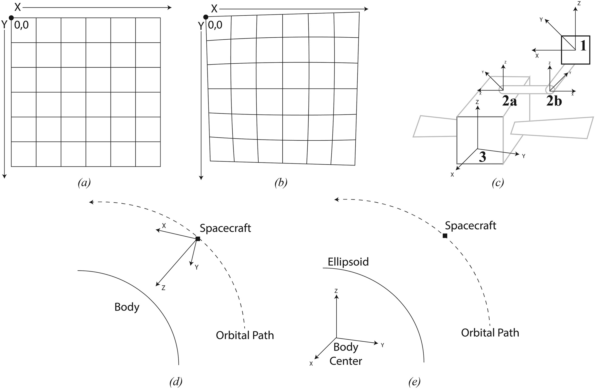

# Reference Systems

In order to describe the location of an object, it is necessary to identify a point of reference by which the object can be localized. One might think of the object with respect to their own position, but it is also possible to describe the object as being at a certain location on a grid, or even some angular distance from a known location.  Despite the differences in the methods of localizing the object, each of these descriptions produces a valid representation of the object's location with respect to some point of reference.  By specifying an origin about which other objects can be oriented, we begin to form the basis of a "reference system," which establishes a coordinate system that can be used to describe positions.  In practice, a reference system is required to define a datum, which is a known coordinate reference by which unknown points can be identified and a set of axes with an associated plane in which angular measurements can be made.  Some examples of common photogrammetric reference systems are as follows:

- Image Reference System: a 2-dimensional (column/row or line/sample) reference system with a defined (0,0) datum, typically at the upper-left of the frame
- Distorted Focal Plane Reference System: a 2-dimensional (x,y) reference system nominally represented in Cartesian space and measured millimeters.  This reference system is used to account for the distortion in an image reference system.
- Sensor Reference System: a 3-dimensional (x,y,z) reference system in which the z axis typically follows the sensor's boresight (if it is an optical sensor) as well as x and y axes that are traditionally parallel to the sensor's x and y axes.
- Spacecraft Reference System: a 3-dimensional (x,y,z) reference system in which the datum is centered on the spacecraft's center of mass. Axes are often represented using 𝜔, 𝜙, 𝜅, which are analogous to yaw, pitch, and roll, but instead of representing axial rotations with respect to onboard navigation, they are expressed with respect to axes of an arbitrary coordinate system.
- Body Centered Body Fixed (BCBF): a 3-dimensional (x,y,z) reference system in which the datum is centered on the target body's center of mass.

<figure markdown>
  
  <figcaption>Reference Systems: (a) Framing sensor image reference frame with origin in upper left corner of the upper left pixel; (b) distorted focal plane reference frame with the distorted origin again in the upper left; (c) sensor (1), gimbal (2a, 2b illustrating an articulated gimbal), and spacecraft (3) reference frames; (d) spacecraft reference frame in the standard configuration with the x axis being the orbital path; (e) body-centered body-fixed (BCBF) reference frame (Laura et al., 2020).</figcaption>
</figure>

# Reference Frames
It is important to note that a reference system does not provide a description of an object's location, but it instead provides a _means_ for describing locations.  When locations are described using a reference system, the result is a "coordinate reference frame," which offers information related to an object's position, orientation, and velocity at a single instant in time.

!!! INFO "Reference System vs Reference Frame"
    A __reference system__ provides an origin, axes / planes, and a fixed point that allows for the description of an object.  A __reference frame__ is a description within the context of that reference system, and provides the location of an object at a given moment in time.

# Frame Chains

Reference frames often have dependencies on other reference frames, which results in a "frame chain" that must be calculated. For example, consider a common scenario in which a camera is intended to record an image of a planetary body.  The camera is mounted on a gimbal, which is mounted on the spacecraft.  In order to move from the image plane to a BCBF system, it is necessary to know the location of both the camera and the planetary body.  However, in order to know the location of the camera, it is necessary to know the extrinsics not only of the camera, but also of the gimbal and the spacecraft to which it is mounted.  The dependency chain that is formed is known as a "frame chain," and the entire chain of extrinsics must be calculated in order to accurately model the objects' relative locations.
