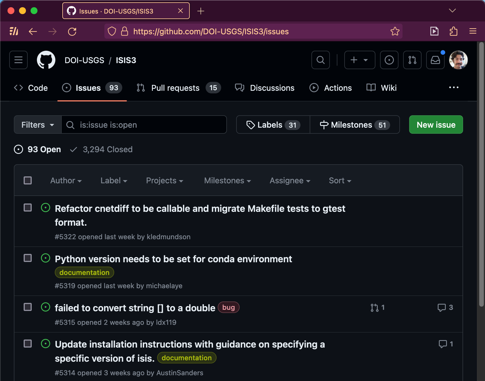
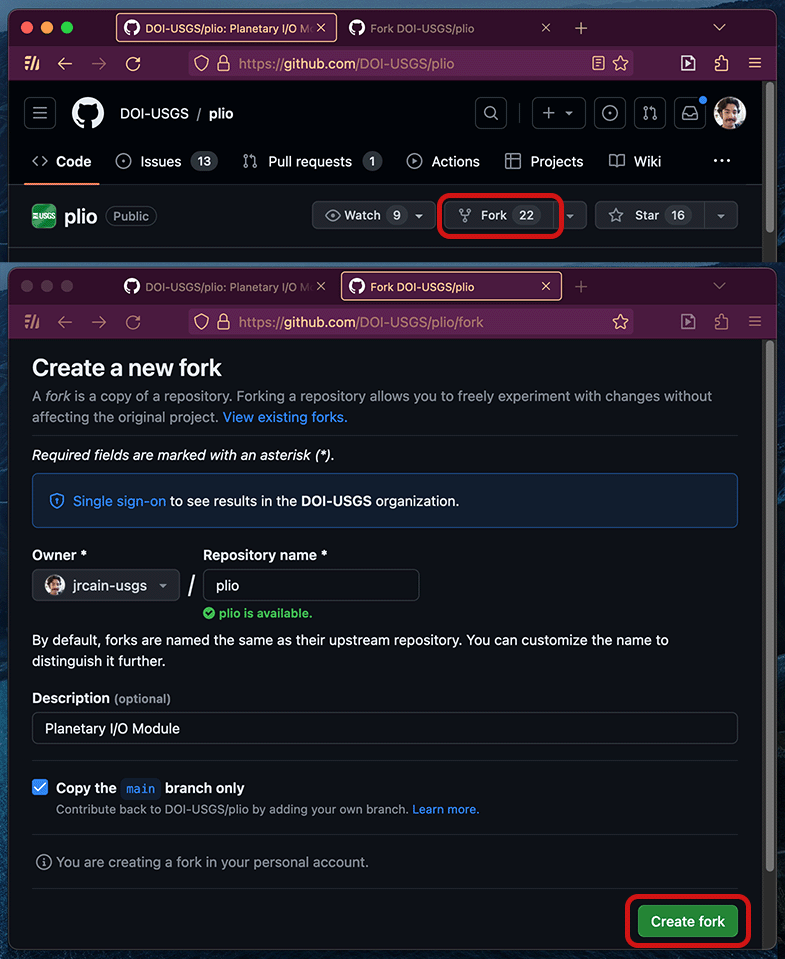
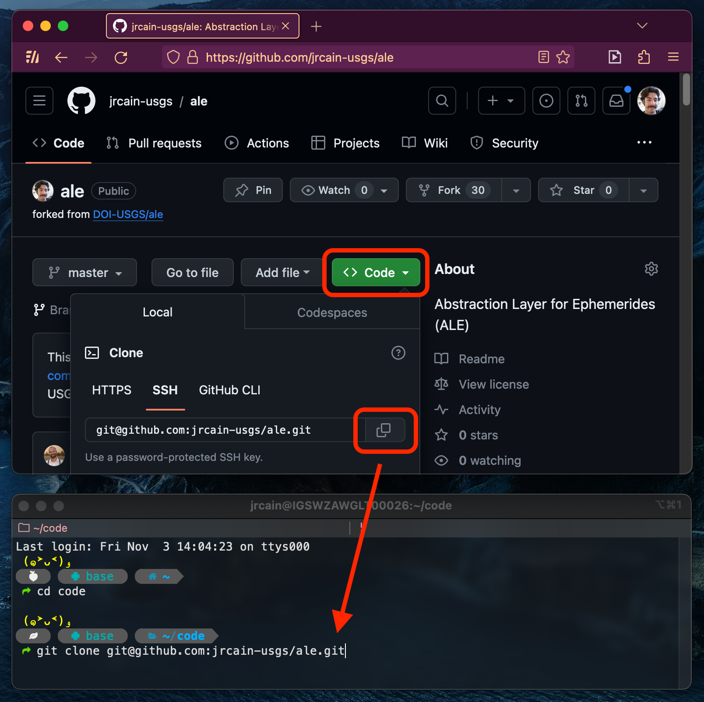

# Contributing with Git

Community contributions are an important part of USGS open source projects.  Contributions from people like you help make our projects at the USGS better for everyone.  And, by contributing, you can build your skills, display your work, and form community connections.

This guide walks through the process of using git.  Git is the system the USGS uses to manage changes and contributions to our software projects.

If you aren't comfortable contributing code, you can also help by contributing documentation or tutorials, or [opening](../../how-to-guides/software-management/guidelines-for-reporting-issues.md) and commenting on git issues.

???+ abstract "Git Contribution Process Overview"
    ```mermaid
    flowchart TD
        A(fa:fa-cloud upstream/main*\nProject Repo) -->|Other Changes to upstream/main\nFETCH & MERGE with your branch| E
        A -->|FORK| B
        B(fa:fa-cloud origin/main\nYour Remote Repo) -->|CLONE| C
        C[fa:fa-computer main\nLocal Repo] -->|BRANCH| D
        D[fa:fa-computer feature-branch\nLocal Repo] -->|Edit, Save, Test & Make COMMITS| E
        E[fa:fa-computer feature-branch\nLocal Repo with changes] -->|PUSH| F
        F(fa:fa-cloud origin/feature-branch\nYour Remote Repo with changes) -->|Open PULL REQUEST, Pull Request MERGED| G
        G(fa:fa-cloud upstream/main \nProject Repo with your changes)
    ```
    * Note, for some projects, the working branch may be `master` or `dev` instead of main.

## Prerequisites

### Installing Git

***git*** is a version control system for managing a project's codebase or documentation, its history, and various versions and contributions.

If you don't have git yet, install as appropriate for your system.

```sh
# Run to see if/what version of git is installed
git version
```


??? tip "Installing git for Windows, Mac, and Linux" 

    | System  | Installation                                                                                                                                                                                               |
    |---------|------------------------------------------------------------------------------------------------------------------------------------------------------------------------------------------------------------|
    | Windows | Download and install git for Windows from the [git-scm website (external)](https://git-scm.com/download/win).  If you have winget you may install git via `winget install --id Git.Git -e --source winget` |
    | Mac     | Mac installs git automatically when you run it from the terminal.  If you have Homebrew, you may install git via `brew install git`.                                                                       |
    | Linux   | Install git using your package manager. For example, `sudo apt install git` on Ubuntu.                                                                                                                     |


```sh
# Once git is installed, set your name and email:
git config --global user.name "Your Name"
git config --global user.email "emailaddress@example.com"
```

### CONTRIBUTING.md

Some projects have a `CONTRIBUTING.md` file in their repo.  It can help explain that project's contribution guidelines, and how you can make your contribution most effective.

## Issues

{ align=right width=450 }

Your contribution should be related to an issue.  You can browse a list of issues on the repository page for each project. 

A git issue is not necessarily something wrong, it may also be a feature to be added.

!!! tip

    If you are working on an issue you have found yourself, and the issue is not listed yet, please [report the issue](../../how-to-guides/software-management/guidelines-for-reporting-issues.md) and assign it to yourself.

-----

## Fork

{ align=right width=450 }

A ***fork*** is a copy of a repository.  The repo that has been forked from is usually called ***"upstream"***, and your fork/working copy is called ***"origin"*** by default.

Your fork is your own working copy, where you can test your code or add new features.  While you are working on your contribution, you don't have to worry about unfinished code affecting the upstream repo; you are on your own fork.  Later, when your code is done, there is a review process before your code can be merged into the upstream repo.

#### To make a fork:

1. Click the fork button on the repository page
1. Enter a name for your fork.
    - If you want to contribute back to the original repo, you can just leave the name the same (your fork is differentiated by your username).

-----

## Clone

To clone a repository means to make a copy of it, usually on your local computer (or the computer you will be working on it from).

{ align=right width=450 }

To download a repo to your computer:

1. Go to your fork's web page.
1. Click the "clone" or "code" button.
1. Copy the address of the repo.
   - If you use the SSH address, you will need to [set up SSH keys on your computer and in your git account (external link)](https://docs.github.com/en/authentication/connecting-to-github-with-ssh).
1. In your terminal, navigate to (or create) a parent directory of choice for your various repos (commonly named "source", "repos", "workspace", or "code").
1. Run
        ```sh
        git clone <your_repo_address>
        ```   
   When it is done, you will have a subdirectory with your repo in it.
1. Navigate into your newly cloned directory from you terminal.  Future git commands will be run from within this directory.

-----

## Branch

A ***branch*** is a version of the codebase within a repository.  Your cloned repository should come with a default branch, likely called "main", "master", or "dev".

Before making changes, make a new branch for your contributions with

    git checkout -b <branch_name>

Running this command will make a copy of the current branch with your new name and switch to it (*check it out*) for you to work on.

!!! tip

    You can switch between branches to work with different versions of the codebase.
    
    `git checkout <branch_name>` switches to another existing branch.
    
    `git branch <branch_name>` creates a new branch without switching to it.

## Git Remotes

A remote is a a copy of a repository hosted online.  When you clone a repository, a remote called ***"origin"*** is added to your local repo, referencing the online repo it was cloned from.

The first step of keeping your work in sync with the overall project is adding it as a remote:

1. Go to the upstream repo's page (the original repo you forked yours from earlier).
1. Click the "clone" or "code" button.
1. Copy the address of the repo.
1. Run the `git remote add upstream <upstream-repo-address>` command.

You should now have two remotes, one called ***"origin"***, and one called ***"upstream"***.  You can list your remotes with `git remote -v`.

## Keeping Updated

1. `git fetch upstream` fetches info about new changes from the upstream remote.
1. `git merge upstream/main` merges any new changes from the upstream main branch into your current branch.

If a change in your code conflicts with a change being merged in, you might have a **Merge Conflict**!  See [GitHub's documentation (external)](https://docs.github.com/en/pull-requests/collaborating-with-pull-requests/addressing-merge-conflicts/resolving-a-merge-conflict-using-the-command-line) for resolving conflicts on the command line, or [Microsoft's video (external)](https://www.youtube.com/watch?v=HosPml1qkrg) for resolving conflics in Visual Studio Code.

If you are about to make a new branch, you might want to `git merge upstream/main` into your own main branch.  Then, whatever branch you make off of your main will start out up to date.

## Making Changes

By this point, you should have made your own fork, cloned the repo to your computer, and made a branch to work on your feature.  You can now start development.  Remember to test and save (and commit, see below) your work as you go along.

## Tracking Files

To track a new file or changes to an existing file with git, you will have to add it with `git add <your_file>`.  You can use `git add -A` to add all changes (this includes changes like removing or renaming a file).  Changes that have been added but not committed are called *staged* changes.  You must save a file before you `git add` it.

If you go back and make another modification to a file, you will have to `git add` that file again.  Use `git status` to list the tracking status of files in your repository.  See [Git Basics from the Pro Git Book (external)](https://git-scm.com/book/en/v2/Git-Basics-Recording-Changes-to-the-Repository) for more details.

You can make a `.gitignore` to tell git never to track a certain file or directory, for example, a secret key, personal configuration, or a build output.  See more info from the [gitignore git documentation (external)](https://git-scm.com/docs/gitignore).

## Commits

A commit is a set of changes to the codebase.

`git commit -m "Short description of your changes"` will commit changes for all tracked files (remember to add them as above).

## Push

When you have made one or more commit, sync them to your remote repo with `git push`.  If you haven't pushed your current branch before, you may have to set its destination with `git push --set-upstream origin <branch_name>`.

-----

!!! note "Before your Pull Request: Tests, Changelogs, and Upstream Changes"

    Before you make a Pull Request, make sure to include tests and/or changelog entries if needed for the project recieving contributions.

    ### Tests

    In order to verify the correct functioning of your contributions, please add automatic tests as appropriate to the repository. For examples, see [App Testing Cookbook](../../how-to-guides/isis-developer-guides/app-testing-cookbook.md) and [Writing ISIS Tests with cTest and gTest](../../how-to-guides/isis-developer-guides/writing-isis-tests-with-ctest-and-gtest.md) for info on ISIS tests.

    ### Changelogs

    If there is a changelog, please add an entry to record your changes.  Changelog entries typically consist of authorship info and a one or two sentence summary of your changes.

    ### Upstream Changes

    [As above](#keeping-updated) make sure to fetch and merge the latest changes from the upstream repo.


## Create Pull Request

A Pull Request (aka PR, Merge Request, or MR) is a request to merge your branch into an upstream repository or another branch.  On your repo's page, you can initiate a pull request.  You should include a description of the changes you made.  Be sure to mention any issues you addressed - "Fixes #364" will tell the system to automatically close issue 364 when your PR is merged.  Some projects require certain information to be recorded as part of a Pull Request.  See [Guidelines for Pull Requests](../../how-to-guides/software-management/guidelines-for-pull-requests.md).


## Code Review

Part of the Pull Request process is a code review.  Before your code is merged, another developer will look through it, and may make comments, ask questions, or request changes.  If the review goes well (which may involve some additional changes, commits, and pushes on your part), the reviewer can approve the Pull Request.  It can then be merged.