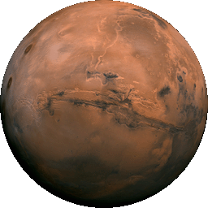

# ISIS - About

## What is ISIS?

ISIS is an image processing app. Its focus
is planetary surface imagery collected by NASA
missions to the Moon, Mars, and other celestial bodies.

If you're familiar with commercial image processing packages like 
Photoshop, Envi, or ERDAS Imagine, you'll recognize many of ISIS's 
standard image processing operations, like
contrast, stretch, image algebra, filters, and statistical analysis.

ISIS has unique features for
processing data from NASA spacecraft missions such as Voyager, Viking,
Galileo, Mars Global Surveyor, and Mars Odyssey. It can import
raw mission data into a usable geospatial image product, and has tools
for digital mosaicking of adjacent images, photometric modeling and
normalization, removal of systematic noise patterns, overlaying
graticules, and other cartographic/scientific analysis
functions.

!!! info inline end "Valles Marineris Mosaic"

    { width=200 }

    This famous mosaic of the Valles Marineris hemisphere of Mars was
    created using ISIS. The mosaic is composed of 102 Viking Orbiter
    images of Mars, and is projected into point perspective, a view
    similar to that which one would see from a spacecraft at a distance of
    2500 kilometers from the surface of the planet.

USGS Astrogeology has used ISIS for:

  - **Global mosaics** : mosaicking hundreds or thousands of images
    collected by space exploration missions to create seamless,
    cartographically accurate, global image maps for use by the
    planetary science community for research and mapping. See our
    [Map-a-Planet](https://astrocloud.wr.usgs.gov/index.php?view=map2) site to view these
    products.

  - **Geologic Mapping** : we create accurate base image maps for
    geologists to use in creating geologic maps. See our [Planetary
    Geologic Mapping
    Program](https://www.usgs.gov/special-topics/planetary-geologic-mapping)
    for more information about this work.

  - **Scientific Research** : Using ISIS to mosaic images of a region
    of interest to create a scientifically accurate image product, and
    analyzing the imagery based on spectral, textural, or other
    attributes. See the following Science Magazine abstract for examples
    of images from the Mars Exploration Rover Mission Microscopic Image
    that were processed and analyzed using ISIS as part of the
    scientific research resulting from the mission: [Textures of the
    Soils and Rocks at Gusev Crater from Spirit's Microscopic
    Imager](https://www.usgs.gov/media/files/textures-soils-and-rocks-gusev-crater-spirits-mi).

- Learn the basics of **[Using ISIS :octicons-arrow-right-16:](introduction-to-isis.md)**

- More on [ISIS's History :octicons-arrow-right-16:](../../concepts/history/isis-history.md)

