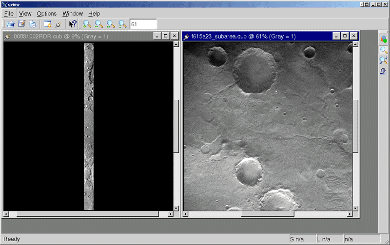
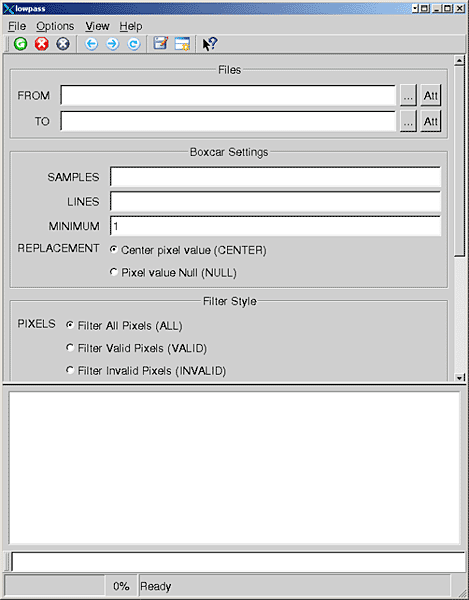
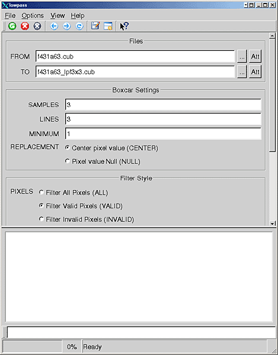
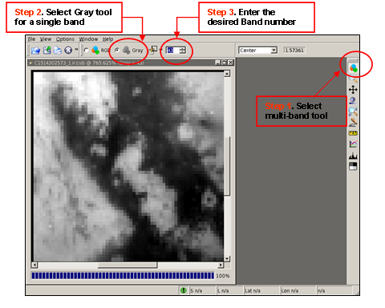
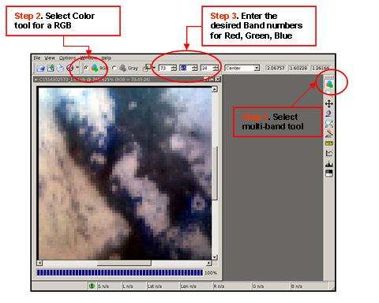
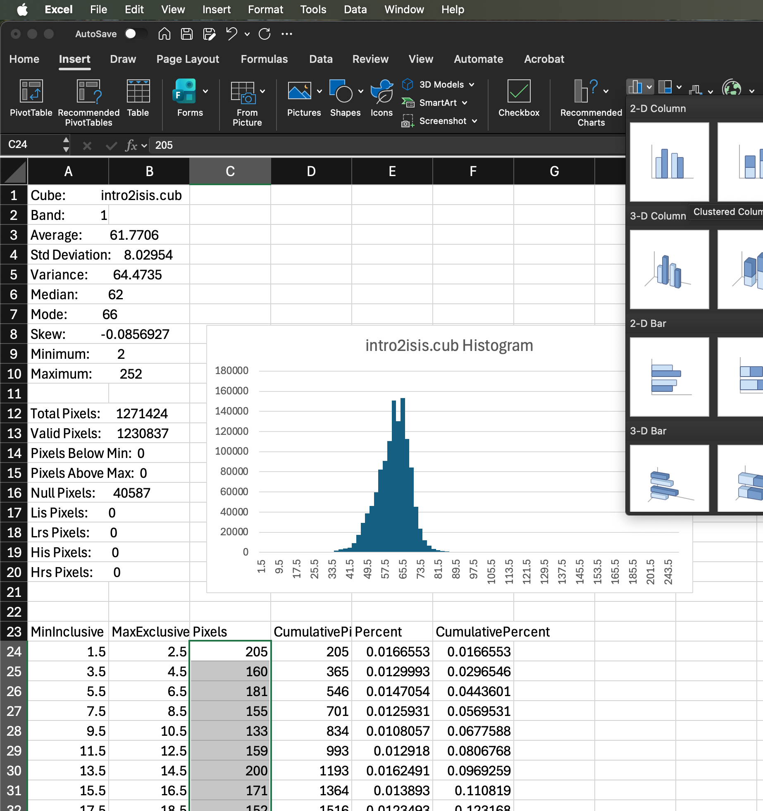

# Using ISIS - Introduction


!!! tip "Setting up ISIS"

    To use ISIS, you will need to install it.  For many functions, including importing images, you must set up the ISIS data area (or use Web SPICE).

    - [Installing ISIS](../../how-to-guides/environment-setup-and-maintenance/installing-isis-via-anaconda.md) - Our script sets up miniforge, ISIS, and the data area for you.
    - [Setting up the ISIS Data Area](../../how-to-guides/environment-setup-and-maintenance/isis-data-area.md) - Download the entire ISIS data area or mission-specific data
    - [Using Web SPICE in ISIS and ALE](../../how-to-guides/SPICE/using-web-spice-in-isis-and-ale.md) - Use web SPICE data via SpiceQL instead of local data
    - [Adding SPICE](adding-spice.md) - Some ISIS apps require SPICE info to be attached to the cube.


## ISIS Apps - Interactive and Non-interactive

!!! info inline end "qview"

    [](../../assets/isis-fundamentals/QviewTwoCubes.png "QviewTwoCubes.png")

    *ISIS's interactive image viewer*

ISIS has a few ***interactive***, and many more ***non-interactive*** apps.
The main interactive app is [`qview`](http://isis.astrogeology.usgs.gov/Application/presentation/Tabbed/qview/qview.html), 
the image viewer.

**Non-interactive** apps are usually run in ***text mode*** on the ***command-line***. 
They process data (usually image files) with specified parameters (settings), 
and write results to a new file (output).  Some examples: 
[`lowpass`](http://isis.astrogeology.usgs.gov/Application/presentation/Tabbed/lowpass/lowpass.html), 
[`ratio`](http://isis.astrogeology.usgs.gov/Application/presentation/Tabbed/ratio/ratio.html), 
[`moc2isis`](http://isis.astrogeology.usgs.gov/Application/presentation/Tabbed/moc2isis/moc2isis.html).

All ISIS programs (interactive or not) are run from the command line, 
by typing the ***program name*** followed by any ***arguments***.

## Command-line Arguments

### Reserved Arguments

Reserved arguments start with a dash `-` and are optional.

- `-help` and `-webhelp` show more info about an ISIS app.
- `-last` and `-restore=<yourFilename>` run an app again with previously-used settings.
- `-gui` runs a program in visual mode.

```sh title="Running lowpass with the -help reserved argument"
lowpass -help
```

??? info "Reserved Arguments - Details"

    See [Command Line Usage - Reserved Parameters](../../concepts/isis-fundamentals/command-line-usage.md#reserved-parameters) for further info.

      - `-webhelp` Launch a web browser showing the ISIS help page for
        that program. All other arguments will be ignored.
      - `-help` Display a list of the program's parameters showing their
        default values. For example:
    ```
        > equalizer -help
        FROMLIST    = Null
        HOLDLIST    = Null
        TOLIST      = Null
        OUTSTATS    = NULL
        INSTATS     = NULL
        PROCESS     = (*BOTH, CALCULATE, APPLY)
        SOLVEMETHOD = (QRD, *SPARSE)
        ADJUST      = (*BOTH, BRIGHTNESS, CONTRAST, GAIN)
        MINCOUNT    = 1000
        WEIGHT      = FALSE
        PERCENT     = 100.0
    ```

      - `-last` Run the program using the same parameter arguments from
        the most recent time the program was run. This does not include any
        reserved arguments.
      - `-restore=filename` Run the program using the arguments from the
        file specified in filename.
      

### Parameter Arguments

Parameter arguments are keyword-value pairs, separated by an equals sign `=`. 
They don't start with a dash.

Parameters set the input data, processing settings, and where to save output.

```sh title="Running lowpass with 4 parameter arguments"
lowpass from=f431a63.lev1_cln.cub to=f431a63.lev1_cln_lpf3x3.cub lines=3 samples=3
```

??? info "Parameter Types"

    - **Cube filenames**  
      The file location of an ISIS cube, for input or output. 
      Input cubes (often `from=your.cub`) must be the output from another ISIS program. 
      Output cubes (often `to=your.cub`) are the file location to save processed results to.
      The `.cub` extension will be added automatically if you don't type it.  
      ```
      from=r0700563_lev1.cub
      to=f431a62  
      ```

    - **Data filenames**  
      The file location of a non-ISIS-cube. This includes input files from missions
      like [MGS](../../concepts/missions/mgs/index.md) or [Viking](../../concepts/missions/vik/index.md), 
      and output files from apps like [`stats`](http://isis.astrogeology.usgs.gov/Application/presentation/Tabbed/stats/stats.html) 
      or [`isis2std`](http://isis.astrogeology.usgs.gov/Application/presentation/Tabbed/isis2std/isis2std.html). Sometimes, a list file
      ```
      to=myStatistic.dat
      ```

    - **Lists**  
      The file location of a list.  Used when an app needs multiple of something, 
      for example, [`findimageoverlaps`](http://isis.astrogeology.usgs.gov/Application/presentation/Tabbed/findimageoverlaps/findimageoverlaps.html)
      needs a list of multiple cubes.  
      ```
      fromlist=image_list.lis
      ```

    - **Floating point numbers**  
      Numeric values with a whole part and (optionally) a fractional part.  
      Can be given values like `1.0`, `0.7823`, `127` or `0.31416E+1`  
      ```
      radius=317.681
      ```

    - **Integers**  
      Numbers with only a whole part.  
      Can be given values like `0`, `2`, `-18223` or `255`  
      ```
      lines=1024
      ```

    - **Booleans (True or False)**   
      True: you can use `True`, `T`, `Yes` or `Y`.  
      False: you can use `False`, `F`, `No` or `N`.  
      Not Case-sensitive.  
      Boolean parameter names are usually a question, like `USEDEM`. This 
      should be read as "Do you want to use a DEM when processing the input?"  
      ```
      CREATESPECIAL=FALSE
      emission=true
      ```

    - **Strings**  
      A sequence of printable characters.  
      For example, `MARS`, `BiLinear` or `The quick brown fox`.  
      ```
      bittype=real
      ```

??? note "Cube Filename Parameters - Adding Attributes"

    For **Cube Filename** Parameters, ***attributes*** like bands or output types can be specified along with the filename.

    **Text Mode**  
    Append a `+` and your attribute to the filename to specify a cube attribute.  Numbers and ranges indicate bands on input cubes; most other attributes specify output format.  See [Command Line Usage](../../concepts/isis-fundamentals/command-line-usage.md#cube-attributes) for more info.
    
    -   `stats from=yourMultibandCube.cub+2`  
        Adding `+2` after the filename is a cube attribute that tells ISIS to open band 2.  
        *`+2` is not literally part of the filename on disk.*

    **Visual Mode**  
    To specify attributes, click the
    arrow to the right of the `From` field and choose `Change
    attributes...` from the menu.

## Text and Visual Modes

All command-line apps can run in:

- **Text Mode**  
  Runs in terminal, non-interactively. (Use parameter arguments.)

- **Visual Mode**  
  Opens a window. (Use `-gui` or run with no arguments.)

!!! note ""

    If **no arguments** are added, an ISIS app will open in **visual mode**.

    If any **parameter arguments** are used, the program will run in **text mode**, 
    unless you add the `-gui` argument, which tells ISIS to read in parameter
    arguments and open the program in visual mode.

### Visual Mode

In visual mode, a window will pop up for you to set parameters, start/stop running
the algorithm, and view the current status.

??? example "Running `lowpass` in visual mode"

    [{ align=right width=400 }](../../assets/isis-fundamentals/LowpassScreenShot1.png "LowpassScreenShot1.png")

    ```sh
    lowpass
    ```

    When run with no parameters, lowpass opens in visual mode to let you enter parameters an a form.

??? example "Forcing visual mode with `-gui`"

    ```sh
    lowpass from=f431a63.cub to=f431a63_lpf3x3.cub lines=3 samples=3 -gui
    ```

    [{ align=right width=400 }](../../assets/isis-fundamentals/LowpassScreenShot2.png "LowpassScreenShot2.png")

    Here, lowpass was run with parameters, but by using the `-gui` flag,
    lowpass opens in graphical mode and automatically fills in values for
    any parameters you passed it on the command line.

    As you can see the parameter arguments on the command line were used to
    set the values for the **lowpass** application, and the `-gui` reserved
    argument caused the program to run in graphical mode instead of in text
    mode.

### Text Mode

In text mode, ISIS apps read parameters from the
command line, process data, and then exit. 
They may or may not output status/results to the terminal. 

Errors are output to the terminal, and may cause the app may exit before completion.

??? example "Running `lowpass` in text mode"

    Run `lowpass`, passing all the parameters on the command line.

    ```sh
    lowpass from=f431a63.lev1_cln.cub to=f431a63.lev1_cln_lpf3x3.cub lines=3 smps=3
    ```

    <div class="result" markdown>

    ```
    **USER ERROR** Invalid command line in UserInterface.cpp at 414
    **USER ERROR** Unknown parameter [smps]. in IsisAml.cpp at 1912
    ```

    </div>

    Oops! "samples" was spelled wrong, but `lowpass` gives us a handy 
    error message to let us know what the problem was. Try again with: 

    ```sh
    lowpass from=f431a63.lev1_cln.cub to=f431a63.lev1_cln_lpf3x3.cub lines=3 samples=3
    ```
    <div class="result" markdown>

    ```
    Working
    100% Processed
    ```

    </div>

    When run correctly, it displays its status while running, 
    and exits to the command prompt when finished.

-----

## Using `qview` to View Cubes

!!! info inline end "Cubes"

    Images in the native ISIS format are called **cubes**.

[`qview`](http://isis.astrogeology.usgs.gov/Application/presentation/Tabbed/qview/qview.html) 
is the image viewer for ISIS. 
It has tools to zoom in/out, adjust contrast, choose color combinations,
compare images, etc.

1.  Type `qview` in the command line and run it.  
    *The qview window will open.*

2.  From the `File` menu, select `Open...` and browse for a cube.  
    *You may open more than one cube at a time.*

3.  Your image(s) will appear in the qview window.

??? example "Load and Display a Multi-Band Cube in `qview`"

    `qview` will load an entire multi-band cube into memory.

    -----

    { align=right width=400 }

    #### Displaying a Single Band in Black and White

    Each band can be selected to view.

    -----

    { align=right width=400 }

    #### Displaying a Red, Green, Blue Color Composite

    -----

## Using the ISIS Application Manuals

The [ISIS Application manuals](https://isis.astrogeology.usgs.gov/Application/alpha.html) 
detail parameters for each app, and have examples for many.

??? example "Looking at the `stats` manual page"

    1. Open the [alphabetical list of ISIS apps](https://isis.astrogeology.usgs.gov/Application/alpha.html)
    1. Press :material-apple-keyboard-command: + `F` (or `Ctrl` + `F`) to *find*
    1. Search for `stats`.
    1. Click on stats to open its [manual](http://isis.astrogeology.usgs.gov/Application/presentation/Tabbed/stats/stats.html).
    1. Click the `Parameters` tab and click on each parameter to investigate.
        - `from` and `to` are often required.
        - Any parameter with a **Default** listed can be left out, and the default will be used.
    1. Click each `Example` tab.
        - `Example 1` shows a simple run with an input cube and an output log.
        - `Example 2` has a `+3` after the cube name - this is a cube attribute that specifies the band 3. The `+3` is not part of the filename on disk.
        - `Example 3` has a more complex cube attribute, specifying multiple bands.


## Running Non-interactive ISIS Apps

Now that you know the basics, 
download [intro2isis.cub](../../assets/isis-fundamentals/intro2isis.cub) as your input cube, 
and run a few ISIS apps (try both visual and text modes).

??? example "Running `stats`"

    Computes stats (average, mode, minimum, maximum, etc.) for pixels in a cube.  
    *[`stats` manual page :octicons-arrow-right-24:](http://isis.astrogeology.usgs.gov/Application/presentation/Tabbed/stats/stats.html)*

    ```sh
    stats from=intro2isis.cub
    ```

    <div class="result" markdown>

    ```
    Group = Results
      From                    = intro2isis.cub
      Band                    = 1
      Average                 = 61.770642254011
      StandardDeviation       = 8.0295403784653
      Variance                = 64.473518689404
      Median                  = 62.0
      Mode                    = 66.0
      Skew                    = -0.085692730285373
      Minimum                 = 2.0
      Maximum                 = 252.0
      Sum                     = 76029592.0
      TotalPixels             = 1271424
      ValidPixels             = 1230837
      OverValidMaximumPixels  = 0
      UnderValidMinimumPixels = 0
      NullPixels              = 40587
      LisPixels               = 0
      LrsPixels               = 0
      HisPixels               = 0
      HrsPixels               = 0
    End_Group
    ```

    </div>

    `stats` prints results to the terminal, but not every ISIS app does this.
    In `stats`, add `to=myStats.log` to save the output to a log file.

    Use the [ISIS Application manuals](https://isis.astrogeology.usgs.gov/Application/alpha.html) 
    for `stats` and other apps to find parameters and examples if you aren't sure how to run them.


??? example "Running `hist`"

    [{ align=right width="200" }](../../assets/isis-fundamentals/intro2isis-hist-excel-notes.png)
    
    Creates a tabular representation of the histogram of a cube.  
    *[`hist` manual page :octicons-arrow-right-24:](http://isis.astrogeology.usgs.gov/Application/presentation/Tabbed/hist/hist.html)*

    ```sh
    hist from=intro2isis.cub to=intro_histogram.csv
    ```

    After you run `hist`, try creating a bar chart in excel to visualize the histogram.


??? example "Running `mirror`"

    Flips a cube from left to right (making an output cube that looks like the mirror-image of the input cube).  
    *[`mirror` manual page :octicons-arrow-right-24:](http://isis.astrogeology.usgs.gov/Application/presentation/Tabbed/mirror/mirror.html)*
    
    ```sh
    mirror from=intro2isis.cub to=intro_mirror.cub
    ```

    *Make sure your output `to=` filename is different than your input `from=` filename!*

    After running `mirror`, open both the input cube 
    and output cube in `qview` to see the results.

