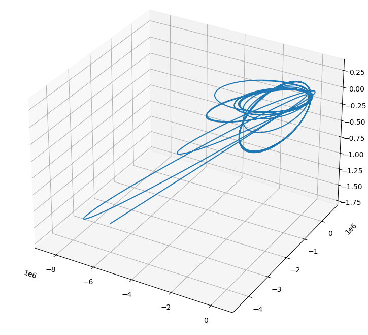

## Using SpiceQL With Other Tools

SpiceQL is a C++ library with python bindings for managing and searching SPICE kernels, and it can be used in conjunction with other planetary science tools such as [ALE](https://github.com/USGS-Astrogeology/ale) and [SpiceyPy](https://github.com/AndrewAnnex/SpiceyPy). This guide demonstrates how to integrate SpiceQL with both ALE and SpiceyPy in your workflow.

!!! Info 
  
    Before following these steps, make sure you have your kernels downloaded locally. Follow [these instructions](https://astrogeology.usgs.gov/docs/manuals/spiceql/) for more info. 


## spicepy/cspice  

SpiceQL enables: 

  * Queries to select a set of kernels 
  * An interface to furnish kernels in a fixed scope 

The general workflow is: 

  1. Search for kernels 
  2. furnish the kernels in a fixed scope 
  4. call whatever cspice/spiceypy function you want to use 

**Boilerplate for the impatient:**

=== "python"
  
    ```python
    # import 
    import spiceypy
    import pyspiceql as spql    
    
    # get supported frames
    print(spql.frameList()) 
    
    # check alias list 
    aliasMap = spql.getAliasMap() 
    print(aliasMap)
    
    # we need the spiceql name for the mission the kernels belong to, you can use the alias map to get spiceql names 
    body_names = [spql.getSpiceqlName("LRO_LROCNACR"), "mro", "mars", "moon"] # ... you can add more 
    
    # delete the types you do not want
    kernel_types = ["ck", "spk", "tspk", "lsk", "sclk", "iak", "ik", "fk", "dsk", "pck"]
    
    # search for kernels, all spiceql calls return a tuple of (data, kernels) 
    # use limitSpk and limitCk to limit the number of time kernels returned, -1 to get all matching kernels
    _, kernels = spql.searchForKernelsets(body_names, kernel_types, 
                                         startTime=-1e100,  # start time (default: -double max, covers all)
                                         stopTime=1e100,    # stop time (default: double max, covers all)
                                         ckQualities=["smithed", "reconstructed"],  # CK quality priorities
                                         spkQualities=["smithed", "reconstructed"], # SPK quality priorities
                                         useWeb=False,      # use web service if True
                                         fullKernelPath=False, # return relative paths if False
                                         limitSpk=-1,   # limit number of SPKs, -1 returns all matching SPK kernels 
                                         limitCk=-1,    # limit the number of CKs, -1 returns all matching CK kernels
                                         overwrite=False) # if True, later kernels overwrite earlier ones
    
    # should print a dict in the form of {"kernel_type" : key} with paths relative to $SPICEROOT
    print(kernels)
    
    # furnish the kernels, if there are many CKs/SPKs it might take a second
    with spql.KernelSet(kernels): 
      # do stuff 
      pass

    ```

=== "C++"

    ```C++
    // C++ Boilerplate for using SpiceQL with CSPICE
    #include <iostream>
    #include <vector>
    #include <string>
    #include "spiceql/api.h"

    using namespace std;

    int main() {
        // Get supported frames
        auto frames = SpiceQL::frameList();
        for (const auto& frame : frames) {
            std::cout << frame << std::endl;
        }

        // Define body names (missions, planets, etc.)
        std::vector<std::string> body_names = {"mro", SpiceQL::getSpiceqlName("LRO_LROCNACR"), "mars", "moon"}; // add more as needed

        // Define kernel types to search for
        std::vector<std::string> kernel_types = {"ck", "spk", "tspk", "lsk", "sclk", "iak", "ik", "fk", "dsk", "pck"};

        // Search for kernels; returns a tuple of (data, kernels)
        // Use limitSpk and limitCk to limit the number of kernels returned, -1 to get all matching kernels
        auto [data, kernels] = 
          SpiceQL::searchForKernelsets(body_names, kernel_types, 
                                      -std::numeric_limits<double>::max(),// startTime
                                      std::numeric_limits<double>::max(), // stopTime  
                                      {"smithed", "reconstructed"},       // ck qualities 
                                      {"smithed", "reconstructed"},       // spk qualities
                                      false,                              // useWeb, uses the web service if true
                                      false,                              // fullKernelPath, false to get relative paths
                                      -1,                                 // limitCk, -1 for all CKs
                                      -1,                                 // limitSpk, -1 for all SPKs
                                      false);                             // overwrite, merge kernels without overwritinf

        cout << kernels.dump(2) << endl;

        // Furnish the kernels using KernelSet (RAII pattern)
        {
            SpiceQL::KernelSet kset(kernels);
            // Do stuff with CSPICE here
            // Example: call spkpos_c, etc.
        } // kernels are unfurnished here

        return 0;
    }

    ```

### Cassini Example 

This is a rewrite of [spiceypy's Cassini Example](https://spiceypy.readthedocs.io/en/stable/exampleone.html). We simply add spiceql calls in order to get the kernels needed. 

=== "spiceypy"

    First, import spicepy and spiceql 

    ```python
    import spiceypy as spice
    import pyspiceql as spql   
    ```
    
    We then set up our variables and do a search for the kernels we need for our example

    ```python   
    # Using SpiceQL to get kernels for cassini, but we also need base and saturn 
    body_names = ["cassini", "base", "saturn"]  
    # we will need enough to get positions 
    kernel_types = ["spk", "lsk", "sclk", "fk"]
    
    # make our lives easier by using pyspiceql to get times
    utc = ["Jun 20, 2004", "Dec 1, 2005"]
    et1, _ = spql.utcToEt(utc[0])
    et2, _ = spql.utcToEt(utc[1])
    ```
   
    ```python
    # search for kernels, all spiceql calls return a tuple of (data, kernels) 
    _, kernels = spql.searchForKernelsets(body_names, kernel_types, startTime=et1, stopTime=et2, 
                                          limitSpk=-1, limitCk=-1, 
                                          spkQualities=["reconstructed"], ckQualities=["reconstructed"])
    # should print a dict in the form of {"kernel_type" : key} with paths relative to $SPICEROOT  
    print(kernels)
    ``` 

    Using `KernelSet` to furnish the kernels returned from the search. `KernelSet` has context manager support to limit 
    the scope of the furnished kernels using the `with` statement.

    ```python
    # use spiceypy to do things 
    step = 4000
    # we are going to get positions between these two dates
    utc = ["Jun 20, 2004", "Dec 1, 2005"]
    
    with spql.KernelSet(kernels): 
        # use spiceypy to do things 
        step = 4000
        # we are going to get positions between these two dates
      
        print("ET One: {}, ET Two: {}".format(et1, et2))
      
        times = [x * (et2 - et1) / step + et1 for x in range(step)]
      
        positions, lightTimes = spice.spkpos(
            "Cassini", times, "J2000", "NONE", "SATURN BARYCENTER"
        )
    
    # kernels are unloaded after leaving the context
    ```

    You can then plot the positions with matplotlib 

    ```python
    import numpy as np
    import matplotlib.pyplot as plt
    from mpl_toolkits.mplot3d import Axes3D

    positions = (
        positions.T
    )  # positions is shaped (4000, 3), let's transpose to (3, 4000) for easier indexing
    fig = plt.figure(figsize=(9, 9))
    ax = fig.add_subplot(111, projection="3d")
    ax.plot(positions[0], positions[1], positions[2])
    plt.title("SpiceyPy Cassini Position Example from Jun 20, 2004 to Dec 1, 2005")
    plt.show()
    ```

    

=== "cspice"
    

    ```C++ 
    // Get your includes in 
    #include <iostream>
    #include <vector>
    #include <string>
    
    // cspice includes 
    #include <SpiceUsr.h>

    #include "spiceql/api.h" 
    ```


    ```C++
    // Using SpiceQL to get kernels for cassini, but we also need base and saturn
    std::vector<std::string> body_names = {"cassini", "base", "saturn"}; 
    // we will need enough to get positions
    std::vector<std::string> kernel_types = {"spk", "sclk", "lsk", "fk"};
    ```

    ```C++
    // define the kernel times in UTC and setup the step 
    std::vector<std::string> utcs = {"Jun 20, 2004", "Dec 1, 2005"}; 
    double step = 4000.0;  
    ```

    ```C++
    // make our lives easier and use spiceql to get times 
    double et1 = SpiceQL::utcToEt(utcs[0]).first;
    double et2 = SpiceQL::utcToEt(utcs[1]).first;
    ```

    ```C++ 
    // Search for kernels; returns a tuple of (data, kernels)
    // Use limitSpk and limitCk to limit the number of kernels returned, -1 to get all matching kernels
    auto [data, kernels] = 
      SpiceQL::searchForKernelsets(body_names, kernel_types, 
                                  et1, // startTime
                                  et2, // stopTime  
                                  {"smithed", "reconstructed"},       // ck qualities 
                                  {"smithed", "reconstructed"},       // spk qualities
                                  false,                              // useWeb, uses the web service if true
                                  false,                              // fullKernelPath, false to get relative paths
                                  -1,                                 // limitCk, -1 for all CKs
                                  -1,                                 // limitSpk, -1 for all SPKs
                                  false);                             // overwrite, merge kernels without overwriting

    // print kernels, a json dict in the form "kernel_type" : ["kernels"]
    std::cout << kernels.dump(2) << std::endl;
    ```
    
    ```C++ 
    // Furnish the kernels using KernelSet (RAII pattern)
    {
      SpiceQL::KernelSet kset(kernels);

      // make sure to check for cspice errors after 
      std::vector<SpiceDouble> times;
      for (int x = 0; x < step; ++x) {
          SpiceDouble t = x * (et2 - et1) / step + et1;
          times.push_back(t);
      }

      for (auto &t : times) {
        SpiceDouble position[3];
        SpiceDouble ltime;
        spkpos_c("Cassini", t, "J2000", "NONE", "SATURN BARYCENTER", position, &ltime);  
        std::cout << "Position at time " << t << " is [" << position[0] << ", " << position[1] << ", " << position[2] << "] and ltime is " << ltime << std::endl;
      }
    } // kernels are unfurnished here

    ```


## ALE/CSM 

!!! Info 
  
    As of ALE 1.0, it is recommended that you use [isd_generate.py](https://astrogeology.usgs.gov/docs/getting-started/using-ale/isd-generate/) to get SPICE info for a camera. SpiceQL is integrated. 


