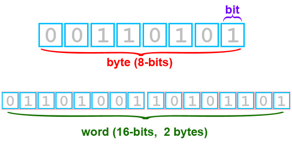

# ISIS Cube Format

## What Is A Cube?
---------------

A cube is a 3-dimensional image with axis: samples, lines, and bands. The physical dimensions of a cube are called the number of samples (NS), number of lines (NL), and number of bands (NB). Typically, the sample and line dimensions are used to represent spatial information while the band dimension represents spectral information. See the table below for examples of the line, sample, and band dimensions of a few data sets from planetary missions.

> Illustration of an ISIS3 image cube, showing the three dimensions of an ISIS3 image: width (samples), height (lines), and depth (bands)

<table>
    <thead>
        <tr>
            <th>Instrument/Camera</th>
            <th># Lines</th>
            <th># Samples</th>
            <th># Bands</th>
            <th>Bands</th>
        </tr>
    </thead>
    <tbody>
        <tr>
            <td>Mars Odyssey - Thermal Emission Imaging System, Infrared (THEMIS-IR)</td>
            <td>240</td>
            <td>320</td>
            <td>10</td>
            <td>All 10 are Infrared, ranging from 6.78 to 14.88 microns</td>
        </tr>
        <tr>
            <td>Mars Odyssey - Thermal Emission Imaging System, Visible Imaging Subsystem (THEMIS-VIS)</td>
            <td>1024</td>
            <td>1024</td>
            <td>5</td>
            <td>visible</td>
        </tr>
        <tr>
            <td>Viking Orbiter</td>
            <td>1056</td>
            <td>1204</td>
            <td>1 ?</td>
            <td>blue, minus-blue, violet, green, red, clear</td>
        </tr>
        <tr>
            <td>Mars Global Surveyor - Mars Oribiter Camera Wide Angle (MOC-WA)</td>
            <td>*</td>
            <td>3456</td>
            <td>1</td>
            <td>bandwidth encompases visible and near-infrared</td>
        </tr>
        <tr>
            <td>Galileo Near-Infrared Mapping Spectrometer (NIMS)</td>
            <td>*</td>
            <td>20</td>
            <td>408</td>
            <td>visible to infrared</td>
        </tr>
    </tbody>
</table>

### [Interactive Cube Demonstration](https://doi-usgs.github.io/ISIS3/ISIS_Cube_Format.html#Cube-Demo)

---------

## What Are Pixels?
----------------

The individual cells within a cube are called pixels. Each pixel in a cube has a location, which is similar to rectangular coordinates (i.e.., (samples, lines, bands)). A cube can be as small as one sample, by one line, by one band (1,1,1). If we had a cube of this size, it would contain only one pixel. A cube can be as large as thousands of samples, by thousands of lines, by thousands of bands. A cube with dimensions (1000, 1000, 1000) would contain one billion pixels.

Move your mouse cursor over the cube (above) and pay attention to the sample/line positions of each pixel shown below the cube:

*   Did you notice that sample 1 is on the left edge of the image and line 1 is on the top edge. Therefore, to figure out the coordinates of a pixel, count lines and samples staring with 1,1 in the upper left corner and move down and to the right.
    
*   How many samples and lines are in this cube?
    

## Bit Type Basics
----------------

Computers store values in base-2 or binary (see glossary below). Values are generally limited to 8, 16, or 32 binary digits, or bits. We refer to the number of bits per value as the bit type. Understanding the bit type and related attributes of an ISIS image cube is important for a variety of reasons. For instance, changing the bit type affects the file size, and a cube's bit type determines the range and number of values that can be stored in a cube.

There are three bit types utilized in ISIS:

<table>
    <thead>
        <tr>
            <th>Bit Type</th>
            <th>Name</th>
            <th>Number of Bytes</th>
            <th>Range</th>
        </tr>
    </thead>
    <tbody>
        <tr>
            <td>8</td>
            <td>Unsigned Byte</td>
            <td>1</td>
            <td>0 to 255</td>
        </tr>
        <tr>
            <td>16</td>
            <td>Signed Word</td>
            <td>2</td>
            <td>-32768 to 32767</td>
        </tr>
        <tr>
            <td>32</td>
            <td>Real</td>
            <td>4</td>
            <td>-3.40282E+38 to 3.04282E+38</td>
        </tr>
    </tbody>
</table>

As shown in the illustration below, there are 8 bits in 1 byte, and 16 bits in 2 bytes. A 16-bit value is called a word.

        

There are 8 bits in 1 byte, and 16 bits in 2 bytes. A 16-bit value is called a word.

There are 256 possible values (called digital numbers, or DNs) that can be represented in an 8-bit file. If all the bits above are set to 1, the output DN value would be 255. The values 0 to 255 are derived by setting different bit positions to 0 or 1. The example below shows the binary number stored by the computer, and the corresponding DN value the user would see on a computer monitor.

<table>
    <thead>
        <tr>
            <th>Binary Number</th>
            <th>DN Value</th>
        </tr>
    </thead>
    <tbody>
        <tr>
            <td>00000000</td>
            <td>0</td>
        </tr>
        <tr>
            <td>00000001</td>
            <td>1</td>
        </tr>
        <tr>
            <td>00000010</td>
            <td>2</td>
        </tr>
        <tr>
            <td>...</td>
            <td>...</td>
        </tr>
        <tr>
            <td>11111110</td>
            <td>254</td>
        </tr>
        <tr>
            <td>11111111</td>
            <td>255</td>
        </tr>
    </tbody>
</table>

As you increase the number of bits, the number of possible DN values that can be represented also increases.

### Glossary & Review

*   **Binary** : Refers to the base-2 numeral system. For an in depth discussion of the binary numeral system, see [this Wikipedia encyclopedia entry for Binary numeral system](http://en.wikipedia.org/wiki/Binary_numeral_system) .
*   **Bit** : Is short for binary digit, which in a computer is the smallest unit of storage. Bits are either "0" or "1".
*   **Byte** : Is short for binary term. A byte is a collection of computer bits. On many modern computers, a byte is a group of eight bits. Typically, computers handle and store information in binary (base-2), and a group of eight bits represents an eight digit binary number.
*   **Bit type** : Refers to how many bits there are per single meaningful value in an image cube file.
*   **DN** : An abbreviation of digital number. For images, particularly ISIS cubes, a DN is also referred to as a pixel.

## Pixel Values: Digital Numbers
-----------------------------

Each pixel contains a numerical value, often referred to as the digital number ( [DN](https://astrogeology.usgs.gov/docs/concepts/glossary/#dn) ). Low DNs typically show up as black in the image and high DN as white. DNs represent real world values such as:

*   Radiance - A measurement describing the amount of electromagnetic energy emitted from an area of a planet
*   Reflectance - The ratio of reflected energy to incoming energy
*   Elevation - The height above or below a fixed point on the surface of a body
*   Emissivity - A measure describing a substances ability to absorb and radiate electromagnetic energy

## Core Base and Multiplier Basics
-------------------------------

Recall that a [\[digital Number\]](https://astrogeology.usgs.gov/docs/concepts/glossary/#dn) is the content of a pixel. These numbers are used to represent real world values such as:

*   Radiance - A measurement describing the amount of electromagnetic energy emitted from an area of a planet.
*   Reflectance - The ratio of reflected energy to incoming energy
*   Elevation - The height above or below a fixed point on the surface of a body
*   Emissivity - A measure describing a substances ability to absorb and radiate electromagnetic energy.

Let's assume we have an 8-bit cube with values representing the elevation in meters. Unfortunately 8-bit pixels have a range of 0 to 255, which is very restrictive for elevation. ISIS3 deals with this problem by using a Core Base and Multiplier. Each DN is really treated as a floating point number in all ISIS3 programs.

In the example to the right, use mouse to examine the values in an 8-bit elevation cube, then change the multiplier and base notice how the values change.

Hold your mouse over the questions to see the answers

Change the multiplier to 100. Re-examine the image. Do the elevations range from 0 to 25500 meters?

## [ISIS Multiplier Demo](https://doi-usgs.github.io/ISIS3/ISIS_Cube_Format.html#Core-Base-and-Multiplier-Basics)

## Sub-Pixel Definition
--------------------

ISIS3 programs and users often need to interact at the sub-pixel level. That is, fractional pixel positions. The integral sample/line position is defined to be the center of a pixel.  
In the example to the right, use mouse to examine the pixel positions in a cube. 

*   What is the sample position on the left edge of the cube?
*   What is the sample position on the right edge of the first pixel?
*   What is the line position on the bottom edge of the cube?

### [ISIS Sub-Pixel Demo](https://doi-usgs.github.io/ISIS3/ISIS_Cube_Format.html#Sub-Pixel-Definition)

## Summary
-------

Cubes are made up of individual pixels. Each pixel usually represents some area of a planet, moon, astroid or other body. Pixels hold a DN (digital number). That number can be one, two or four bytes long depending on the accuracy necessary to represent the data. DNs can be modified by a "Base" and "Multiplier". The columns of a cube are called samples, the rows are called lines and a plane of samples and lines is called a band.

[Cube.png](../../assets/isis-fundamentals/Cube.png) (44.8 KB) Adam Paquette, 2016-06-10 12:19 PM